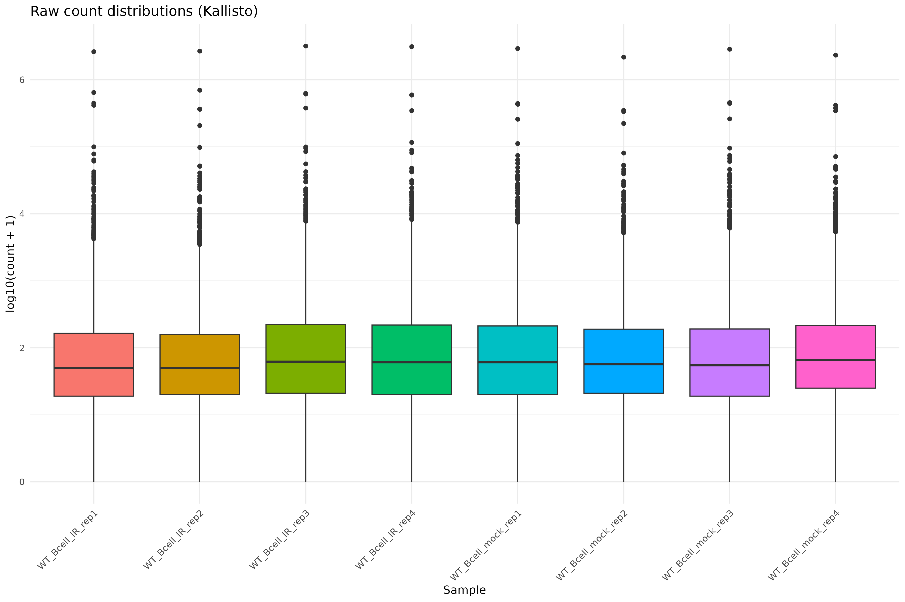
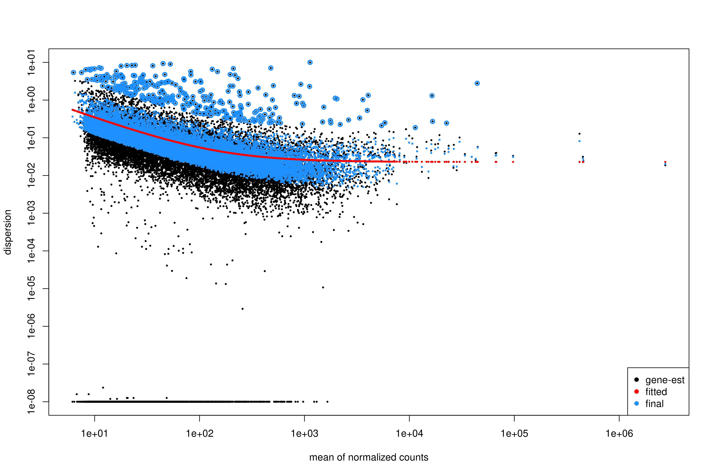

:::::::::::::::::::::::::::::::::::::: questions

- How do we import transcript-level quantification from Kallisto into DESeq2?
- What exploratory analyses should we perform before differential expression testing?
- How do we perform differential expression analysis with DESeq2 using tximport data?
- How do we visualize and interpret DE results from transcript-based quantification?
- What are the key differences between genome-based and transcript-based DE workflows?

::::::::::::::::::::::::::::::::::::::::::::::::

::::::::::::::::::::::::::::::::::::: objectives

- Load tximport data from Kallisto quantification into DESeq2.
- Perform quality control visualizations (boxplots, density plots, PCA).
- Apply variance stabilizing transformation for exploratory analysis.
- Run differential expression analysis with appropriate contrasts.
- Create volcano plots to visualize DE results.
- Export annotated DE results for downstream analysis.

::::::::::::::::::::::::::::::::::::::::::::::::


## Attribution

This section is adapted from materials developed by **Michael Gribskov**, Professor of Computational Genomics & Systems Biology at Purdue University.
 
Original and related materials are available via the **CGSB Wiki**:
<https://cgsb.miraheze.org/wiki/Main_Page>

## Introduction

In Episode 04b, we quantified transcript expression using **Kallisto** and summarized the results to gene-level counts using **tximport**. In this episode, we use those gene-level estimates for differential expression analysis with **DESeq2**.

The workflow follows the same general pattern as Episode 05 (genome-based), but with important differences:

1. **Input data**: We use the `txi` object from tximport rather than raw counts from featureCounts.
2. **Count handling**: Kallisto estimates are model-based (not integer counts), and DESeq2 handles this appropriately via `DESeqDataSetFromTximport()`.
3. **Bootstrap support**: Kallisto's uncertainty estimates (from bootstraps) can be used with sleuth for transcript-level DE.

::::::::::::::::::::::::::::::::::::::: callout

## When to use this pathway

Use this transcript-based workflow when:

- You quantified with Salmon, Kallisto, or similar tools.
- You want to leverage transcript-level bias corrections.
- You did not generate BAM files and cannot use featureCounts.

The genome-based workflow (Episode 05) is preferred when you have BAM files and need splice junction information or plan to visualize alignments.

:::::::::::::::::::::::::::::::::::::::

::::::::::::::::::::::::::::::::::::::: prereq

## What you need for this episode

- `txi.rds` file generated from tximport in Episode 04b
- A `samples.csv` file describing the experimental groups
- RStudio session via Open OnDemand

If you haven't created the sample metadata file, create `scripts/samples.csv` with:

```
sample,condition
WT_Bcell_mock_rep1,WT_mock
WT_Bcell_mock_rep2,WT_mock
WT_Bcell_mock_rep3,WT_mock
WT_Bcell_mock_rep4,WT_mock
WT_Bcell_IR_rep1,WT_IR
WT_Bcell_IR_rep2,WT_IR
WT_Bcell_IR_rep3,WT_IR
WT_Bcell_IR_rep4,WT_IR
```

Create a results directory:

```bash
mkdir -p results/deseq2_kallisto
```

:::::::::::::::::::::::::::::::::::::::

## Step 1: Load packages and data

Start your RStudio session via Open OnDemand as described in Episode 05, then load the required packages:

```r
library(DESeq2)
library(tximportData)
library(ggplot2)
library(reshape2)
library(pheatmap)
library(RColorBrewer)
library(ggrepel)
library(readr)
library(dplyr)
# Construct the path dynamically
work_dir <- file.path("/scratch/negishi", Sys.getenv("USER"), "rnaseq-workshop")
setwd(work_dir)
```

Load the tximport object created in Episode 04b:

```r
txi <- readRDS("results/kallisto_quant/txi.rds")
```

Examine the structure of the tximport object:

```r
names(txi)
```

```
[1] "abundance"           "counts"              "infReps"             "length"              "countsFromAbundance"
```

```r
head(txi$counts)
```

```text
                      WT_Bcell_IR_rep1 WT_Bcell_IR_rep2 WT_Bcell_IR_rep3 WT_Bcell_IR_rep4 WT_Bcell_mock_rep1 WT_Bcell_mock_rep2 WT_Bcell_mock_rep3
ENSMUSG00000000001.5         387.39815         329.4356     737.97311964        654.17550           687.1189          620.35065          661.35411
ENSMUSG00000000003.16          0.00000           1.0000       0.00000000          0.00000             0.0000            0.00000            0.00000
ENSMUSG00000000028.16         32.81579          20.0000      36.63144821         29.71743            53.5750           36.92104           39.00000
ENSMUSG00000000031.20          0.00000           0.0000       0.09733145          0.00000             0.0000            0.00000            0.00000
ENSMUSG00000000037.18          2.00000           3.0000       1.28018005          8.00000             1.0000            0.00000            1.58711
ENSMUSG00000000049.12          0.00000           0.0000       0.00000000          0.00000             0.0000            0.00000            0.00000
                      WT_Bcell_mock_rep4
ENSMUSG00000000001.5            704.8851
ENSMUSG00000000003.16             0.0000
ENSMUSG00000000028.16            36.0000
ENSMUSG00000000031.20             0.0000
ENSMUSG00000000037.18             0.0000
ENSMUSG00000000049.12             0.0000
```

::::::::::::::::::::::::::::::::::::::: callout

## Understanding the tximport object

The `txi` object contains several components:

- **counts**: Gene-level estimated counts (used by DESeq2).
- **abundance**: Gene-level TPM values (within-sample normalized).
- **length**: Average transcript length per gene (used for length bias correction).
- **countsFromAbundance**: Method used to generate counts (default: `"no"`).

When using `DESeqDataSetFromTximport()`, the `length` matrix is automatically used to correct for gene-length bias during normalization. This is why we use the default `countsFromAbundance = "no"` in Episode 04b—DESeq2 handles length correction internally, so pre-scaling counts would apply the correction twice.

:::::::::::::::::::::::::::::::::::::::

Load sample metadata:

```r
coldata <- read.csv(
    "scripts/samples.csv",
    row.names = 1,
    header = TRUE,
    stringsAsFactors = TRUE
)
coldata$condition <- as.factor(coldata$condition)
coldata <- coldata[colnames(txi$counts), , drop = FALSE]
coldata
```

```
                   condition
WT_Bcell_IR_rep1       WT_IR
WT_Bcell_IR_rep2       WT_IR
WT_Bcell_IR_rep3       WT_IR
WT_Bcell_IR_rep4       WT_IR
WT_Bcell_mock_rep1   WT_mock
WT_Bcell_mock_rep2   WT_mock
WT_Bcell_mock_rep3   WT_mock
WT_Bcell_mock_rep4   WT_mock
```

Verify that sample names match between tximport and metadata:

```r
all(colnames(txi$counts) == rownames(coldata))
```

```
[1] TRUE
```

## Step 2: Create DESeq2 object from tximport

The key difference from the genome-based workflow is using `DESeqDataSetFromTximport()` instead of `DESeqDataSetFromMatrix()`:

```r
dds <- DESeqDataSetFromTximport(
    txi,
    colData = coldata,
    design = ~ condition
)
```

::::::::::::::::::::::::::::::::::::::: callout

## Why use DESeqDataSetFromTximport?

This function:

- Automatically handles non-integer counts from Salmon/Kallisto.
- Preserves transcript length information for accurate normalization.
- Incorporates the `txi$length` matrix to account for gene-length bias.

Using `DESeqDataSetFromMatrix()` with tximport counts would lose this information.

:::::::::::::::::::::::::::::::::::::::

Filter lowly expressed genes using group-aware filtering:

```r
# Group-aware filtering: keep genes with >= 10 counts in at least 4 samples
# (the size of the smallest experimental group)
min_samples <- 4
min_counts <- 10
keep <- rowSums(counts(dds) >= min_counts) >= min_samples
dds <- dds[keep, ]
dim(dds)
```

```
[1] 18924     8
```

::::::::::::::::::::::::::::::::::::::: callout

## Why use group-aware filtering?

A simple sum filter (`rowSums(counts(dds)) >= 10`) can be problematic:

- A gene with 10 total counts across 8 samples averages ~1.25 counts/sample—too low to be informative.
- It may remove genes expressed in only one condition (biologically interesting!).

Group-aware filtering (`rowSums(counts >= threshold) >= min_group_size`) ensures:

- Each kept gene has meaningful expression in at least one experimental group.
- Genes with condition-specific expression are retained.
- The threshold is interpretable (e.g., "at least 10 counts in at least 4 samples").

:::::::::::::::::::::::::::::::::::::::

Estimate size factors:

```r
dds <- estimateSizeFactors(dds)
head(normalizationFactors(dds))

```

```
                      WT_Bcell_IR_rep1 WT_Bcell_IR_rep2 WT_Bcell_IR_rep3 WT_Bcell_IR_rep4 WT_Bcell_mock_rep1 WT_Bcell_mock_rep2 WT_Bcell_mock_rep3
ENSMUSG00000000001.5         0.8578693        0.8520842         1.099577        1.0524525           1.059461          0.9946634          0.9552297
ENSMUSG00000000028.16        0.9455555        0.7479666         1.149805        0.9882356           1.071439          1.0191038          0.9154327
ENSMUSG00000000056.8         0.8580737        0.8528464         1.101744        1.0540656           1.058546          0.9930345          0.9540278
ENSMUSG00000000078.8         0.8580503        0.8527592         1.101496        1.0538811           1.058650          0.9932207          0.9541651
ENSMUSG00000000085.17        0.7941016        0.7697798         1.199288        1.0181546           1.163680          0.9580967          1.0675296
ENSMUSG00000000088.8         0.8537054        0.8364591         1.055812        1.0199231           1.078562          1.0286198          0.9803416
                      WT_Bcell_mock_rep4
ENSMUSG00000000001.5            1.174355
ENSMUSG00000000028.16           1.244899
ENSMUSG00000000056.8            1.173333
ENSMUSG00000000078.8            1.173450
ENSMUSG00000000085.17           1.125634
ENSMUSG00000000088.8            1.195682
```

## Step 3: Exploratory data analysis

### Raw count distributions

Visualize the distribution of raw counts across samples:

```r
counts_melted <- melt(
    log10(counts(dds) + 1),
    varnames = c("gene", "sample"),
    value.name = "log10_count"
)

ggplot(counts_melted, aes(x = sample, y = log10_count, fill = sample)) +
    geom_boxplot(show.legend = FALSE) +
    theme_minimal() +
    labs(
        x = "Sample",
        y = "log10(count + 1)",
        title = "Raw count distributions (Kallisto)"
    ) +
    theme(axis.text.x = element_text(angle = 45, hjust = 1))
```

<div class="figure" style="text-align: center">

<p class="caption">Raw count distributions</p>
</div>


Density plot of raw counts:

```r
ggplot(counts_melted, aes(x = log10_count, fill = sample)) +
    geom_density(alpha = 0.3) +
    theme_minimal() +
    labs(
        x = "log10(count + 1)",
        y = "Density",
        title = "Count density distributions"
    )
```

<div class="figure" style="text-align: center">

<p class="caption">Count density distributions</p>
</div>


### Variance stabilizing transformation

Apply VST for exploratory analysis:

```r
vsd <- vst(dds, blind = TRUE)
```

::::::::::::::::::::::::::::::::::::::: callout

## Why use VST?

Raw counts have a strong mean-variance relationship: highly expressed genes have higher variance. VST removes this dependency, making distance-based methods (PCA, clustering) more reliable.

Setting `blind = TRUE` ensures the transformation is not influenced by the experimental design, which is appropriate for quality control.

:::::::::::::::::::::::::::::::::::::::

### Sample-to-sample distances

```r
sampleDists <- dist(t(assay(vsd)))
sampleDistMatrix <- as.matrix(sampleDists)
rownames(sampleDistMatrix) <- colnames(vsd)
colnames(sampleDistMatrix) <- NULL
colors <- colorRampPalette(rev(brewer.pal(9, "Blues")))(255)

pheatmap(
    sampleDistMatrix,
    clustering_distance_rows = sampleDists,
    clustering_distance_cols = sampleDists,
    col = colors,
    main = "Sample distance heatmap (Kallisto)"
)
```

<div class="figure" style="text-align: center">

<p class="caption">Sample distance heatmap</p>
</div>


The distance heatmap shows how similar samples are to each other. Samples from the same condition should cluster together.

### PCA plot

```r
pcaData <- plotPCA(vsd, intgroup = "condition", returnData = TRUE)
percentVar <- round(100 * attr(pcaData, "percentVar"))

ggplot(pcaData, aes(PC1, PC2, color = condition)) +
    geom_point(size = 4) +
    geom_text_repel(aes(label = name)) +
    xlab(paste0("PC1: ", percentVar[1], "% variance")) +
    ylab(paste0("PC2: ", percentVar[2], "% variance")) +
    theme_bw() +
    ggtitle("PCA of Kallisto-quantified samples")
```

<div class="figure" style="text-align: center">

<p class="caption">PCA plot of Kallisto-quantified samples</p>
</div>

::::::::::::::::::::::::::::::::::::::: challenge

## Exercise: Interpret exploratory plots

Using the distance heatmap and PCA plot:

1. Do samples cluster by experimental condition?
2. Are there any outlier samples that don't group with their replicates?
3. How much variance is explained by PC1? What might this represent biologically?

::::::::::::::::::::::::::::::::::: solution

Example interpretation:

1. Samples should cluster by condition (WT_mock vs WT_IR) in both the heatmap and PCA.
2. If all replicates cluster together, there are no obvious outliers.
3. PC1 typically captures the largest source of variation. If it separates conditions, the experimental treatment is the dominant signal.

:::::::::::::::::::::::::::::::::::

:::::::::::::::::::::::::::::::::::::::

## Step 4: Differential expression analysis

Run the full DESeq2 pipeline:

```r
dds <- DESeq(dds)
```

```
estimating size factors
estimating dispersions
gene-wise dispersion estimates
mean-dispersion relationship
final dispersion estimates
fitting model and testing
```

Inspect dispersion estimates:

```r
plotDispEsts(dds)
```

<div class="figure" style="text-align: center">

<p class="caption">Volcano plot of differential expression results</p>
</div>


::::::::::::::::::::::::::::::::::::::: callout

## Interpreting the dispersion plot

- **Black dots**: Gene-wise dispersion estimates.
- **Red line**: Fitted trend (shrinkage target).
- **Blue dots**: Final shrunken estimates.

A good fit shows the red line passing through the center of the black cloud, with blue dots closer to the line than the original black dots.

:::::::::::::::::::::::::::::::::::::::

Extract results for the contrast of interest:

```r
res <- results(
    dds,
    contrast = c("condition", "WT_mock", "WT_IR")
)

summary(res)
```

```
out of 19693 with nonzero total read count
adjusted p-value < 0.1
LFC > 0 (up)       : 3482, 18%
LFC < 0 (down)     : 3675, 19%
outliers [1]       : 10, 0.051%
low counts [2]     : 0, 0%
(mean count < 6)
[1] see 'cooksCutoff' argument of ?results
[2] see 'independentFiltering' argument of ?results
```

Order results by adjusted p-value:

```r
res_ordered <- res[order(res$padj), ]
head(res_ordered)
```

Output:

```text
log2 fold change (MLE): condition WT_IR vs WT_mock 
Wald test p-value: condition WT_IR vs WT_mock 
DataFrame with 6 rows and 6 columns
                       baseMean log2FoldChange     lfcSE      stat       pvalue         padj
                      <numeric>      <numeric> <numeric> <numeric>    <numeric>    <numeric>
ENSMUSG00000004085.15   795.499        4.10779  0.157888   26.0172 3.16645e-149 6.23252e-145
ENSMUSG00000021701.9    840.251        6.34293  0.253829   24.9889 8.06388e-138 7.93607e-134
ENSMUSG00000072825.13   705.733        4.70979  0.190927   24.6680 2.35896e-134 1.54771e-130
ENSMUSG00000048458.9    820.666        5.79808  0.238203   24.3409 7.24251e-131 3.56386e-127
ENSMUSG00000028893.9    680.824        4.28171  0.179531   23.8495 1.02517e-125 4.03570e-122
ENSMUSG00000075122.6    836.194        3.74860  0.158501   23.6502 1.17375e-123 3.85048e-120
```

### Apply log fold change shrinkage

LFC shrinkage improves estimates for genes with low counts or high dispersion.

First, check the available coefficients:

```r
resultsNames(dds)
```

```
[1] "Intercept"        "condition_WT_mock_vs_WT_IR"
```

Apply shrinkage using `apeglm` (recommended for standard contrasts):

```r
res_shrunk <- lfcShrink(
    dds,
    coef = "condition_WT_mock_vs_WT_IR",
    type = "apeglm"
)
```

::::::::::::::::::::::::::::::::::::::: callout

## Why shrink log fold changes?

Genes with low counts can have unreliably large fold changes. Shrinkage:

- Reduces noise in LFC estimates.
- Improves ranking for downstream analyses (e.g., GSEA).
- Does not affect p-values or significance calls.
:::::::::::::::::::::::::::::::::::::::

::::::::::::::::::::::::::::::::::::::: callout

## Choosing a shrinkage method

- **`apeglm`** (recommended): Fast, well-calibrated, uses coefficient name (`coef`).
- **`ashr`**: Required for complex contrasts that can't be specified with `coef` (e.g., interaction terms).
- **`normal`**: Legacy method, generally not recommended.

For simple two-group comparisons like ours, `apeglm` is preferred.

:::::::::::::::::::::::::::::::::::::::

## Step 5: Summarize and visualize results

Create a summary table:

```r
log2fc_cut <- log2(1.5)

res_df <- as.data.frame(res_shrunk)
res_df$gene_id <- rownames(res_df)

summary_table <- tibble(
    total_genes = nrow(res_df),
    sig = sum(res_df$padj < 0.05, na.rm = TRUE),
    up = sum(res_df$padj < 0.05 & res_df$log2FoldChange > log2fc_cut, na.rm = TRUE),
    down = sum(res_df$padj < 0.05 & res_df$log2FoldChange < -log2fc_cut, na.rm = TRUE)
)

print(summary_table)
```
output:

```text
# A tibble: 1 × 4
  total_genes   sig    up  down
        <int> <int> <int> <int>
1       19693  6078  2296  2448
```

We will attach annotations so that results are interpretable. Load gene annotation data (from Episode 02):


```r
mart <-
  read.csv(
    "data/mart.tsv",
    sep = "\t",
    header = TRUE
  )

annot <-
  read.csv(
    "data/annot.tsv",
    sep = "\t",
    header = TRUE
  )
```

```r
res_df <- as.data.frame(res)
res_df$ensembl_gene_id_version <- rownames(res_df)
```

Join DE results, normalized counts, and annotation:

```r
res_annot <- res_df %>%
  dplyr::left_join(mart,
                   by = "ensembl_gene_id_version")
```

Joining normalized counts and annotation makes the output biologically interpretable.
The final table becomes a comprehensive results object containing:

- `gene identifiers`
- `gene symbols`
- `functional descriptions`
- `differential expression statistics`

This is the format most researchers expect when examining results or importing them into downstream tools.

Define significance labels for plotting:

```r
log2fc_cut <- log2(1.5)

res_annot <- res_annot %>%
  dplyr::mutate(
    label = dplyr::coalesce(external_gene_name, ensembl_gene_id_version),
    sig = dplyr::case_when(
      padj <= 0.05 & log2FoldChange >=  log2fc_cut ~ "up",
      padj <= 0.05 & log2FoldChange <= -log2fc_cut ~ "down",
      TRUE ~ "ns"
    )
  )
```


### Volcano plot

```r
ggplot(
  res_annot,
  aes(
    x     = log2FoldChange,
    y     = -log10(padj),
    col   = sig,
    label = label
  )
) +
  geom_point(alpha = 0.6) +
  scale_color_manual(values = c(
    "up"   = "firebrick",
    "down" = "dodgerblue3",
    "ns"   = "grey70"
  )) +
  geom_text_repel(
    data = dplyr::filter(res_annot, sig != "ns"),
    max.overlaps       = 12,
    min.segment.length = Inf,
    box.padding        = 0.3,
    seed               = 42,
    show.legend        = FALSE
  ) +
  geom_hline(yintercept = -log10(0.05), linetype = "dashed", color = "grey40") +
  geom_vline(xintercept = c(-log2fc_cut, log2fc_cut), linetype = "dashed", color = "grey40") +
  theme_classic() +
  xlab("log2 fold change") +
  ylab("-log10 adjusted p value") +
  ggtitle("Volcano plot: WT_IR vs WT_mock")
```

<div class="figure" style="text-align: center">

<p class="caption">Volcano plot of differential expression results</p>
</div>


::::::::::::::::::::::::::::::::::::::: callout

## Interpreting the volcano plot

- **X-axis**: Direction and magnitude of change (positive = higher in WT_IR, i.e., upregulated by radiation).
- **Y-axis**: Statistical significance (-log10 scale, higher = more significant).
- **Colored points**: Genes passing both fold change and significance thresholds.

:::::::::::::::::::::::::::::::::::::::

::::::::::::::::::::::::::::::::::::::: challenge

## Exercise: Compare with genome-based results

If you also ran Episode 05 (genome-based workflow):

1. Are the number of DE genes similar between the two approaches?
2. Do the top DE genes overlap?
3. Are there systematic differences in fold change estimates?

::::::::::::::::::::::::::::::::::: solution

Expected observations:

1. The number of DE genes should be broadly similar, though not identical.
2. Most top DE genes should overlap between methods.
3. Kallisto may produce slightly different LFC estimates due to its different quantification algorithm.

Both approaches are valid; consistency between them increases confidence in the results.

:::::::::::::::::::::::::::::::::::

:::::::::::::::::::::::::::::::::::::::

## Step 6: Save results

Save the full results table:

```r
write_tsv(
    res_df,
    "results/deseq2_kallisto/DESeq2_kallisto_results.tsv"
)
```

Save significant genes only:

```r
sig_res <- res_df %>%
    filter(
        padj <= 0.05,
        abs(log2FoldChange) >= log2fc_cut
    )

write_tsv(
    sig_res,
    "results/deseq2_kallisto/DESeq2_kallisto_sig.tsv"
)
```

Save the DESeq2 object for downstream analysis:

```r
saveRDS(dds, "results/deseq2_kallisto/dds_kallisto.rds")
```

::::::::::::::::::::::::::::::::::::::: discussion

## Genome-based vs. transcript-based: Which to choose?

| Aspect | Genome-based (Ep 05) | Transcript-based (Ep 05b) |
|--------|---------------------|--------------------------|
| Input | BAM files | FASTQ files |
| Speed | Slower (alignment + counting) | Faster (pseudo-alignment) |
| Storage | Large (BAM files) | Small (abundance.tsv files) |
| Bias correction | Limited | Sequence + GC bias |
| Novel transcripts | Can detect | Cannot detect |
| Visualization | IGV compatible | No BAM files |

For standard differential expression, both methods produce comparable results. Choose based on your specific needs and available resources.

:::::::::::::::::::::::::::::::::::::::

## Summary

::::::::::::::::::::::::::::::::::::: keypoints

- Kallisto output is imported via `tximport` and loaded with `DESeqDataSetFromTximport()`.
- The tximport object preserves transcript length information for accurate normalization.
- Exploratory analysis (PCA, distance heatmaps) should precede differential expression testing.
- DESeq2 handles the statistical analysis identically to the genome-based workflow.
- LFC shrinkage improves fold change estimates for low-count genes.
- Results from transcript-based and genome-based workflows should be broadly concordant.

::::::::::::::::::::::::::::::::::::::::::::::::
