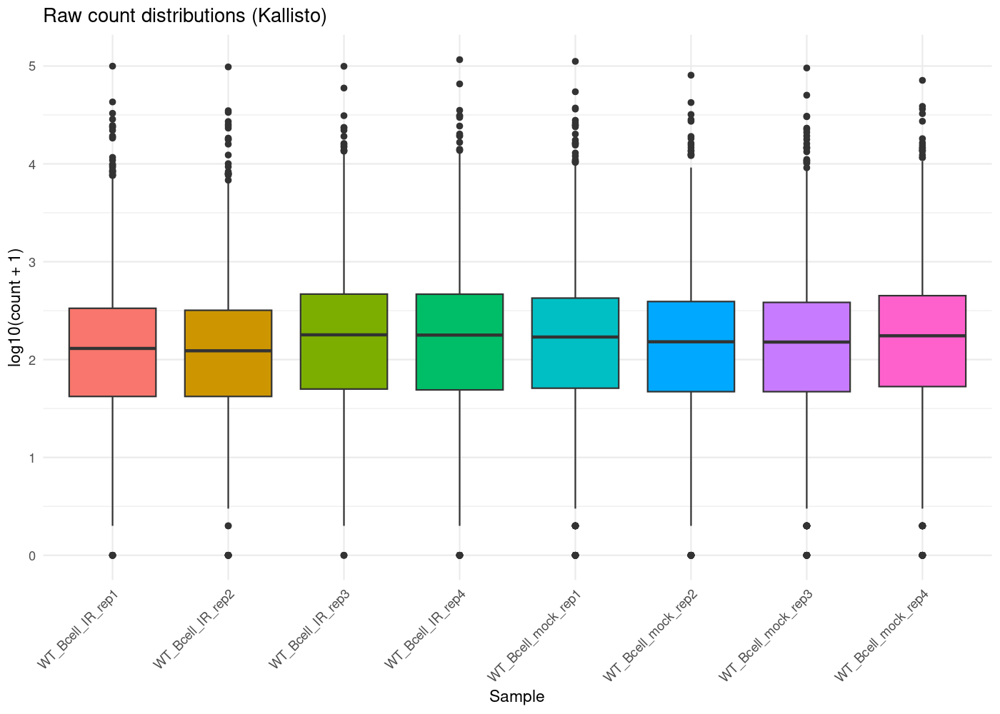
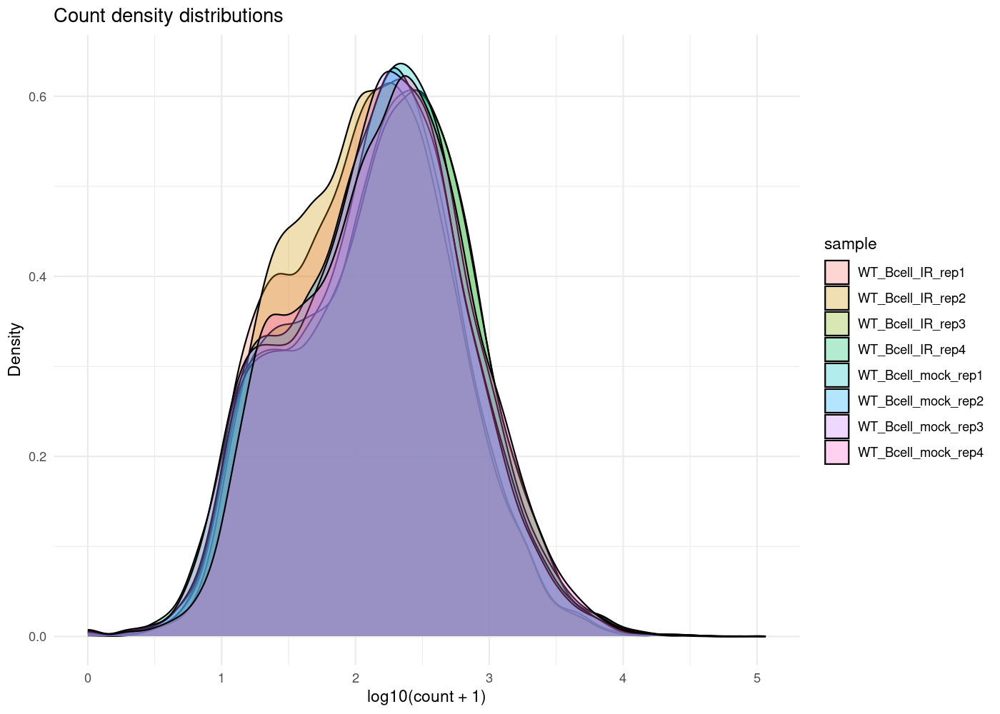
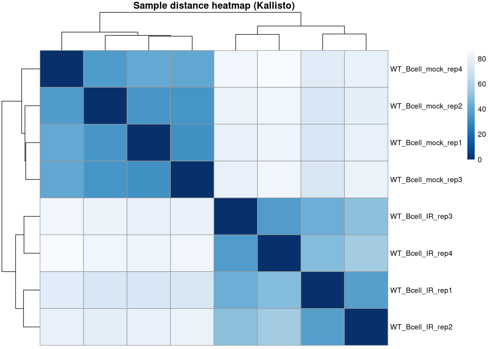
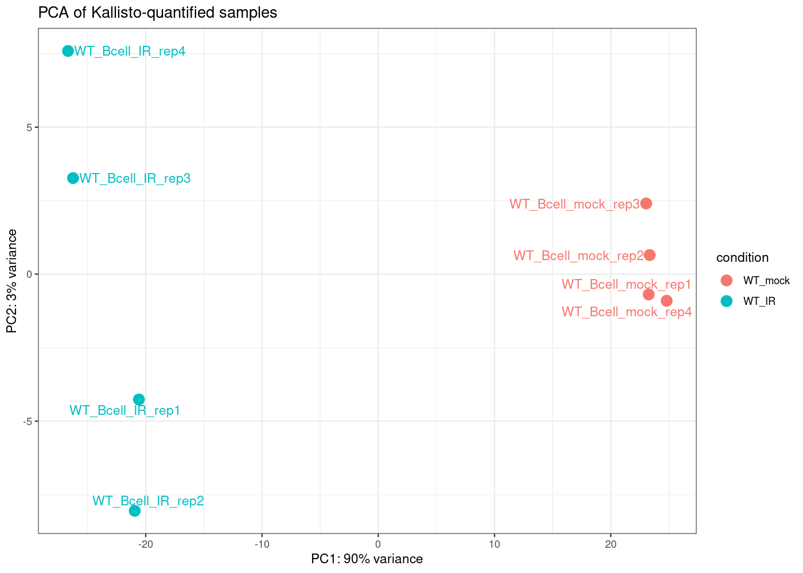
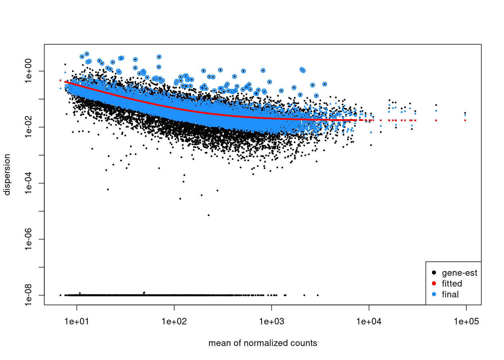
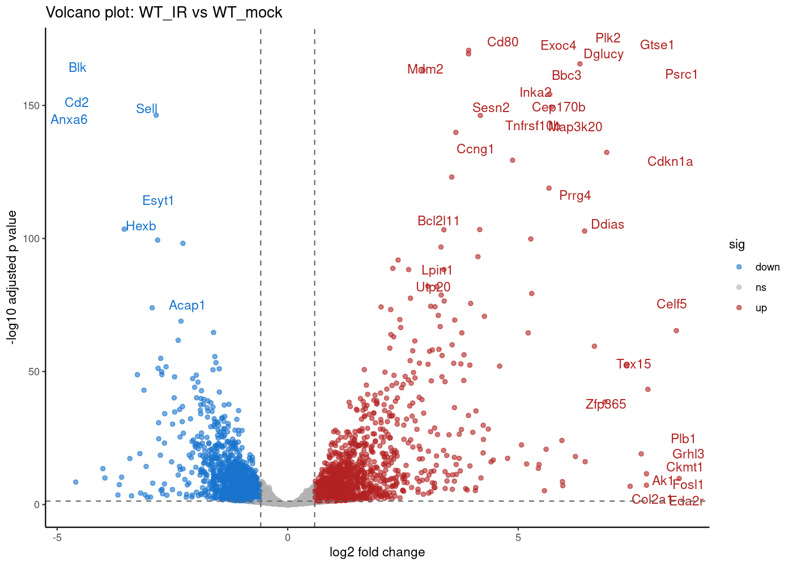

:::::::::::::::::::::::::::::::::::::: questions

- How do we import transcript-level quantification from Kallisto into DESeq2?
- What exploratory analyses should we perform before differential expression testing?
- How do we perform differential expression analysis with DESeq2 using tximport data?
- How do we visualize and interpret DE results from transcript-based quantification?
- What are the key differences between genome-based and transcript-based DE workflows?

::::::::::::::::::::::::::::::::::::::::::::::::

::::::::::::::::::::::::::::::::::::: objectives

- Load tximport data from Kallisto quantification into DESeq2.
- Perform quality control visualizations (boxplots, density plots, PCA).
- Apply variance stabilizing transformation for exploratory analysis.
- Run differential expression analysis with appropriate contrasts.
- Create volcano plots to visualize DE results.
- Export annotated DE results for downstream analysis.

::::::::::::::::::::::::::::::::::::::::::::::::


## Attribution

This section is adapted from materials developed by **Michael Gribskov**, Professor of Computational Genomics & Systems Biology at Purdue University.
 
Original and related materials are available via the **CGSB Wiki**:
<https://cgsb.miraheze.org/wiki/Main_Page>

## Introduction

In Episode 4B, we quantified transcript expression using **Kallisto** and summarized the results to gene-level counts using **tximport**. In this episode, we use those gene-level estimates for differential expression analysis with **DESeq2**.

The workflow follows the same general pattern as Episode 5A (genome-based), but with important differences:

1. **Input data**: We use the `txi` object from tximport rather than raw counts from featureCounts.
2. **Count handling**: Kallisto estimates are model-based (not integer counts), and DESeq2 handles this appropriately via `DESeqDataSetFromTximport()`.
3. **Bootstrap support**: if you run Kallisto with bootstraps (`-b`), the uncertainty estimates can be used with sleuth for transcript-level DE. DESeq2 does not use them, which is why Episode 4B runs with `-b 0`.

::::::::::::::::::::::::::::::::::::::: callout

## When to use this pathway

Use this transcript-based workflow when:

- You quantified with Salmon, Kallisto, or similar tools.
- You want to leverage transcript-level bias corrections.
- You did not generate BAM files and cannot use featureCounts.

The genome-based workflow (Episode 5A) is preferred when you have BAM files and need splice junction information or plan to visualize alignments.

:::::::::::::::::::::::::::::::::::::::

::::::::::::::::::::::::::::::::::::::: prereq

## What you need for this episode

- `txi.rds` file generated from tximport in Episode 4B
- A `samples.csv` file describing the experimental groups
- RStudio session via Open OnDemand

If you haven't created the sample metadata file, create `scripts/samples.csv` with:

```
sample,condition
WT_Bcell_mock_rep1,WT_mock
WT_Bcell_mock_rep2,WT_mock
WT_Bcell_mock_rep3,WT_mock
WT_Bcell_mock_rep4,WT_mock
WT_Bcell_IR_rep1,WT_IR
WT_Bcell_IR_rep2,WT_IR
WT_Bcell_IR_rep3,WT_IR
WT_Bcell_IR_rep4,WT_IR
```

The R code below creates the `results/deseq2_kallisto` directory for the output.

:::::::::::::::::::::::::::::::::::::::

## Step 1: Load packages and data

Start your RStudio session via Open OnDemand as described in Episode 5A, then load the required packages:

```r
library(DESeq2)
library(ggplot2)
library(reshape2)
library(pheatmap)
library(RColorBrewer)
library(ggrepel)
library(readr)
library(dplyr)
# Construct the path dynamically
work_dir <- file.path("/scratch/negishi", Sys.getenv("USER"), "rnaseq-workshop")
setwd(work_dir)
# output directory for this episode
dir.create("results/deseq2_kallisto", recursive = TRUE, showWarnings = FALSE)
```

Load the tximport object created in Episode 4B:

```r
txi <- readRDS("results/kallisto_quant/txi.rds")
```

Examine the structure of the tximport object:

```r
names(txi)
```

```text
[1] "abundance"           "counts"              "length"             
[4] "countsFromAbundance"
```

```r
head(txi$counts)
```

```text
                      WT_Bcell_IR_rep1 WT_Bcell_IR_rep2 WT_Bcell_IR_rep3
ENSMUSG00000000001.5         387.39815        329.43564        737.97318
ENSMUSG00000000003.16          0.00000          1.00000          0.00000
ENSMUSG00000000028.16         37.73844         23.20617         39.45979
ENSMUSG00000000031.20          2.00000          1.00000          1.00000
ENSMUSG00000000037.18          2.00000          4.00000          3.00000
ENSMUSG00000000049.12          0.00000          0.00000          1.00000
                      WT_Bcell_IR_rep4 WT_Bcell_mock_rep1 WT_Bcell_mock_rep2
ENSMUSG00000000001.5         654.17550           687.1189          620.35065
ENSMUSG00000000003.16          0.00000             0.0000            0.00000
ENSMUSG00000000028.16         29.71743            55.0000           39.20456
ENSMUSG00000000031.20          0.00000             0.0000            0.00000
ENSMUSG00000000037.18          8.00000             1.0000            1.00000
ENSMUSG00000000049.12          0.00000             0.0000            2.00000
                      WT_Bcell_mock_rep3 WT_Bcell_mock_rep4
ENSMUSG00000000001.5            661.3541          704.88506
ENSMUSG00000000003.16             0.0000            0.00000
ENSMUSG00000000028.16            40.0984           41.44387
ENSMUSG00000000031.20             0.0000            0.00000
ENSMUSG00000000037.18             2.0000            1.00000
ENSMUSG00000000049.12             0.0000            1.00000
```

::::::::::::::::::::::::::::::::::::::: callout

## Understanding the tximport object

The `txi` object contains several components:

- **counts**: Gene-level estimated counts (used by DESeq2).
- **abundance**: Gene-level TPM values (within-sample normalized).
- **length**: Average transcript length per gene (used for length bias correction).
- **countsFromAbundance**: Method used to generate counts (default: `"no"`).

When using `DESeqDataSetFromTximport()`, the `length` matrix is automatically used to correct for gene-length bias during normalization. This is why we use the default `countsFromAbundance = "no"` in Episode 4B—DESeq2 handles length correction internally, so pre-scaling counts would apply the correction twice.

:::::::::::::::::::::::::::::::::::::::

Load sample metadata:

```r
coldata <- read.csv(
    "scripts/samples.csv",
    row.names = 1,
    header = TRUE,
    stringsAsFactors = TRUE
)
coldata$condition <- as.factor(coldata$condition)
# make WT_mock the reference (denominator) level, as in Episode 5A
coldata$condition <- relevel(coldata$condition, ref = "WT_mock")
coldata <- coldata[colnames(txi$counts), , drop = FALSE]
coldata
```

```text
                   condition
WT_Bcell_IR_rep1       WT_IR
WT_Bcell_IR_rep2       WT_IR
WT_Bcell_IR_rep3       WT_IR
WT_Bcell_IR_rep4       WT_IR
WT_Bcell_mock_rep1   WT_mock
WT_Bcell_mock_rep2   WT_mock
WT_Bcell_mock_rep3   WT_mock
WT_Bcell_mock_rep4   WT_mock
```

Verify that sample names match between tximport and metadata:

```r
all(colnames(txi$counts) == rownames(coldata))
```

```text
[1] TRUE
```

## Step 2: Create DESeq2 object from tximport

The key difference from the genome-based workflow is using `DESeqDataSetFromTximport()` instead of `DESeqDataSetFromMatrix()`:

```r
dds <- DESeqDataSetFromTximport(
    txi,
    colData = coldata,
    design = ~ condition
)
```

::::::::::::::::::::::::::::::::::::::: callout

## Why use DESeqDataSetFromTximport?

This function:

- Automatically handles non-integer counts from Salmon/Kallisto.
- Preserves transcript length information for accurate normalization.
- Incorporates the `txi$length` matrix to account for gene-length bias.

Using `DESeqDataSetFromMatrix()` with tximport counts would lose this information.

:::::::::::::::::::::::::::::::::::::::

Keep protein-coding genes, as in Episode 5A, so that both tracks test the same kind of genes and their results can be compared directly. Load the gene annotation tables copied with the workshop data (the same files as in Episode 5A; its "How were these data prepared?" spoiler shows how they were made):

```r
mart <-
  read.csv(
    "data/mart.tsv",
    sep = "\t",
    header = TRUE
  )

annot <-
  read.csv(
    "data/annot.tsv",
    sep = "\t",
    header = TRUE
  )

protein_coding <- mart$ensembl_gene_id_version[mart$gene_biotype == "protein_coding"]
dds <- dds[rownames(dds) %in% protein_coding, ]
```

Then filter lowly expressed genes using group-aware filtering:

```r
# Group-aware filtering: keep genes with >= 10 counts in at least 4 samples
# (the size of the smallest experimental group)
min_samples <- 4
min_counts <- 10
keep <- rowSums(counts(dds) >= min_counts) >= min_samples
dds <- dds[keep, ]
dim(dds)
```

```text
[1] 12768     8
```

::::::::::::::::::::::::::::::::::::::: callout

## Why use group-aware filtering?

A simple sum filter (`rowSums(counts(dds)) >= 10`) can be problematic:

- A gene with 10 total counts across 8 samples averages ~1.25 counts/sample—too low to be informative.
- It may remove genes expressed in only one condition (biologically interesting!).

Group-aware filtering (`rowSums(counts >= threshold) >= min_group_size`) ensures:

- Each kept gene has meaningful expression in at least one experimental group.
- Genes with condition-specific expression are retained.
- The threshold is interpretable (e.g., "at least 10 counts in at least 4 samples").

:::::::::::::::::::::::::::::::::::::::

Estimate size factors:

```r
dds <- estimateSizeFactors(dds)
head(normalizationFactors(dds))
```

```text
using 'avgTxLength' from assays(dds), correcting for library size
                      WT_Bcell_IR_rep1 WT_Bcell_IR_rep2 WT_Bcell_IR_rep3
ENSMUSG00000000001.5         0.8537247        0.8469403         1.126820
ENSMUSG00000000028.16        0.9221633        0.6861075         1.193100
ENSMUSG00000000056.8         0.9521929        1.0820695         1.132853
ENSMUSG00000000078.8         0.9499078        0.8589537         1.212266
ENSMUSG00000000085.17        0.8137271        0.6687624         1.202663
ENSMUSG00000000088.8         0.8598602        0.9017598         1.051854
                      WT_Bcell_IR_rep4 WT_Bcell_mock_rep1 WT_Bcell_mock_rep2
ENSMUSG00000000001.5          1.168215           1.042938          0.9615182
ENSMUSG00000000028.16         1.145844           1.054745          1.0064376
ENSMUSG00000000056.8          1.148567           1.236721          0.8908183
ENSMUSG00000000078.8          1.177931           1.000095          0.9125703
ENSMUSG00000000085.17         1.255550           1.264048          0.9614268
ENSMUSG00000000088.8          1.116178           1.025893          0.9896438
                      WT_Bcell_mock_rep3 WT_Bcell_mock_rep4
ENSMUSG00000000001.5           0.9378961          1.1170726
ENSMUSG00000000028.16          0.9312717          1.1694632
ENSMUSG00000000056.8           0.7157949          0.9458896
ENSMUSG00000000078.8           0.9205824          1.0215522
ENSMUSG00000000085.17          0.8347515          1.1995943
ENSMUSG00000000088.8           0.9490056          1.1400986
```

## Step 3: Exploratory data analysis

### Raw count distributions

Visualize the distribution of raw counts across samples:

```r
counts_melted <- melt(
    log10(counts(dds) + 1),
    varnames = c("gene", "sample"),
    value.name = "log10_count"
)

ggplot(counts_melted, aes(x = sample, y = log10_count, fill = sample)) +
    geom_boxplot(show.legend = FALSE) +
    theme_minimal() +
    labs(
        x = "Sample",
        y = "log10(count + 1)",
        title = "Raw count distributions (Kallisto)"
    ) +
    theme(axis.text.x = element_text(angle = 45, hjust = 1))
```

<div class="figure" style="text-align: center">

<p class="caption">Raw count distributions</p>
</div>


Density plot of raw counts:

```r
ggplot(counts_melted, aes(x = log10_count, fill = sample)) +
    geom_density(alpha = 0.3) +
    theme_minimal() +
    labs(
        x = "log10(count + 1)",
        y = "Density",
        title = "Count density distributions"
    )
```

<div class="figure" style="text-align: center">

<p class="caption">Count density distributions</p>
</div>


### Variance stabilizing transformation

Apply VST for exploratory analysis:

```r
vsd <- vst(dds, blind = TRUE)
```

::::::::::::::::::::::::::::::::::::::: callout

## Why use VST?

Raw counts have a strong mean-variance relationship: highly expressed genes have higher variance. VST removes this dependency, making distance-based methods (PCA, clustering) more reliable.

Setting `blind = TRUE` ensures the transformation is not influenced by the experimental design, which is appropriate for quality control.

:::::::::::::::::::::::::::::::::::::::

### Sample-to-sample distances

```r
sampleDists <- dist(t(assay(vsd)))
sampleDistMatrix <- as.matrix(sampleDists)
rownames(sampleDistMatrix) <- colnames(vsd)
colnames(sampleDistMatrix) <- NULL
colors <- colorRampPalette(rev(brewer.pal(9, "Blues")))(255)

pheatmap(
    sampleDistMatrix,
    clustering_distance_rows = sampleDists,
    clustering_distance_cols = sampleDists,
    col = colors,
    main = "Sample distance heatmap (Kallisto)"
)
```

<div class="figure" style="text-align: center">

<p class="caption">Sample distance heatmap</p>
</div>


The distance heatmap shows how similar samples are to each other. Samples from the same condition should cluster together.

### PCA plot

```r
pcaData <- plotPCA(vsd, intgroup = "condition", returnData = TRUE)
percentVar <- round(100 * attr(pcaData, "percentVar"))

ggplot(pcaData, aes(PC1, PC2, color = condition)) +
    geom_point(size = 4) +
    geom_text_repel(aes(label = name)) +
    xlab(paste0("PC1: ", percentVar[1], "% variance")) +
    ylab(paste0("PC2: ", percentVar[2], "% variance")) +
    theme_bw() +
    ggtitle("PCA of Kallisto-quantified samples")
```

<div class="figure" style="text-align: center">

<p class="caption">PCA plot of Kallisto-quantified samples</p>
</div>

::::::::::::::::::::::::::::::::::::::: challenge

## Exercise: Interpret exploratory plots

Using the distance heatmap and PCA plot:

1. Do samples cluster by experimental condition?
2. Are there any outlier samples that don't group with their replicates?
3. How much variance is explained by PC1? What might this represent biologically?

::::::::::::::::::::::::::::::::::: solution

Interpretation for this dataset:

1. Yes. The heatmap and the PCA both separate the mock and IR samples.
2. No. Each sample groups with its own condition. Within the IR group, IR_rep3 and IR_rep4 sit apart from IR_rep1 and IR_rep2 on PC2 (3 percent of the variance), the same read-quality pattern seen in Episode 5A.
3. PC1 explains 90 percent of the variance and separates IR from mock: the radiation response is by far the largest signal in the data.

:::::::::::::::::::::::::::::::::::

:::::::::::::::::::::::::::::::::::::::

## Step 4: Differential expression analysis

Run the full DESeq2 pipeline:

```r
dds <- DESeq(dds)
```

```text
using pre-existing normalization factors
estimating dispersions
gene-wise dispersion estimates
mean-dispersion relationship
final dispersion estimates
fitting model and testing
```

"Using pre-existing normalization factors" refers to the gene-specific factors that `estimateSizeFactors()` computed above from the tximport transcript lengths.

Inspect dispersion estimates:

```r
plotDispEsts(dds)
```

<div class="figure" style="text-align: center">

<p class="caption">Dispersion estimates from DESeq2 (Kallisto pathway)</p>
</div>


::::::::::::::::::::::::::::::::::::::: callout

## Interpreting the dispersion plot

- **Black dots**: Gene-wise dispersion estimates.
- **Red line**: Fitted trend (shrinkage target).
- **Blue dots**: Final shrunken estimates.

A good fit shows the red line passing through the center of the black cloud, with blue dots closer to the line than the original black dots.

:::::::::::::::::::::::::::::::::::::::

Extract results for the contrast of interest, naming the numerator (`WT_IR`) and denominator (`WT_mock`) explicitly so that positive log2 fold changes mean higher after IR (see "Name your contrast" in Episode 5A):

```r
res <- results(
    dds,
    contrast = c("condition", "WT_IR", "WT_mock")
)

summary(res)
```

```text
out of 12768 with nonzero total read count
adjusted p-value < 0.1
LFC > 0 (up)       : 2942, 23%
LFC < 0 (down)     : 2858, 22%
outliers [1]       : 3, 0.023%
low counts [2]     : 0, 0%
(mean count < 7)
[1] see 'cooksCutoff' argument of ?results
[2] see 'independentFiltering' argument of ?results
```

Order results by adjusted p-value:

```r
res_ordered <- res[order(res$padj), ]
head(res_ordered)
```

Output:

```text
log2 fold change (MLE): condition WT_IR vs WT_mock 
Wald test p-value: condition WT IR vs WT mock 
DataFrame with 6 rows and 6 columns
                       baseMean log2FoldChange     lfcSE      stat       pvalue
                      <numeric>      <numeric> <numeric> <numeric>    <numeric>
ENSMUSG00000021668.16   969.739        3.93425  0.139284   28.2462 1.58373e-175
ENSMUSG00000030609.19  1614.126        3.93126  0.139829   28.1148 6.45948e-174
ENSMUSG00000021701.9   1025.821        6.35432  0.228657   27.7897 5.77184e-170
ENSMUSG00000020184.16  1787.889        2.94186  0.106658   27.5823 1.81422e-167
ENSMUSG00000048458.9    791.676        5.69856  0.212540   26.8118 2.35666e-158
ENSMUSG00000002083.14   464.032        5.73884  0.217511   26.3842 2.08072e-153
                              padj
                         <numeric>
ENSMUSG00000021668.16 2.02163e-171
ENSMUSG00000030609.19 4.12276e-170
ENSMUSG00000021701.9  2.45592e-166
ENSMUSG00000020184.16 5.78964e-164
ENSMUSG00000048458.9  6.01656e-155
ENSMUSG00000002083.14 4.42674e-150
```

### Apply log fold change shrinkage

LFC shrinkage improves estimates for genes with low counts or high dispersion.

First, check the available coefficients:

```r
resultsNames(dds)
```

```text
[1] "Intercept"                  "condition_WT_IR_vs_WT_mock"
```

Apply shrinkage using `apeglm` (recommended for standard contrasts):

```r
res_shrunk <- lfcShrink(
    dds,
    coef = "condition_WT_IR_vs_WT_mock",
    type = "apeglm"
)
```

::::::::::::::::::::::::::::::::::::::: callout

## Why shrink log fold changes?

Genes with low counts can have unreliably large fold changes. Shrinkage:

- Reduces noise in LFC estimates.
- Improves ranking for downstream analyses (e.g., GSEA).
- Does not affect p-values or significance calls.
:::::::::::::::::::::::::::::::::::::::

::::::::::::::::::::::::::::::::::::::: callout

## Choosing a shrinkage method

- **`apeglm`** (recommended): Fast, well-calibrated, uses coefficient name (`coef`).
- **`ashr`**: Required for complex contrasts that can't be specified with `coef` (e.g., interaction terms).
- **`normal`**: Legacy method, generally not recommended.

For simple two-group comparisons like ours, `apeglm` is preferred.

:::::::::::::::::::::::::::::::::::::::

## Step 5: Summarize and visualize results

Create a summary table:

```r
log2fc_cut <- log2(1.5)

res_df <- as.data.frame(res_shrunk)
res_df$ensembl_gene_id_version <- rownames(res_df)

summary_table <- tibble(
    total_genes = nrow(res_df),
    sig = sum(res_df$padj < 0.05, na.rm = TRUE),
    up = sum(res_df$padj < 0.05 & res_df$log2FoldChange > log2fc_cut, na.rm = TRUE),
    down = sum(res_df$padj < 0.05 & res_df$log2FoldChange < -log2fc_cut, na.rm = TRUE)
)

print(summary_table)
```
output:

```text
# A tibble: 1 × 4
  total_genes   sig    up  down
        <int> <int> <int> <int>
1       12768  5086  1740  1672
```

We attach the annotation loaded in Step 2 so that results are interpretable. Join the shrunken DE results (`res_df`, built above) with it:

```r
res_annot <- res_df %>%
  dplyr::left_join(mart,
                   by = "ensembl_gene_id_version")
```

Joining the annotation makes the output biologically interpretable.
The final table contains:

- `gene identifiers`
- `gene symbols`
- `functional descriptions`
- `differential expression statistics`

This is the format most researchers expect when examining results or importing them into downstream tools.

Define significance labels for plotting:

```r
log2fc_cut <- log2(1.5)

res_annot <- res_annot %>%
  dplyr::mutate(
    label = dplyr::coalesce(external_gene_name, ensembl_gene_id_version),
    sig = dplyr::case_when(
      padj <= 0.05 & log2FoldChange >=  log2fc_cut ~ "up",
      padj <= 0.05 & log2FoldChange <= -log2fc_cut ~ "down",
      TRUE ~ "ns"
    )
  )
```


### Volcano plot

```r
ggplot(
  res_annot,
  aes(
    x     = log2FoldChange,
    y     = -log10(padj),
    col   = sig,
    label = label
  )
) +
  geom_point(alpha = 0.6) +
  scale_color_manual(values = c(
    "up"   = "firebrick",
    "down" = "dodgerblue3",
    "ns"   = "grey70"
  )) +
  geom_text_repel(
    data = dplyr::filter(res_annot, sig != "ns"),
    max.overlaps       = 12,
    min.segment.length = Inf,
    box.padding        = 0.3,
    seed               = 42,
    show.legend        = FALSE
  ) +
  geom_hline(yintercept = -log10(0.05), linetype = "dashed", color = "grey40") +
  geom_vline(xintercept = c(-log2fc_cut, log2fc_cut), linetype = "dashed", color = "grey40") +
  theme_classic() +
  xlab("log2 fold change") +
  ylab("-log10 adjusted p value") +
  ggtitle("Volcano plot: WT_IR vs WT_mock")
```

<div class="figure" style="text-align: center">

<p class="caption">Volcano plot of differential expression results</p>
</div>


::::::::::::::::::::::::::::::::::::::: callout

## Interpreting the volcano plot

- **X-axis**: Direction and magnitude of change (positive = higher in WT_IR, i.e., upregulated by radiation).
- **Y-axis**: Statistical significance (-log10 scale, higher = more significant).
- **Colored points**: Genes passing both fold change and significance thresholds.

:::::::::::::::::::::::::::::::::::::::

::::::::::::::::::::::::::::::::::::::: challenge

## Exercise: Compare with genome-based results

If you also ran Episode 5A (genome-based workflow):

1. Are the number of DE genes similar between the two approaches?
2. Do the top DE genes overlap?
3. Are there systematic differences in fold change estimates?

::::::::::::::::::::::::::::::::::: solution

Observations for this dataset (padj at most 0.05 and fold change at least 1.5):

1. Similar: 3,598 significant genes on the genome track and 3,412 on the Kallisto track, 2,795 of them in both.
2. Largely: 38 of the 50 genes with the smallest padj are the same on both tracks, and the canonical p53 targets (*Cdkn1a*, *Mdm2*, *Bax*, *Bbc3*, *Pmaip1*) are strongly upregulated on both.
3. The fold changes agree well (Spearman correlation 0.93 over the 11,289 genes tested on both tracks); the differences come from how each method handles reads shared between genes and isoforms.

Both approaches are valid; consistency between them increases confidence in the results.

:::::::::::::::::::::::::::::::::::

:::::::::::::::::::::::::::::::::::::::

## Step 6: Save results

Save the full results table:

```r
write_tsv(
    res_annot,
    "results/deseq2_kallisto/DESeq2_kallisto_results.tsv"
)
```

Episode 6 can start from this file instead of the Episode 5A table; it has the same `ensembl_gene_id_version`, `log2FoldChange`, `pvalue`, and `padj` columns.

Save significant genes only:

```r
sig_res <- res_annot %>%
    filter(
        padj <= 0.05,
        abs(log2FoldChange) >= log2fc_cut
    )

write_tsv(
    sig_res,
    "results/deseq2_kallisto/DESeq2_kallisto_sig.tsv"
)
```

Save the DESeq2 object for downstream analysis:

```r
saveRDS(dds, "results/deseq2_kallisto/dds_kallisto.rds")
```

::::::::::::::::::::::::::::::::::::::: discussion

## Genome-based vs. transcript-based: Which to choose?

| Aspect | Genome-based (Ep 5A) | Transcript-based (Ep 5B) |
|--------|---------------------|--------------------------|
| Input | BAM files | FASTQ files |
| Speed | Slower (alignment + counting) | Faster (pseudo-alignment) |
| Storage | Large (BAM files) | Small (abundance.tsv files) |
| Bias correction | Limited | Sequence + GC bias |
| Novel transcripts | Can detect | Cannot detect |
| Visualization | IGV compatible | No BAM files |

For standard differential expression, both methods produce comparable results. Choose based on your specific needs and available resources.

:::::::::::::::::::::::::::::::::::::::

## Summary

::::::::::::::::::::::::::::::::::::: keypoints

- Kallisto output is imported via `tximport` and loaded with `DESeqDataSetFromTximport()`.
- The tximport object preserves transcript length information for accurate normalization.
- Exploratory analysis (PCA, distance heatmaps) should precede differential expression testing.
- DESeq2 handles the statistical analysis identically to the genome-based workflow.
- LFC shrinkage improves fold change estimates for low-count genes.
- Results from transcript-based and genome-based workflows should be broadly concordant.

::::::::::::::::::::::::::::::::::::::::::::::::
