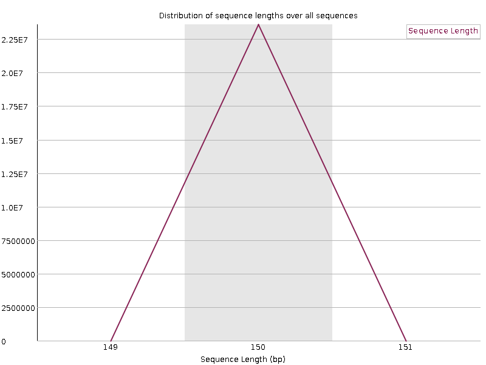
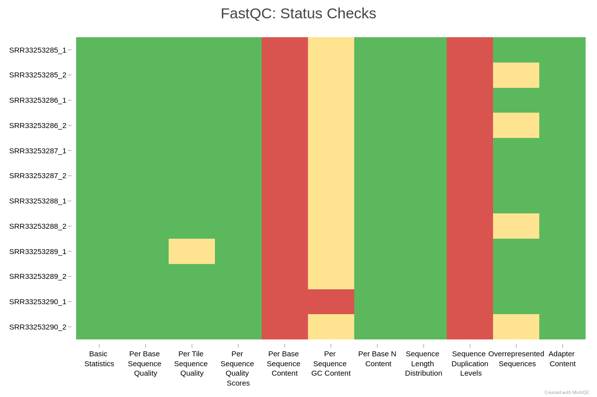

:::::::::::::::::::::::::::::::::::::: questions

- How do we check the quality of raw RNA-seq reads?
- What information do FastQC and MultiQC provide?
- How do we decide if trimming is required?
- What QC issues are common in Illumina RNA-seq data?

::::::::::::::::::::::::::::::::::::::::::::::::

::::::::::::::::::::::::::::::::::::: objectives

- Run FastQC and MultiQC on RNA-seq FASTQ files.
- Understand how to interpret the important FastQC modules.
- Learn which FastQC warnings are expected for RNA-seq.
- Understand why trimming is usually unnecessary for standard RNA-seq.
- Identify samples that may require closer inspection.

::::::::::::::::::::::::::::::::::::::::::::::::

## Introduction

Before mapping reads to a genome, it is important to evaluate the quality of the raw RNA-seq data.  
Quality control helps reveal problems such as adapter contamination, low quality cycles, and unexpected technical issues.  

In this episode, we will run FastQC and MultiQC on the p53/ionizing radiation dataset and interpret the results.  
We will also explain when trimming is useful and when it can be harmful for alignment based RNA-seq workflows.

FastQC evaluates individual FASTQ files. MultiQC summarizes all FastQC reports into one view, which is helpful for comparing replicates.

::::::::::::::::::::::::::::::::::::::: callout

## Why do we perform QC on FASTQ files?

Quality control answers several questions:  

- Are sequencing qualities stable across cycles?  
- Are adapters present at high levels?  
- Do different replicates show similar patterns?  
- Are there outliers that indicate failed libraries?

QC provides confidence that downstream steps will be reliable.

:::::::::::::::::::::::::::::::::::::::

## Running FastQC

FastQC generates an HTML report for each FASTQ file. For paired-end datasets, you can run it on both R1 and R2 together or separately.

We will create a directory for QC output and then run FastQC on all FASTQ files.

### Run FastQC on your FASTQ files

Use the commands below to run FastQC on all reads in the `data` directory.

```bash
cd $SCRATCH/rnaseq-workshop
mkdir -p results/qc_fastq/

sinteractive -A workshop -p cpu -N 1 -n 4 --time=1:00:00
module load biocontainers
module load fastqc

fastqc data/*.fastq.gz --outdir results/qc_fastq/ --threads 4
````

```bash
qc
├── WT_Bcell_mock_rep1_R1_fastqc.html
├── WT_Bcell_mock_rep1_R1_fastqc.zip
├── WT_Bcell_mock_rep1_R2_fastqc.html
├── WT_Bcell_mock_rep1_R2_fastqc.zip
├── WT_Bcell_mock_rep2_R1_fastqc.html
├── WT_Bcell_mock_rep2_R1_fastqc.zip
├── WT_Bcell_mock_rep2_R2_fastqc.html
├── WT_Bcell_mock_rep2_R2_fastqc.zip
├── WT_Bcell_mock_rep3_R1_fastqc.html
├── WT_Bcell_mock_rep3_R1_fastqc.zip
├── WT_Bcell_mock_rep3_R2_fastqc.html
├── WT_Bcell_mock_rep3_R2_fastqc.zip
├── WT_Bcell_mock_rep4_R1_fastqc.html
├── WT_Bcell_mock_rep4_R1_fastqc.zip
├── WT_Bcell_mock_rep4_R2_fastqc.html
├── WT_Bcell_mock_rep4_R2_fastqc.zip
├── WT_Bcell_IR_rep1_R1_fastqc.html
├── WT_Bcell_IR_rep1_R1_fastqc.zip
├── WT_Bcell_IR_rep1_R2_fastqc.html
├── WT_Bcell_IR_rep1_R2_fastqc.zip
├── WT_Bcell_IR_rep2_R1_fastqc.html
├── WT_Bcell_IR_rep2_R1_fastqc.zip
├── WT_Bcell_IR_rep2_R2_fastqc.html
├── WT_Bcell_IR_rep2_R2_fastqc.zip
├── WT_Bcell_IR_rep3_R1_fastqc.html
├── WT_Bcell_IR_rep3_R1_fastqc.zip
├── WT_Bcell_IR_rep3_R2_fastqc.html
├── WT_Bcell_IR_rep3_R2_fastqc.zip
├── WT_Bcell_IR_rep4_R1_fastqc.html
├── WT_Bcell_IR_rep4_R1_fastqc.zip
├── WT_Bcell_IR_rep4_R2_fastqc.html
└── WT_Bcell_IR_rep4_R2_fastqc.zip
```

## Understanding the FastQC report

FastQC produces several diagnostic modules. RNA-seq users often misinterpret certain modules, so we focus on the ones that matter most.

::::::::::::::::::::::::::::::::::::::: callout

## Which FastQC modules are important for RNA-seq?

Most informative modules:

- Per base sequence quality
- Per sequence quality scores
- Per base sequence content
- Per sequence GC content
- Adapter content
- Overrepresented sequences

Modules that commonly show warnings for RNA-seq, even when libraries are fine:

- Per sequence GC content (RNA-seq reflects transcript GC bias, not whole genome)
- K-mer content (poly A tails and priming artifacts often trigger warnings)

Warnings do not always indicate problems. Context and comparison across samples matter more than individual icons.

:::::::::::::::::::::::::::::::::::::::

## Key modules explained

Below are guidelines for interpreting the most useful modules.

### Per base sequence quality

Shows the distribution of quality scores at each position across all reads.
You want high and stable quality across the read. A small quality drop at the end of R2 is common and usually not a problem.

```{r, fig.cap="Per base sequence quality for a typical RNA-seq dataset", echo=FALSE, message=FALSE}
knitr::include_graphics("fig/02_qc/fastqc_sequence_quality_histogram.png")
```

### Per tile sequence quality

Reports whether specific regions of the flowcell produced lower quality reads.
Uneven tiles can indicate instrument issues or bubble formation, but this module rarely shows problems in modern Illumina data.

```{r, fig.cap="Per tile sequence quality plot", echo=FALSE, message=FALSE}
knitr::include_graphics("fig/02_qc/fastqc_per_base_sequence_content.png")


```

### Per sequence quality scores

Shows how many reads have high or low overall quality.
A good dataset has most reads with high scores and very few reads with low quality.

```{r, fig.cap="Distribution of per sequence quality scores", echo=FALSE, message=FALSE}
knitr::include_graphics("fig/02_qc/fastqc_per_sequence_quality_score.png")
```

### Per base sequence content

Shows the proportion of A, C, G, and T at each cycle.
For genomic resequencing, all four lines should be close to 25 percent.
RNA-seq usually shows imbalanced composition in early cycles due to biased priming and transcript composition. Mild imbalance at the start of the read is normal and does not require trimming.

```{r, fig.cap="Per base sequence content for RNA-seq reads", echo=FALSE, message=FALSE}
knitr::include_graphics("fig/02_qc/fastqc_per_base_atgc_content.png")
```

### Per sequence GC content

Shows the GC distribution across all reads.
RNA-seq often fails this test because expressed transcripts are not GC neutral. Only pronounced multi-modal or extremely shifted distributions are concerning, for example when contamination from another organism is suspected.

```{r, fig.cap="Per sequence GC content distribution", echo=FALSE, message=FALSE}
knitr::include_graphics("fig/02_qc/fastqc_per_sequence_GC_content.png")
```

### Per base N content

Reports the percentage of unidentified bases (N) at each position.
This should be near zero for modern Illumina runs. High N content indicates failed cycles or poor sequencing chemistry.

```{r, fig.cap="Per base N content plot", echo=FALSE, message=FALSE}
knitr::include_graphics("fig/02_qc/fastqc_per_base_n_content.png")
```

### Sequence length distribution

Shows the distribution of read lengths.
Standard RNA-seq libraries should have a narrow peak at the expected read length. Variable lengths usually appear after trimming or for specialized protocols such as small RNA.

```{r, fig.cap="Sequence length distribution for RNA-seq data", echo=FALSE, message=FALSE}

```

### Sequence duplication levels

Reports how many reads are exact duplicates.
Some duplication is normal in RNA-seq because highly expressed genes produce many identical fragments. Very high duplication, especially combined with low library size, can indicate low library complexity or overamplification.

```{r, fig.cap="Sequence duplication levels", echo=FALSE, message=FALSE}
knitr::include_graphics("fig/02_qc/fastqc_sequence_duplication_level.png")
```

### Overrepresented sequences

Lists specific sequences that occur more often than expected.
Common sources include ribosomal RNA fragments, poly A tails, adapter sequence, or reads from highly expressed transcripts. Some overrepresented sequences are expected, but very high levels may indicate contamination or poor rRNA depletion.

### Adapter content

Shows whether any read cycles contain adapter sequences.
Small amounts at the extreme ends are common and usually harmless. Consistently high adapter content across many cycles suggests short inserts or poorly prepared libraries.

```{r, fig.cap="Adapter content across the read", echo=FALSE, message=FALSE}
knitr::include_graphics("fig/02_qc/fastqc_adapter_content.png")
```


## Aggregating reports with MultiQC

FastQC generates a separate HTML file per sample. MultiQC consolidates all reports and allows easy comparison of replicates.

### Run MultiQC on the FastQC outputs

Generate a single combined report using MultiQC.

```bash
cd rnaseq-workshop
module load biocontainers
module load multiqc

cd $SCRATCH/rnaseq-workshop
multiqc results/qc_fastq/ -o results/qc_fastq/
```

```{r, fig.cap="Example MultiQC summary across all samples", echo=FALSE, message=FALSE}

```

## Trimming adapter sequences

Before deciding whether to trim reads, it is essential to understand what adapters are and why they appear in sequencing data.

Adapters are short synthetic DNA sequences ligated to both ends of each fragment during library preparation. They provide primer binding sites needed for cluster amplification and sequencing. Ideally, the sequenced fragment is long enough that the machine reads only biological DNA. However, when the insert is shorter than the read length, the sequencer runs into the adapter sequence, which produces adapter contamination at the ends of reads.

Many users assume that adapters must always be trimmed, but this is not true for typical RNA-seq workflows.

::::::::::::::::::::::::::::::::::::::: discussion

## Do we need to trim reads for standard RNA-seq workflows?

For alignment based RNA-seq, adapter trimming is usually not required.
Modern aligners such as HISAT2 and STAR detect and soft clip adapter sequence automatically. Soft-clipped bases do not contribute to mismatches or mapping penalties, so adapters generally do not harm alignment quality.

In contrast, unnecessary trimming can introduce new problems:

- shorter reads and lower mapping power
- uneven trimming across samples and artificial differences
- reduction in read complexity
- broken read pairing for paired-end sequencing
- more parameters to track for reproducibility

Trimming is recommended only in specific situations:

- very short inserts, for example degraded RNA or ancient DNA
- adapter sequence dominating read tails, for example more than 10-15 percent adapter content
- transcript assembly workflows such as StringTie or Scallop, which benefit from uniform read lengths
- small RNA or miRNA libraries, where inserts are intentionally very short and adapter presence is guaranteed

:::::::::::::::::::::::::::::::::::::::

## Exercise: evaluate the QC results

::::::::::::::::::::::::::::::::::::::: challenge

### Inspect your MultiQC report

Using the MultiQC HTML report, answer:

1. Do all replicates show similar per base sequence quality profiles?
2. Is adapter content high enough to impact analysis?
3. Is any sample behaving differently from the rest, for example in number of reads, quality, duplication, or GC percentage?

::::::::::::::::::::::::::::::::::: solution

Typical interpretation for this dataset (students should compare with their own):

- All replicates show high, stable sequence quality.
- Adapter signal appears only at the extreme ends of reads for selected samples and is less than 4 percent.
- No samples show concerning patterns or biases.
- Trimming is therefore unnecessary for this dataset.

:::::::::::::::::::::::::::::::::::

:::::::::::::::::::::::::::::::::::::::


:::::::::::::::::::::::::::::::::::::::::: spoiler

## What if trimming is required?

*Optional reference: how to trim adapters with `fastp` (not part of the hands-on)*

Sometimes you may encounter datasets where trimming is appropriate, for example short inserts, small RNA, or visibly high adapter content in QC. Although we will not trim reads in this workshop, here is a minimal example you can use in your own projects if trimming becomes necessary.

`fastp` is a fast, widely used tool that can automatically detect adapters, trim them, filter low quality reads, and generate QC reports.

### Example: trimming paired-end reads with `fastp`

```bash
module load biocontainers
module load fastp

fastp \
  -i SRRXXXXXXX_1.fastq.gz \
  -I SRRXXXXXXX_2.fastq.gz \
  -o SRRXXXXXXX_1.trimmed.fastq.gz \
  -O SRRXXXXXXX_2.trimmed.fastq.gz \
  --detect_adapter_for_pe \
  --thread 8 \
  --html fastp_report.html \
  --json fastp_report.json
```

### What this command does

- automatically detects adapters (`--detect_adapter_for_pe`)
- trims low quality bases (default behaviour)
- keeps paired-end reads synchronized
- writes trimmed output (`*.trimmed.fastq.gz`)
- generates QC reports (HTML and JSON)

### When to use this

Use trimming only if:

- QC shows strong adapter presence
- your library prep is known to produce short inserts
- you are working with small RNA or degraded RNA
- you are doing transcript assembly where uniform read length matters

For standard RNA-seq, trimming is usually unnecessary.

::::::::::::::::::::::::::::::::::::::::::

## Summary

::::::::::::::::::::::::::::::::::::: keypoints

- FastQC and MultiQC provide essential diagnostics for RNA-seq data.
- Some FastQC warnings are normal for RNA-seq and do not indicate problems.
- Aligners soft clip adapters, so trimming is usually unnecessary for alignment based RNA-seq.
- QC helps detect outliers before alignment and quantification.

::::::::::::::::::::::::::::::::::::::::::::::::
