:::::::::::::::::::::::::::::::::::::: questions

- How do we check the quality of raw RNA-seq reads?
- What information do FastQC and MultiQC provide?
- How do we decide if trimming is required?
- What QC issues are common in Illumina RNA-seq data?

::::::::::::::::::::::::::::::::::::::::::::::::

::::::::::::::::::::::::::::::::::::: objectives

- Run FastQC and MultiQC on RNA-seq FASTQ files.
- Understand how to interpret the important FastQC modules.
- Learn which FastQC warnings are expected for RNA-seq.
- Understand why trimming is usually unnecessary for standard RNA-seq.
- Identify samples that may require closer inspection.

::::::::::::::::::::::::::::::::::::::::::::::::

## Introduction

Before mapping reads to a genome, it is important to evaluate the quality of the raw RNA-seq data.  
Quality control helps reveal problems such as adapter contamination, low quality cycles, and unexpected technical issues.  

In this episode, we will run FastQC and MultiQC on the p53/ionizing radiation dataset and interpret the results.  
We will also explain when trimming is useful and when it can be harmful for alignment based RNA-seq workflows.

FastQC evaluates individual FASTQ files. MultiQC summarizes all FastQC reports into one view, which is helpful for comparing replicates.

::::::::::::::::::::::::::::::::::::::: callout

## Why do we perform QC on FASTQ files?

Quality control answers several questions:  

- Are sequencing qualities stable across cycles?  
- Are adapters present at high levels?  
- Do different replicates show similar patterns?  
- Are there outliers that indicate failed libraries?

QC provides confidence that downstream steps will be reliable.

:::::::::::::::::::::::::::::::::::::::

## Running FastQC

FastQC generates an HTML report for each FASTQ file. For paired-end datasets, you can run it on both R1 and R2 together or separately.

We will create a directory for QC output and then run FastQC on all FASTQ files.

### Run FastQC on your FASTQ files

Use the commands below to run FastQC on all reads in the `data` directory.

```bash
cd $SCRATCH/rnaseq-workshop
mkdir -p results/qc_fastq/

sinteractive -A rcac-rnaseq -q standby -p cpu -N 1 -n 4 --time=1:00:00
module load biocontainers
module load fastqc

fastqc data/*.fastq.gz --outdir results/qc_fastq/ --threads 4
```

FastQC writes one HTML report and one zip archive per FASTQ file:

```text
WT_Bcell_IR_rep1_R1_fastqc.html
WT_Bcell_IR_rep1_R1_fastqc.zip
WT_Bcell_IR_rep1_R2_fastqc.html
WT_Bcell_IR_rep1_R2_fastqc.zip
WT_Bcell_IR_rep2_R1_fastqc.html
WT_Bcell_IR_rep2_R1_fastqc.zip
WT_Bcell_IR_rep2_R2_fastqc.html
WT_Bcell_IR_rep2_R2_fastqc.zip
WT_Bcell_IR_rep3_R1_fastqc.html
WT_Bcell_IR_rep3_R1_fastqc.zip
WT_Bcell_IR_rep3_R2_fastqc.html
WT_Bcell_IR_rep3_R2_fastqc.zip
WT_Bcell_IR_rep4_R1_fastqc.html
WT_Bcell_IR_rep4_R1_fastqc.zip
WT_Bcell_IR_rep4_R2_fastqc.html
WT_Bcell_IR_rep4_R2_fastqc.zip
WT_Bcell_mock_rep1_R1_fastqc.html
WT_Bcell_mock_rep1_R1_fastqc.zip
WT_Bcell_mock_rep1_R2_fastqc.html
WT_Bcell_mock_rep1_R2_fastqc.zip
WT_Bcell_mock_rep2_R1_fastqc.html
WT_Bcell_mock_rep2_R1_fastqc.zip
WT_Bcell_mock_rep2_R2_fastqc.html
WT_Bcell_mock_rep2_R2_fastqc.zip
WT_Bcell_mock_rep3_R1_fastqc.html
WT_Bcell_mock_rep3_R1_fastqc.zip
WT_Bcell_mock_rep3_R2_fastqc.html
WT_Bcell_mock_rep3_R2_fastqc.zip
WT_Bcell_mock_rep4_R1_fastqc.html
WT_Bcell_mock_rep4_R1_fastqc.zip
WT_Bcell_mock_rep4_R2_fastqc.html
WT_Bcell_mock_rep4_R2_fastqc.zip
```

## Understanding the FastQC report

FastQC produces several diagnostic modules. RNA-seq users often misinterpret certain modules, so we focus on the ones that matter most.

::::::::::::::::::::::::::::::::::::::: callout

## Which FastQC modules are important for RNA-seq?

Most informative modules:

- Per base sequence quality
- Per sequence quality scores
- Per base sequence content
- Per sequence GC content
- Adapter content
- Overrepresented sequences

Modules that commonly show warnings for RNA-seq, even when libraries are fine:

- Per sequence GC content (RNA-seq reflects transcript GC bias, not whole genome)
- K-mer content (poly A tails and priming artifacts often trigger warnings)

Warnings do not always indicate problems. Context and comparison across samples matter more than individual icons.

:::::::::::::::::::::::::::::::::::::::

## Key modules explained

Below are guidelines for interpreting the most useful modules.

Each module below shows the plot from your own run of the workshop data ("your output"), followed by a contrast example: a schematic cartoon or a plot from a different dataset that shows what a problem, or a very clean run, looks like. The contrast examples are not from this workshop's samples.

### Per base sequence quality

Shows the distribution of quality scores at each position across all reads.
You want high and stable quality across the read. A small quality drop at the end of R2 is common and usually not a problem.

```{r, fig.cap="Your output: mean quality per position for the 16 workshop FASTQ files (MultiQC)", echo=FALSE, message=FALSE}
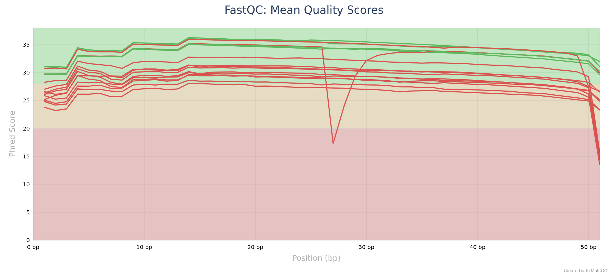
```

In the workshop data, the ten files from flowcell C1PF5ACXX (IR_rep1, IR_rep2, and mock_rep1 to mock_rep3) sit lower and drop sharply at the last cycle. The six files from the other two flowcells stay high, apart from a dip at cycle 27 in IR_rep4 R2 and a weaker last cycle in mock_rep4 R1.

```{r, fig.cap="Contrast example, schematic and not data: one read of a pair failing, a chemistry problem during the run, and a good profile. Cartoon by Zandra Selina, CC BY 4.0.", fig.alt="Three cartoon quality plots: read 2 quality collapsing while read 1 stays high, a short quality bump followed by a drop, and a stable high profile", echo=FALSE, message=FALSE}
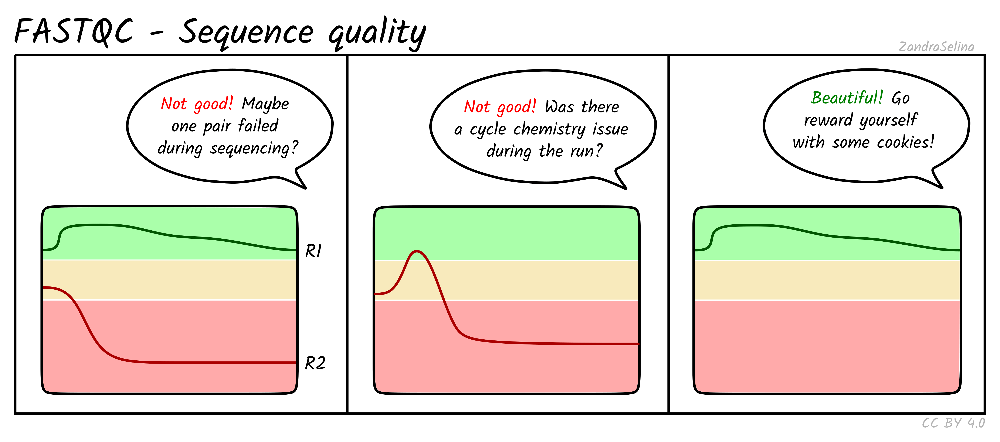
```

```{r, fig.cap="Contrast example from a different dataset (150 bp reads): per base quality that stays near Q39 across the whole read, which is what an excellent run looks like.", fig.alt="FastQC per base sequence quality plot from another dataset with 150 bp reads, mean quality flat near 39 for every position", echo=FALSE, message=FALSE}
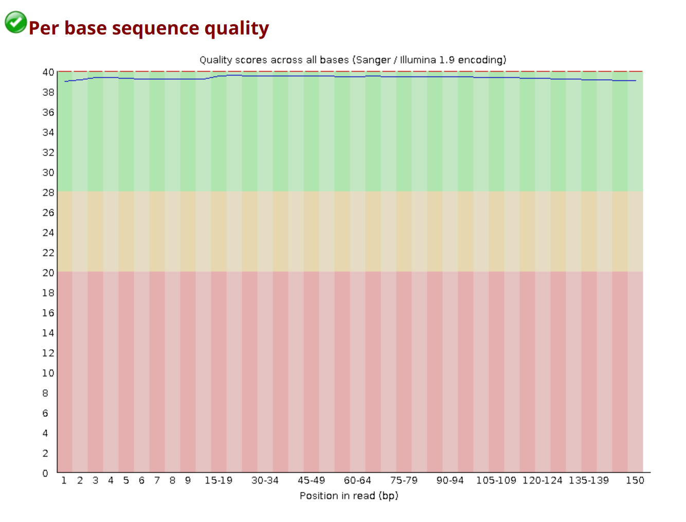
```


### Per tile sequence quality

Reports whether specific regions of the flowcell produced lower quality reads.
Uneven tiles can indicate instrument issues or bubble formation. In this workshop's data the module fails in 12 of 16 files: all ten from flowcell C1PF5ACXX, plus IR_rep4 R2 and mock_rep4 R1.

```{r, fig.cap="Your output: per tile sequence quality for WT_Bcell_IR_rep1_R1, one of the 12 files that fail this module", echo=FALSE, message=FALSE}
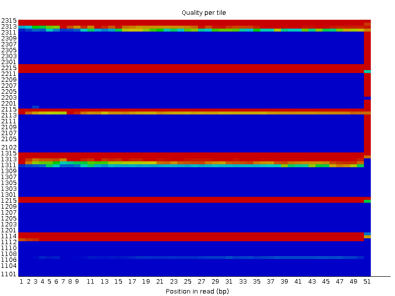
```

```{r, fig.cap="Contrast example, schematic and not data: tile-level patterns, from quality loss toward the end of the run on every tile, to a single failed lane, to a clean flowcell. The cartoon is titled Per base sequence content, but its panels show tile patterns. Cartoon by Zandra Selina, CC BY 4.0.", fig.alt="Three cartoon flowcell heat maps: all tiles turning yellow toward the end of the run, one lane yellow while the others stay blue, and all tiles blue", echo=FALSE, message=FALSE}
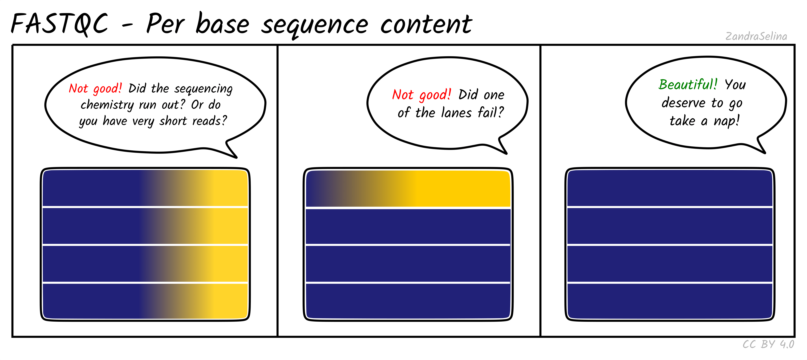
```


### Per sequence quality scores

Shows how many reads have high or low overall quality.
A good dataset has most reads with high scores and very few reads with low quality.

```{r, fig.cap="Your output: per sequence quality scores for the 16 workshop FASTQ files (MultiQC)", echo=FALSE, message=FALSE}
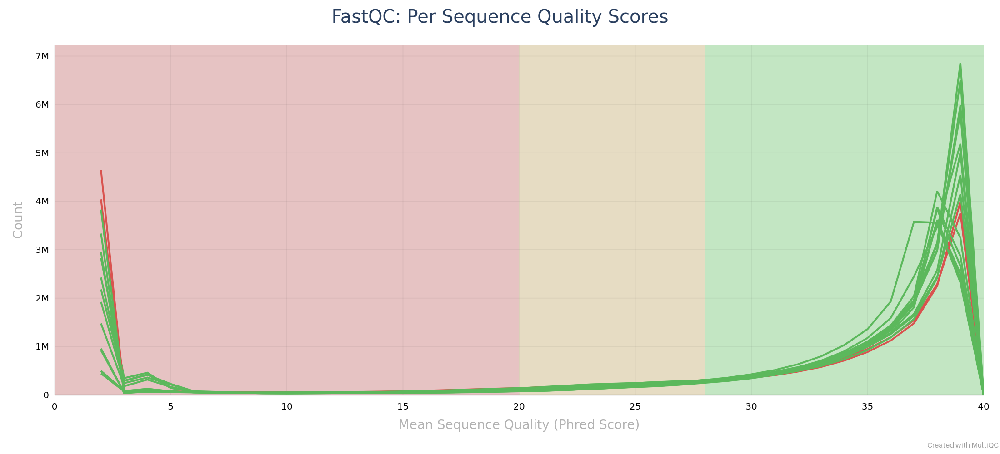
```

```{r, fig.cap="Contrast example, schematic and not data: most reads of low quality (a bad run), a bimodal distribution (often a flowcell location artifact), and a good single peak at high quality. Cartoon by Zandra Selina, CC BY 4.0.", fig.alt="Three cartoon histograms of per read quality: a single peak at low quality, two peaks, and one sharp peak at high quality", echo=FALSE, message=FALSE}
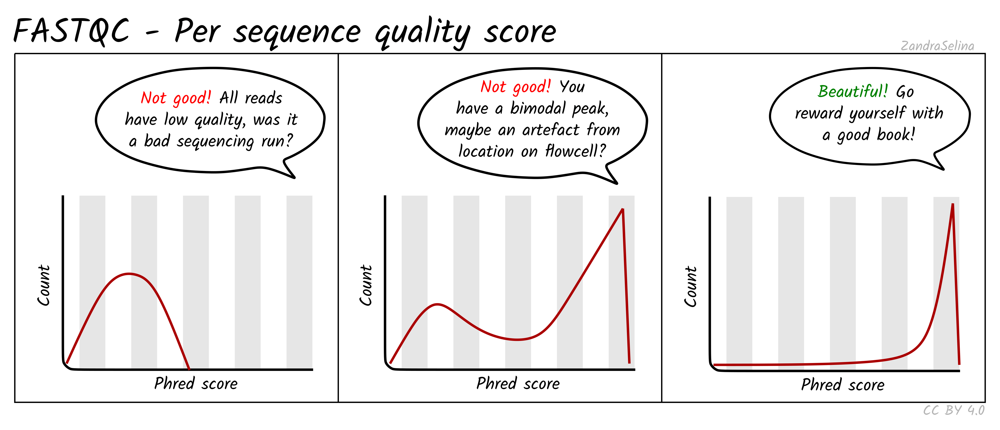
```


### Per base sequence content

Shows the proportion of A, C, G, and T at each cycle.
For genomic resequencing, all four lines should be close to 25 percent.
RNA-seq usually shows imbalanced composition in early cycles due to biased priming and transcript composition. Mild imbalance at the start of the read is normal and does not require trimming.

```{r, fig.cap="Your output: per base sequence content for WT_Bcell_IR_rep3_R1", echo=FALSE, message=FALSE}
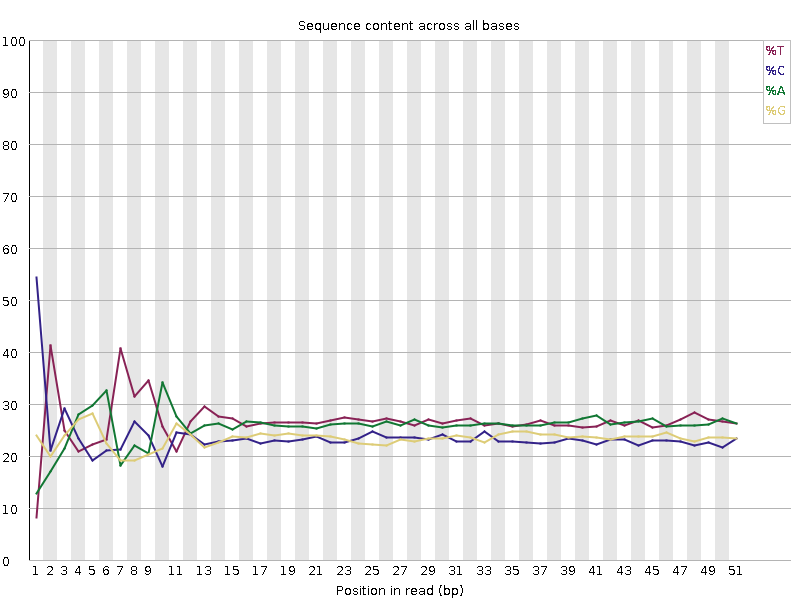
```

```{r, fig.cap="Contrast example from a different RNA-seq dataset (40 bp reads): the same uneven base composition in the first cycles, caused by biased priming. FastQC flags it, but it is normal for RNA-seq.", fig.alt="FastQC per base sequence content plot from another dataset with 40 bp reads, where the A, C, G, and T lines diverge in the first few cycles and then run nearly flat", echo=FALSE, message=FALSE}
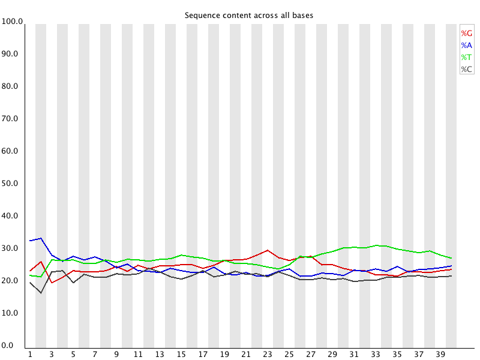
```


### Per sequence GC content

Shows the GC distribution across all reads.
RNA-seq often fails this test because expressed transcripts are not GC neutral. Only pronounced multi-modal or extremely shifted distributions are concerning, for example when contamination from another organism is suspected.

```{r, fig.cap="Your output: per sequence GC content for the 16 workshop FASTQ files (MultiQC)", echo=FALSE, message=FALSE}
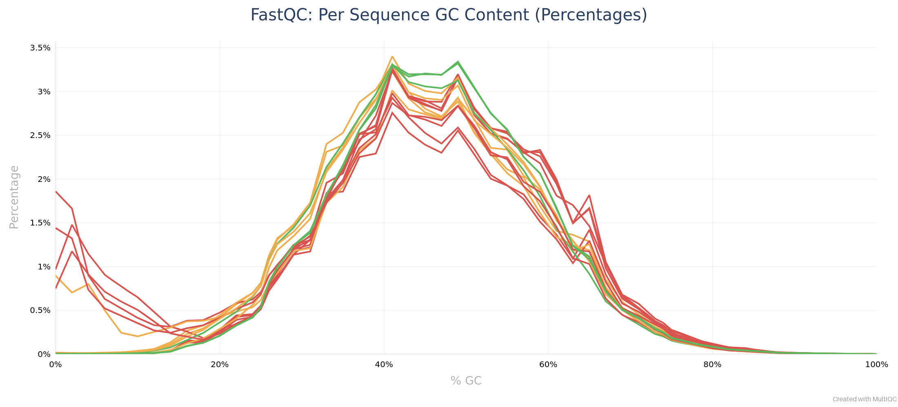
```

```{r, fig.cap="Contrast example, schematic and not data: libraries with different GC content (fine across species, a warning within one), a non-normal distribution that suggests a lab artifact, and a good match to the expected curve. Cartoon by Zandra Selina, CC BY 4.0.", fig.alt="Three cartoon GC content plots: two shifted peaks, one skewed peak, and an observed peak matching the expected curve", echo=FALSE, message=FALSE}
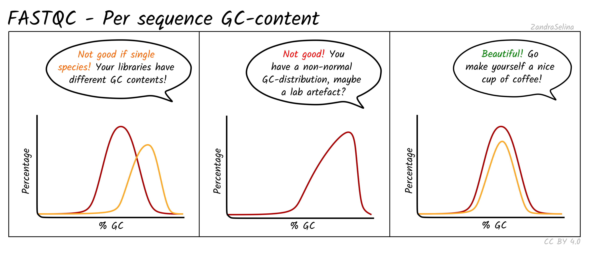
```


### Per base N content

Reports the percentage of unidentified bases (N) at each position.
This should be near zero for modern Illumina runs. High N content indicates failed cycles or poor sequencing chemistry.

```{r, fig.cap="Your output: per base N content for the 16 workshop FASTQ files (MultiQC)", echo=FALSE, message=FALSE}
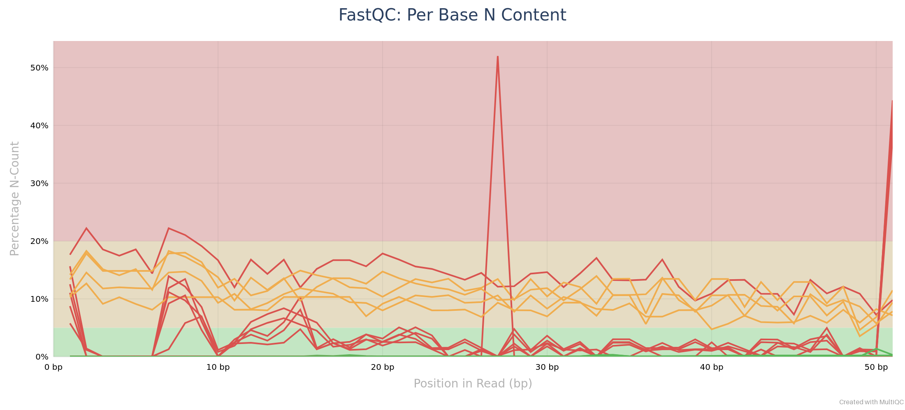
```

In the workshop data, the R1 files from flowcell C1PF5ACXX have 38 to 44 percent N bases at the last cycle, their R2 files 13 to 22 percent at one early cycle, and IR_rep4 R2 52 percent at cycle 27. These are failed cycles on the sequencer, not a property of the libraries.

```{r, fig.cap="Contrast example, schematic and not data: N bases rising toward the end of the read (chemistry running out), a constant N level (a failed lane or masked reads), and no N bases. Cartoon by Zandra Selina, CC BY 4.0.", fig.alt="Three cartoon N content plots: a curve rising at the end of the read, a flat line above zero, and a flat line at zero", echo=FALSE, message=FALSE}
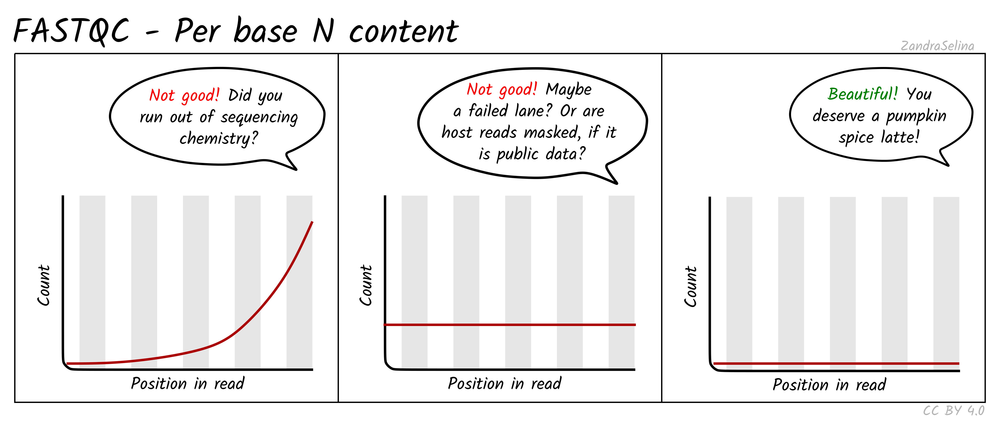
```


### Sequence length distribution

Shows the distribution of read lengths.
Standard RNA-seq libraries should have a narrow peak at the expected read length. Variable lengths usually appear after trimming or for specialized protocols such as small RNA.

```{r, fig.cap="Your output: sequence length distribution for WT_Bcell_IR_rep3_R1, where every read is 51 bp", echo=FALSE, message=FALSE}
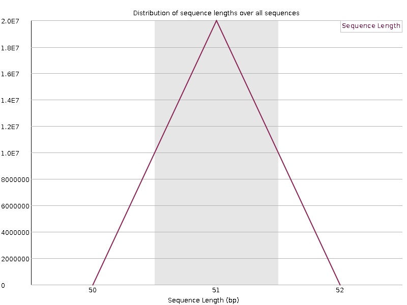
```

```{r, fig.cap="Contrast example from a different dataset sequenced with 150 bp reads: still a single narrow peak, only at a different read length. Nothing is wrong here; a broad distribution would point to trimming or a small RNA protocol.", fig.alt="FastQC sequence length distribution from another dataset, a single sharp peak at 150 bp", echo=FALSE, message=FALSE}
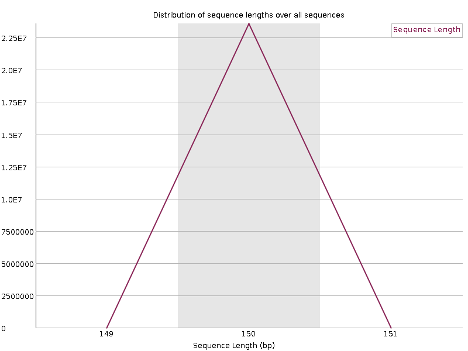
```


### Sequence duplication levels

Reports how many reads are exact duplicates.
Some duplication is normal in RNA-seq because highly expressed genes produce many identical fragments. Very high duplication, especially combined with low library size, can indicate low library complexity or overamplification.

```{r, fig.cap="Your output: sequence duplication levels for the 16 workshop FASTQ files (MultiQC)", echo=FALSE, message=FALSE}
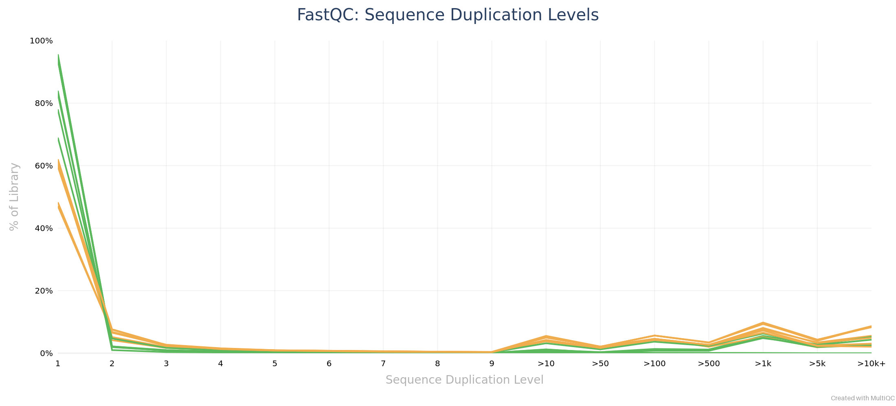
```

```{r, fig.cap="Contrast example, schematic and not data: high duplication from a low-complexity or over-amplified library, a periodic pattern that can be fine for amplicon data, and a library dominated by unique reads. Cartoon by Zandra Selina, CC BY 4.0.", fig.alt="Three cartoon duplication plots: a slowly decaying curve, a wavy pattern, and a single spike at duplication level one", echo=FALSE, message=FALSE}
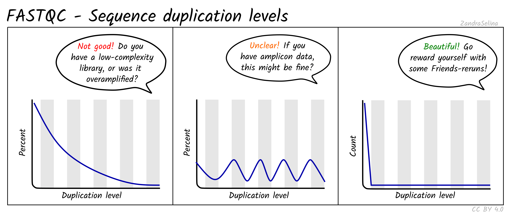
```


### Overrepresented sequences

Lists specific sequences that occur more often than expected.
Common sources include ribosomal RNA fragments, poly A tails, adapter sequence, or reads from highly expressed transcripts. Some overrepresented sequences are expected, but very high levels may indicate contamination or poor rRNA depletion.

### Adapter content

Shows whether any read cycles contain adapter sequences.
Small amounts at the extreme ends are common and usually harmless. Consistently high adapter content across many cycles suggests short inserts or poorly prepared libraries.

```{r, fig.cap="Your output: adapter content for the 16 workshop FASTQ files (MultiQC)", echo=FALSE, message=FALSE}
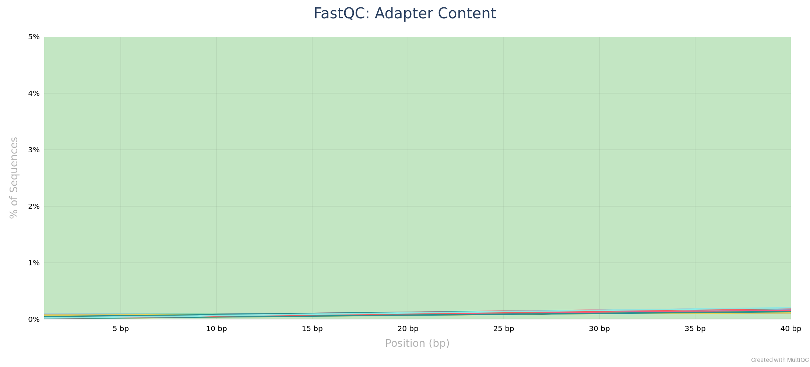
```

```{r, fig.cap="Contrast example, schematic and not data: adapter content rising toward the read end (short inserts, acceptable only for fragmented ancient DNA) and a flat line near zero. Cartoon by Zandra Selina, CC BY 4.0.", fig.alt="Two cartoon adapter content plots: a curve rising toward the end of the read, and a flat line at zero", echo=FALSE, message=FALSE}
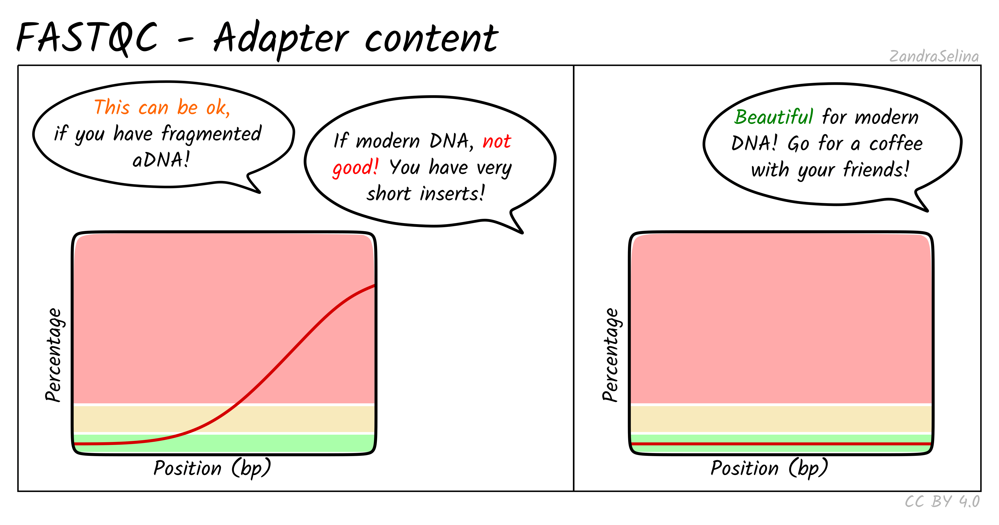
```


## Aggregating reports with MultiQC

FastQC generates a separate HTML file per sample. MultiQC consolidates all reports and allows easy comparison of replicates.

### Run MultiQC on the FastQC outputs

Generate a single combined report using MultiQC.

```bash
module load biocontainers
module load multiqc

cd $SCRATCH/rnaseq-workshop
multiqc results/qc_fastq/ -o results/qc_fastq/
```

```{r, fig.cap="Your output: MultiQC summary of the FastQC status checks for the 16 workshop FASTQ files", echo=FALSE, message=FALSE}
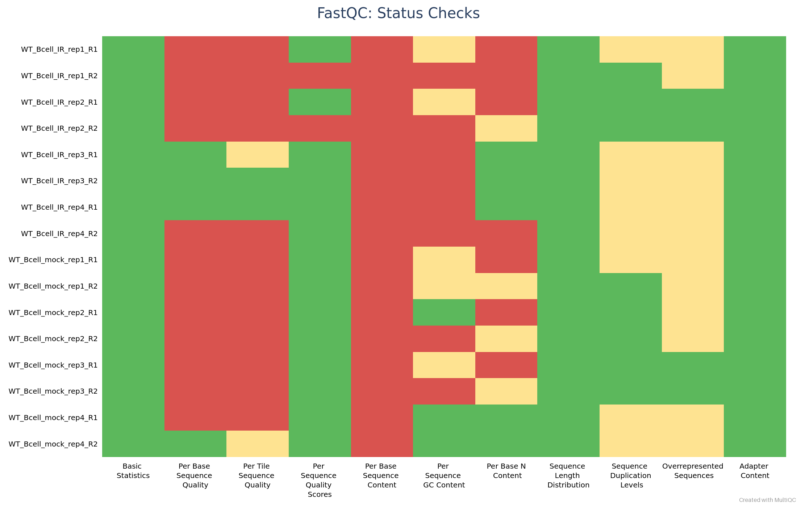
```

```{r, fig.cap="Contrast example from a different dataset (runs SRR33253285 to SRR33253290): per base sequence content and sequence duplication fail in every file. In RNA-seq both are common and are not by themselves a reason to discard data; read the plots, not only the colors.", fig.alt="MultiQC FastQC status heat map from another dataset with six runs, where the per base sequence content and sequence duplication columns are red for every file and most other columns are green", echo=FALSE, message=FALSE}
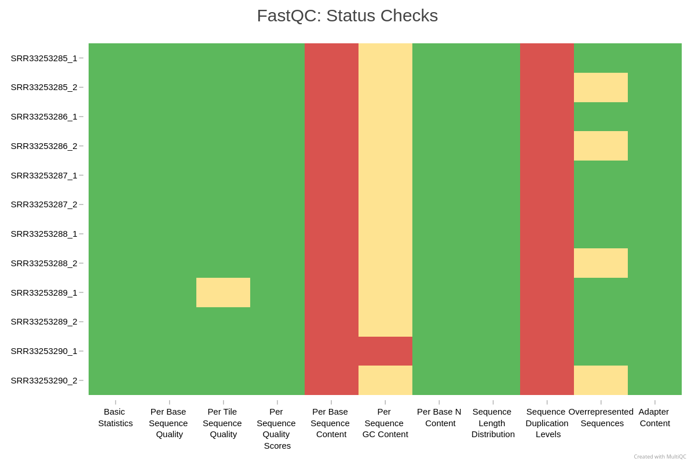
```


## Trimming adapter sequences

Before deciding whether to trim reads, it is essential to understand what adapters are and why they appear in sequencing data.

Adapters are short synthetic DNA sequences ligated to both ends of each fragment during library preparation. They provide primer binding sites needed for cluster amplification and sequencing. Ideally, the sequenced fragment is long enough that the machine reads only biological DNA. However, when the insert is shorter than the read length, the sequencer runs into the adapter sequence, which produces adapter contamination at the ends of reads.

Many users assume that adapters must always be trimmed, but this is not true for typical RNA-seq workflows.

::::::::::::::::::::::::::::::::::::::: discussion

## Do we need to trim reads for standard RNA-seq workflows?

For alignment based RNA-seq, adapter trimming is usually not required.
Modern aligners such as HISAT2 and STAR detect and soft clip adapter sequence automatically. Soft-clipped bases do not contribute to mismatches or mapping penalties, so adapters generally do not harm alignment quality.

In contrast, unnecessary trimming can introduce new problems:

- shorter reads and lower mapping power
- uneven trimming across samples and artificial differences
- reduction in read complexity
- broken read pairing for paired-end sequencing
- more parameters to track for reproducibility

Trimming is recommended only in specific situations:

- very short inserts, for example degraded RNA or ancient DNA
- adapter sequence dominating read tails, for example more than 10-15 percent adapter content
- transcript assembly workflows such as StringTie or Scallop, which benefit from uniform read lengths
- small RNA or miRNA libraries, where inserts are intentionally very short and adapter presence is guaranteed

:::::::::::::::::::::::::::::::::::::::

## Exercise: evaluate the QC results

::::::::::::::::::::::::::::::::::::::: challenge

### Inspect your MultiQC report

Using the MultiQC HTML report, answer:

1. Do all replicates show similar per base sequence quality profiles?
2. Is adapter content high enough to impact analysis?
3. Is any sample behaving differently from the rest, for example in number of reads, quality, duplication, or GC percentage?

::::::::::::::::::::::::::::::::::: solution

Interpretation for this dataset (compare with your own report):

1. No. The samples fall into two groups. IR_rep3, IR_rep4, and mock_rep4 have good quality along most of the read (mean about Q33 to Q35), apart from one cycle in IR_rep4 R2 that is about half N bases and a weak last cycle in mock_rep4 R1. The other five samples are lower (mean about Q26 to Q31), their last cycle collapses (the lower quartile drops to Q2 at position 51, with 38 to 44 percent N bases in R1), and their R2 files have 13 to 22 percent N at one early cycle. FastQC fails per base sequence quality in 12 of 16 files, per tile sequence quality in 12 of 16, and per base N content in 7 of 16. These five samples were sequenced on one flowcell (C1PF5ACXX, visible in the read names) and the clean three on two others, so these are problems of that sequencing run, not of the libraries. They show up again in Episode 4A: the three clean samples have the highest STAR mapping rates.
2. No. Adapter content passes in all 16 files; with 51 bp reads, very few inserts are shorter than the read.
3. Besides the quality groups, duplication differs: IR_rep2 and mock_rep3 are about 96 percent unique (FastQC "deduplicated percentage"), the other samples 53 to 79 percent. This is worth recording, but it is not a reason to drop a sample at this stage. Per sequence GC content fails in 8 of 16 files, which is common for RNA-seq, as explained above.

Trimming is not needed for this dataset: adapters are absent and the aligner handles low quality read ends.

:::::::::::::::::::::::::::::::::::

:::::::::::::::::::::::::::::::::::::::


:::::::::::::::::::::::::::::::::::::::::: spoiler

## What if trimming is required?

*Optional reference: how to trim adapters with `fastp` (not part of the hands-on)*

Sometimes you may encounter datasets where trimming is appropriate, for example short inserts, small RNA, or visibly high adapter content in QC. Although we will not trim reads in this workshop, here is a minimal example you can use in your own projects if trimming becomes necessary.

`fastp` is a fast, widely used tool that can automatically detect adapters, trim them, filter low quality reads, and generate QC reports.

### Example: trimming paired-end reads with `fastp`

```bash
module load biocontainers
module load fastp

fastp \
  -i SRRXXXXXXX_1.fastq.gz \
  -I SRRXXXXXXX_2.fastq.gz \
  -o SRRXXXXXXX_1.trimmed.fastq.gz \
  -O SRRXXXXXXX_2.trimmed.fastq.gz \
  --detect_adapter_for_pe \
  --thread 8 \
  --html fastp_report.html \
  --json fastp_report.json
```

### What this command does

- automatically detects adapters (`--detect_adapter_for_pe`)
- trims low quality bases (default behaviour)
- keeps paired-end reads synchronized
- writes trimmed output (`*.trimmed.fastq.gz`)
- generates QC reports (HTML and JSON)

### When to use this

Use trimming only if:

- QC shows strong adapter presence
- your library prep is known to produce short inserts
- you are working with small RNA or degraded RNA
- you are doing transcript assembly where uniform read length matters

For standard RNA-seq, trimming is usually unnecessary.

::::::::::::::::::::::::::::::::::::::::::

## Summary

::::::::::::::::::::::::::::::::::::: keypoints

- FastQC and MultiQC provide essential diagnostics for RNA-seq data.
- Some FastQC warnings are normal for RNA-seq and do not indicate problems.
- Aligners soft clip adapters, so trimming is usually unnecessary for alignment based RNA-seq.
- QC helps detect outliers before alignment and quantification.

::::::::::::::::::::::::::::::::::::::::::::::::
