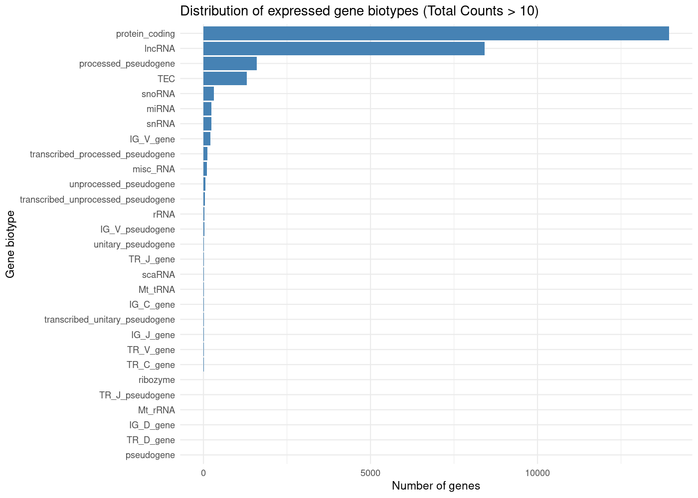
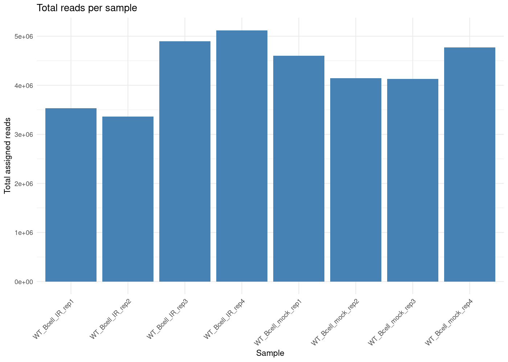
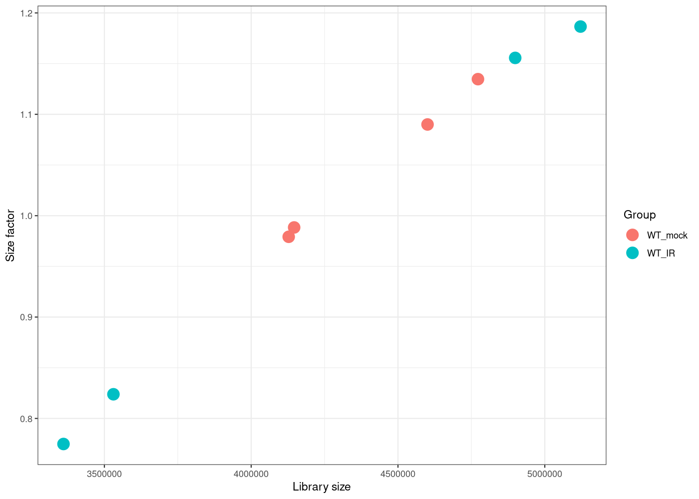
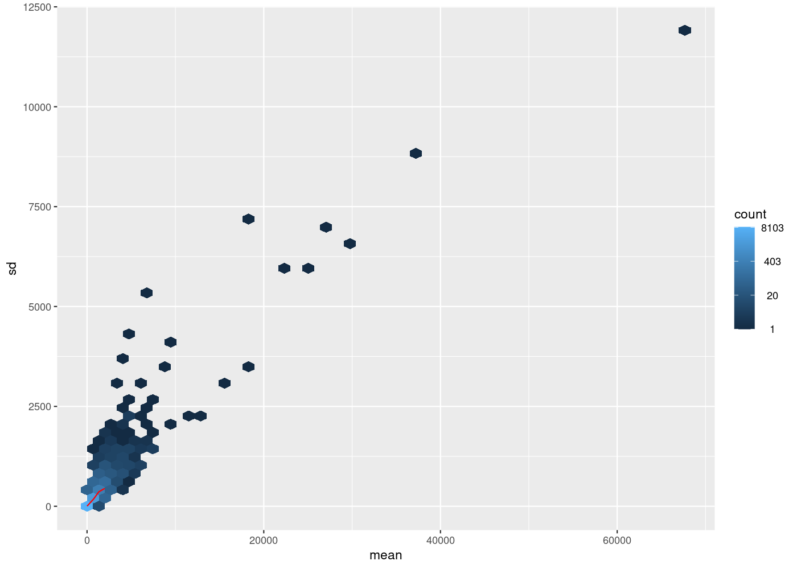
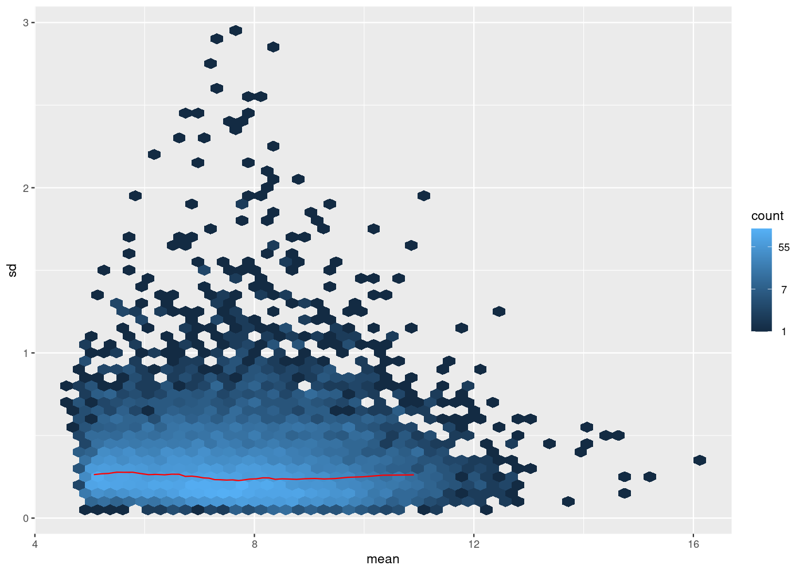
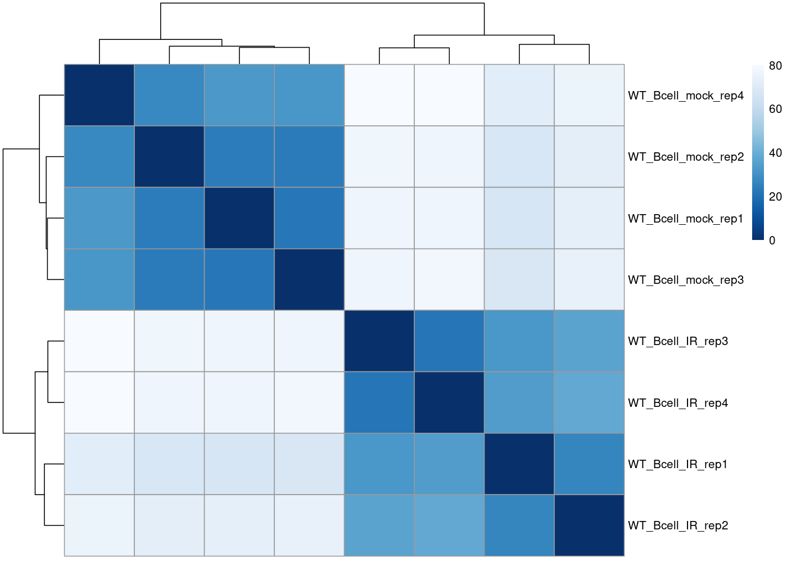
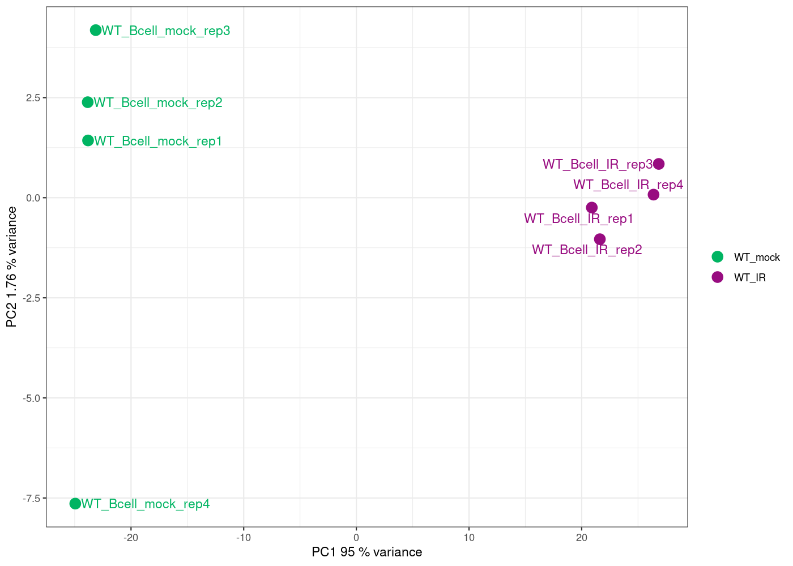
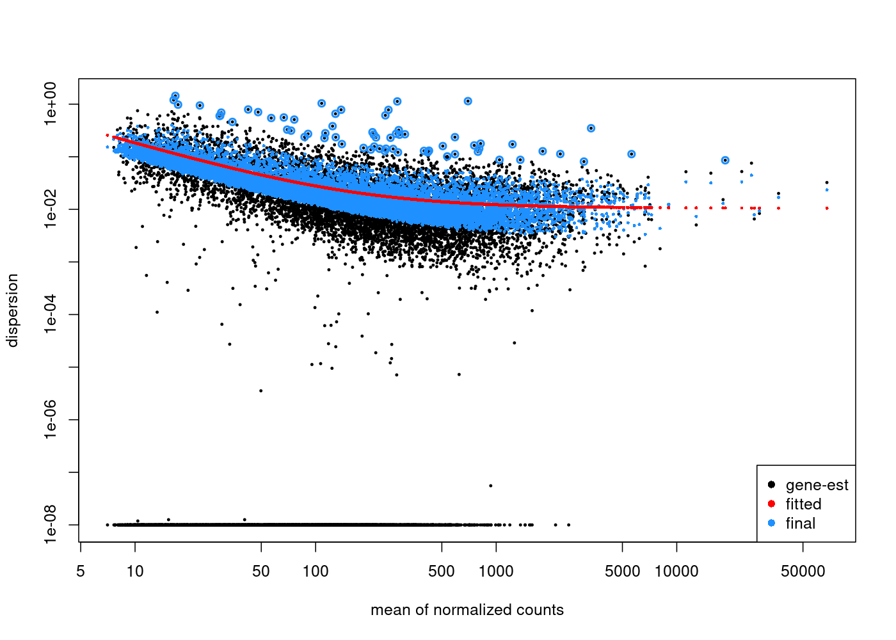
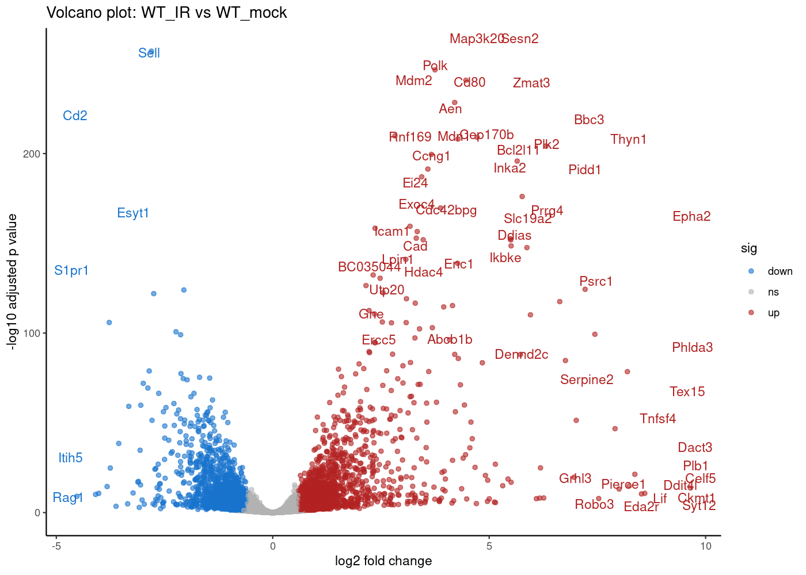

:::::::::::::::::::::::::::::::::::::: questions

- How do we explore RNA seq count data before running DESeq2.
- How do we restrict analysis to protein coding genes.
- How do we perform differential expression with DESeq2.
- How do we visualize sample relationships and DE genes.
- How do we save a useful DE results table with annotation and expression values.

::::::::::::::::::::::::::::::::::::::::::::::::

::::::::::::::::::::::::::::::::::::: objectives

- Import count and sample metadata into R.
- Attach biotype and gene symbol annotation to Ensembl gene IDs.
- Explore library sizes, variance stabilizing transforms, distances, and PCA.
- Run DESeq2 for a two group comparison.
- Create a volcano plot with gene symbols.
- Export joined DE results including normalized counts and annotation.

::::::::::::::::::::::::::::::::::::::::::::::::

## Introduction

In this episode we move from **count matrices** to **differential expression analysis** and **visualization**.

The workflow has four parts:

1. Import counts and sample metadata.
2. Exploratory analysis on protein coding genes (quality checks).
3. Differential expression analysis with DESeq2.
4. Visualization and export of annotated DE results.


::::::::::::::::::::::::::::::::::::::: prereq

## What you need for this episode

- `gene_counts_clean.txt` generated from featureCounts  
- a `samples.csv` file describing the experimental groups  
- RStudio session on Negishi using Open OnDemand

While we created the count matrix in the previous episode, we still need to create a sample metadata file. This file should contain at least two columns: sample names matching the count matrix column names, and the experimental condition (e.g., control vs treatment). Simply copy/paste the following into a text file and save it in your `scripts` directory as `samples.csv`:

```
sample,condition
WT_Bcell_mock_rep1,WT_mock
WT_Bcell_mock_rep2,WT_mock
WT_Bcell_mock_rep3,WT_mock
WT_Bcell_mock_rep4,WT_mock
WT_Bcell_IR_rep1,WT_IR
WT_Bcell_IR_rep2,WT_IR
WT_Bcell_IR_rep3,WT_IR
WT_Bcell_IR_rep4,WT_IR
```
The R code below creates the `results/deseq2` directory for the output.

:::::::::::::::::::::::::::::::::::::::

All analyses are performed in R through Open OnDemand

## Step 1: Start Open OnDemand R session and prepare data


Start RStudio on Negishi's Open OnDemand portal, [gateway.negishi.rcac.purdue.edu](https://gateway.negishi.rcac.purdue.edu/), exactly as described in [Starting RStudio on Open OnDemand](../learners/setup.md#starting-rstudio-on-open-ondemand) on the Setup page: **Interactive Apps > RStudio (bioconductor)**, partition `cpu`, account `rcac-rnaseq`, QoS `standby`, 4 hours, 4 cores, R version `4.4.0-bioconductor`. Once the job is running, click **Connect to RStudio Server**.

Once in RStudio, load the necessary libraries:

### Setup: load packages and data

```r
library(RColorBrewer)
library(tidyverse)
library(DESeq2)
library(ggplot2)
library(pheatmap)
library(readr)
library(dplyr)
library(ggrepel)
library(vsn)
# Construct the path dynamically
work_dir <- file.path("/scratch/negishi", Sys.getenv("USER"), "rnaseq-workshop")
setwd(work_dir)
# output directory for this episode
dir.create("results/deseq2", recursive = TRUE, showWarnings = FALSE)

countsFile <- "results/counts/gene_counts_clean.txt"
# prepare this file first!
groupFile  <- "scripts/samples.csv"

coldata <-
  read.csv(
    groupFile,
    row.names = 1,
    header = TRUE,
    stringsAsFactors = TRUE
  )
coldata$condition <- as.factor(coldata$condition)
# make WT_mock the reference (denominator) level; see "Name your contrast" below
coldata$condition <- relevel(coldata$condition, ref = "WT_mock")

cts <- as.matrix(read.delim(countsFile, row.names = 1, header = TRUE))
```

We also load gene level annotation tables that were prepared for the workshop and copied with the data (`data/mart.tsv` and `data/annot.tsv`). The spoiler below shows how they were made with biomaRt.

```r
mart <-
  read.csv(
    "data/mart.tsv",
    sep = "\t",
    header = TRUE
  )

annot <-
  read.csv(
    "data/annot.tsv",
    sep = "\t",
    header = TRUE
  )
```

::::::::::::::::::::::::::::::::::::::: spoiler

## How were these data prepared?


Since the gene IDs in the count matrix are Ensembl IDs, it will be hard to interpret the results without annotation. We query Ensembl BioMart with the `biomaRt` package for gene symbols, biotypes, and descriptions. Run this after the setup block above, so that `cts` exists. It writes to `data/mart_biomart.tsv` and `data/annot_biomart.tsv`, so it does not overwrite the workshop copies.

```r
library(biomaRt)
library(tidyverse)
# select Mart
ensembl = useMart("ENSEMBL_MART_ENSEMBL")
# we need to use the correct dataset for mouse
# we will query the available datasets and filter for mouse (GRCm39)
listDatasets(ensembl) %>%
  filter(str_detect(description, "GRCm39"))
# we can use the dataset name to set the dataset
ensembl = useDataset("mmusculus_gene_ensembl", mart = ensembl)
# our counts have Ensembl gene IDs with version numbers
# lets find how it is referred in biomaRt
listFilters(ensembl) %>%
  filter(str_detect(name, "ensembl"))
# so we will now set the filter type accordingly
filterType <- "ensembl_gene_id_version"
# from our counts data, get the list of gene IDs
filterValues <- rownames(cts)
# take a look at the available attributes (first 20)
listAttributes(ensembl) %>%
     head(20)
# we will retrieve ensembl gene id, ensembl gene id with version and external gene name
attributeNames <- c('ensembl_gene_id',
                    'ensembl_gene_id_version',
                    'external_gene_name',
                    'gene_biotype',
                    'description')
# get the annotation
mart <- getBM(
  attributes = attributeNames,
  filters = filterType,
  values = filterValues,
  mart = ensembl
)
saveRDS(mart, file = "results/counts/gene_annotation.rds")
# also save as tsv for future use
write.table(
  mart,
  file = "data/mart_biomart.tsv",
  sep = "\t",
  quote = FALSE,
  row.names = FALSE
)
# save a simplified annotation table with only the identifier columns
annot <- mart %>%
  dplyr::select(ensembl_gene_id, ensembl_gene_id_version, external_gene_name)
write.table(
  annot,
  file = "data/annot_biomart.tsv",
  sep = "\t",
  quote = FALSE,
  row.names = FALSE
)
```

`mart` from this query has the same columns as `data/mart.tsv` (`ensembl_gene_id`, `ensembl_gene_id_version`, `external_gene_name`, `gene_biotype`, `description`), so the rest of the episode runs the same with either source.

::::::::::::::::::::::::::::::::::::::: callout

## If BioMart is unavailable

BioMart is an online service and is sometimes down or redirected (for example to `status.ensembl.org`) during Ensembl releases. If `useMart()` or `getBM()` fails, keep the `mart` and `annot` objects read from `data/mart.tsv` and `data/annot.tsv` in the block above; they were made with this same query and cover every gene in the GENCODE vM38 annotation. The current Ensembl release can also be newer than GENCODE vM38 (Ensembl 115), in which case some versioned gene IDs do not match and come back without annotation.

:::::::::::::::::::::::::::::::::::::::

:::::::::::::::::::::::::::::::::::::::


The objects loaded here form the foundation for the entire workflow.
`cts` contains raw gene counts from featureCounts.
`coldata` contains the metadata that describes each sample and defines the comparison groups.
`mart` and `annot` contain functional information for each gene so we can attach gene symbols and biotypes later in the analysis.


::::::::::::::::::::::::::::::::::::::: callout

## Sample metadata and design

`coldata` must have row names that match the count matrix column names.
The `condition` column defines the groups for DESeq2 (`WT_mock` vs `WT_IR`).

:::::::::::::::::::::::::::::::::::::::

## Exploratory analysis

### Attach annotation and filter to protein coding genes

We first join counts with biotype information from `mart` and filter to protein coding genes.

```r
cts_tbl <- cts %>%
  as.data.frame() %>%
  rownames_to_column("ensembl_gene_id_version")

cts_annot <- cts_tbl %>%
  left_join(mart, by = "ensembl_gene_id_version")

sum(is.na(cts_annot$gene_biotype))
```

Output:

```text
[1] 0
```


Joining annotation allows us to move beyond raw Ensembl IDs.
This step attaches gene symbols, biotypes, and descriptions so that later plots and tables are interpretable.
At this point the dataset is still large and includes many noncoding genes, pseudogenes, and biotypes we won't analyze further.


Summarize gene biotypes:

```r
biotype_df <- cts_annot %>%
  filter(rowSums(dplyr::select(., starts_with("WT_Bcell"))) > 10) %>%
  dplyr::count(gene_biotype, name = "n") %>%
  arrange(desc(n))

ggplot(biotype_df, aes(x = reorder(gene_biotype, n), y = n)) +
  geom_col(fill = "steelblue") +
  coord_flip() +
  theme_minimal() +
  labs(
    x = "Gene biotype",
    y = "Number of genes",
    title = "Distribution of expressed gene biotypes (Total Counts > 10)"
  )
```

```{r, fig.cap="Distribution of gene biotypes in annotation", echo=FALSE, message=FALSE}

```

Visualizing biotype composition gives a sense of how many genes belong to each functional class.
RNA-seq quantifies all transcribed loci, but many biotypes (snRNA, TEC, pseudogenes) are not suitable for differential expression with DESeq2 because they tend to be lowly expressed or unstable.
This motivates filtering to protein-coding genes for QC and visualization.


Filter to protein coding genes and apply group-aware expression filtering:

```r
# Filter to protein-coding genes
cts_pc <- cts_annot %>%
    filter(gene_biotype == "protein_coding") %>%
    dplyr::select(ensembl_gene_id_version, all_of(rownames(coldata)))

# Group-aware filtering: keep genes with >= 10 counts in at least 4 samples
# (the size of the smallest experimental group)
min_samples <- 4
min_counts <- 10

cts_coding <- cts_pc %>%
    filter(rowSums(across(all_of(rownames(coldata)), ~ . >= min_counts)) >= min_samples) %>%
    column_to_rownames("ensembl_gene_id_version")

dim(cts_coding)
```

```text
[1] 11330     8
```

::::::::::::::::::::::::::::::::::::::: callout

## Why use group-aware filtering?

A simple sum filter (e.g., `rowSums > 5`) can be problematic:

- A gene with 10 total counts across 8 samples averages ~1.25 counts/sample—often too noisy.
- It may inadvertently remove genes expressed in only one condition.

Group-aware filtering ensures:

- Each kept gene has meaningful expression in at least one experimental group.
- Genes with condition-specific expression are retained.
- The threshold is interpretable ("at least 10 counts in at least 4 samples").

For exploratory analysis, we also restrict to protein-coding genes to focus on the most interpretable features.

:::::::::::::::::::::::::::::::::::::::

### Library size differences

We summarize total counts per sample for protein coding genes.

```r
libSize <- colSums(cts_coding) %>%
  as.data.frame() %>%
  rownames_to_column("sample") %>%
  dplyr::rename(total_counts = 2) %>%
  mutate(total_millions = total_counts / 1e6)

ggplot(libSize, aes(x = sample, y = total_counts)) +
  geom_col(fill = "steelblue") +
  theme_minimal() +
  labs(
    x = "Sample",
    y = "Total assigned reads",
    title = "Total reads per sample"
  ) +
  theme(
    axis.text.x = element_text(angle = 45, hjust = 1)
  )
```

```{r, fig.cap="Total assigned reads per sample", echo=FALSE, message=FALSE}

```

Library size differences affect normalization.
Although DESeq2 corrects for this through size factors, inspecting raw library sizes ensures no sample has abnormally low sequencing depth, which could compromise downstream analyses.


### Create DESeq2 object for exploratory plots

```r
dds <- DESeqDataSetFromMatrix(
  countData = cts_coding,
  colData   = coldata,
  design    = ~ condition
)

dds <- estimateSizeFactors(dds)
```

Inspect size factors vs library size:

```r
ggplot(
  data.frame(
    libSize    = colSums(assay(dds)),
    sizeFactor = sizeFactors(dds),
    Group      = dds$condition
  ),
  aes(x = libSize, y = sizeFactor, col = Group)
) +
  geom_point(size = 5) +
  theme_bw() +
  labs(x = "Library size", y = "Size factor")
```

```{r, fig.cap="Size factors vs library size", echo=FALSE, message=FALSE}

```


### Variance stabilization and mean SD plots


Raw count data have a strong mean–variance dependency:
low count genes have high variance, and high count genes show lower relative variability.
This makes Euclidean distance and PCA misleading on raw counts.
VST removes this dependency so that downstream clustering is biologically meaningful rather than driven by count scale.

Inspect mean vs standard deviation plot before transformation:


```r
meanSdPlot(assay(dds), ranks = FALSE)
```

```{r, fig.cap="Average counts vs variance before transformation", echo=FALSE, message=FALSE}

```

::::::::::::::::::::::::::::::::::::::: callout

## Deprecation warnings from packages

`meanSdPlot()` may print a warning such as `` `aes_string()` was deprecated in ggplot2 3.0.0 ``. It comes from code inside the vsn package, not from your commands, and does not change the plot. You will see similar warnings from enrichplot in Episode 06. Warnings are worth reading, but this kind can be ignored.

:::::::::::::::::::::::::::::::::::::::

Apply variance stabilizing transform (VST):

```r
vsd <- DESeq2::vst(dds, blind = TRUE)
meanSdPlot(assay(vsd), ranks = FALSE)
```

```{r, fig.cap="average counts vs variance after transformation", echo=FALSE, message=FALSE}

```


::::::::::::::::::::::::::::::::::::::: callout

## Why use VST

Counts have mean dependent variance.
Variance stabilizing transform (VST) makes the variance roughly constant across the range, which improves distance based methods and PCA.

:::::::::::::::::::::::::::::::::::::::

### Sample to sample distances

The distance heatmap helps answer a key question:
Do samples group by biological condition or by an unwanted variable (batch, sequencing run, contamination)?
This is one of the fastest ways to detect outliers.

```r
sampleDists       <- dist(t(assay(vsd)))
sampleDistMatrix  <- as.matrix(sampleDists)
rownames(sampleDistMatrix) <- colnames(vsd)
colnames(sampleDistMatrix) <- NULL
colors <- colorRampPalette(rev(brewer.pal(9, "Blues")))(255)

pheatmap(
  sampleDistMatrix,
  clustering_distance_rows = sampleDists,
  clustering_distance_cols = sampleDists,
  col                      = colors
)
```

```{r, fig.cap="Euclidean distance heatmap", echo=FALSE, message=FALSE}

```


### PCA on top variable genes

PCA projects samples into low-dimensional space and reveals dominant sources of variation.
Ideally, samples separate by biological condition along one of the top PCs.
If not, the signal from the condition may be weak or confounded by other factors.

```r
rv <- rowVars(assay(vsd))
select <- order(rv, decreasing = TRUE)[seq_len(min(500, length(rv)))]

pca <- prcomp(t(assay(vsd)[select, ]))
percentVar <- pca$sdev ^ 2 / sum(pca$sdev ^ 2)

intgroup    <- "condition"
intgroup.df <- as.data.frame(colData(vsd)[, intgroup, drop = FALSE])

group <- if (length(intgroup) == 1) {
  factor(apply(intgroup.df, 1, paste, collapse = " : "))
}

d <- data.frame(
  PC1 = pca$x[, 1],
  PC2 = pca$x[, 2],
  intgroup.df,
  name = colnames(vsd)
)

ggplot(d, aes(PC1, PC2, color = condition)) +
  scale_shape_manual(values = 1:12) +
  scale_color_manual(values = c(
    "WT_mock" = "#00b462",
    "WT_IR"   = "#980c80"
  )) +
  theme_bw() +
  theme(legend.title = element_blank()) +
  geom_point(size = 2, stroke = 2) +
  geom_text_repel(aes(label = name)) +
  xlab(paste("PC1", round(percentVar[1] * 100, 2), "% variance")) +
  ylab(paste("PC2", round(percentVar[2] * 100, 2), "% variance"))
```

```{r, fig.cap="PCA plot showing sample clustering", echo=FALSE, message=FALSE}

```

::::::::::::::::::::::::::::::::::::::: callout

## Using PCA to detect batch effects

PCA is one of the most powerful tools for detecting **batch effects**—unwanted technical variation from sample processing, sequencing runs, or other non-biological factors.

**What to look for:**

- **Good**: Samples separate primarily by biological condition (treatment, genotype).
- **Concerning**: Samples cluster by processing date, sequencing lane, or technician instead of biology.
- **Red flag**: PC1 captures technical variation rather than the condition of interest.

**If you detect batch effects:**

1. **Include batch in the design formula** if batch is known:
   ```r
   design = ~ batch + condition
   ```

2. **Use batch correction tools** like `ComBat-seq` or `sva` for complex batch structures.

3. **Never simply remove batch-affected samples** without understanding the underlying cause.

In this dataset, PC1 (95 percent of the variance) separates the IR samples from the mock samples. A much smaller pattern within the groups follows read quality, as the exercise below shows.

:::::::::::::::::::::::::::::::::::::::

::::::::::::::::::::::::::::::::::::::: challenge

## Exercise: interpret exploratory plots

Using the library size, distance heatmap, and PCA:

1. Are there any obvious outlier samples?
2. Do replicates from the same condition cluster together?
3. Does any sample look inconsistent with its metadata label?
4. Is there evidence of batch effects (samples clustering by non-biological factors)?

::::::::::::::::::::::::::::::::::: solution

Interpretation for this dataset:

1. No. Library sizes (assigned read pairs on protein-coding genes) range from 3.4 to 5.1 million, and the size factors from 0.78 to 1.19, so no sample has abnormally low depth.
2. Yes. The distance heatmap splits the samples into a mock and an IR cluster, and PC1, which explains 95 percent of the variance, separates the two conditions.
3. No. Every sample is closest to the other samples with its own label.
4. Not one that matters here. The condition dominates, but within each group there is a small, consistent pattern: IR_rep3 and IR_rep4 pair up apart from IR_rep1 and IR_rep2, and mock_rep4 sits apart from the other mock samples on PC2 (under 2 percent of the variance). These are the samples with the cleanest reads in Episode 03, so this is a technical effect of read quality. It is small next to the treatment effect and does not need correction in this analysis, but it is worth recording.

:::::::::::::::::::::::::::::::::::

:::::::::::::::::::::::::::::::::::::::


## Differential gene expression analysis

For DE testing we use the same filtered protein-coding matrix (`cts_coding`) as for the exploratory plots.
This keeps the analysis focused on the genes we inspected above and avoids testing thousands of barely expressed noncoding features.

```r
dds <- DESeqDataSetFromMatrix(
  countData = cts_coding,
  colData   = coldata,
  design    = ~ condition
)
```

You can either run the individual DESeq2 steps:

```r
dds <- estimateSizeFactors(dds)
dds <- estimateDispersions(dds)
dds <- nbinomWaldTest(dds)
```

::::::::::::::::::::::::::::::::::: spoiler

## Single command to run the DESeq2 pipeline

Above three steps can be run together using the `DESeq` function:

```r
dds <- DESeq(dds)
```

```text
using pre-existing size factors
estimating dispersions
found already estimated dispersions, replacing these
gene-wise dispersion estimates
mean-dispersion relationship
final dispersion estimates
fitting model and testing
```

Because the three steps above already ran on `dds`, `DESeq()` reuses the size factors and replaces the dispersions, as its messages say. On a new object it estimates both itself.
:::::::::::::::::::::::::::::::::::


Inspect dispersion estimates:
```r
plotDispEsts(dds)
```

```{r, fig.cap="Dispersion estimates from DESeq2", echo=FALSE, message=FALSE}

```


Obtain results for the contrast of interest. The `contrast` argument names the factor, then the numerator level, then the denominator level, so positive log2 fold changes mean higher in `WT_IR` than in `WT_mock`:

```r
res <-
  results(
    dds,
    contrast = c(
      "condition",
      "WT_IR",
      "WT_mock"
    )
  )

summary(res)
```

```text
out of 11330 with nonzero total read count
adjusted p-value < 0.1
LFC > 0 (up)       : 3317, 29%
LFC < 0 (down)     : 3260, 29%
outliers [1]       : 0, 0%
low counts [2]     : 0, 0%
(mean count < 7)
[1] see 'cooksCutoff' argument of ?results
[2] see 'independentFiltering' argument of ?results
```

::::::::::::::::::::::::::::::::::::::: callout

## Name your contrast

DESeq2 compares factor levels, and R orders levels alphabetically unless told otherwise. Here that puts `WT_IR` before `WT_mock`, so by default `WT_IR` would be the reference level and any result taken from the second model coefficient would be **mock vs IR**: every fold change would have the opposite sign, p53 targets would look downregulated, and the volcano plot and enrichment results would be mirrored.

Two habits prevent this:

- Pass an explicit `contrast = c("condition", "WT_IR", "WT_mock")` to `results()`. The direction is then stated in the code and does not depend on level order.
- When a function needs a coefficient name instead (as `lfcShrink(type = "apeglm")` does below), set the reference level with `relevel()` and check `resultsNames(dds)` before using it. The coefficient `condition_WT_IR_vs_WT_mock` exists only if the levels are set up the way you intend; if they are not, the call fails instead of silently returning flipped results.

The first line of a printed results table, `log2 fold change (MLE): condition WT_IR vs WT_mock`, confirms the direction.

:::::::::::::::::::::::::::::::::::::::

Order the results by p value to see the top DE genes:

```r
head(res[order(res$pvalue), ])
```

```text
log2 fold change (MLE): condition WT_IR vs WT_mock 
Wald test p-value: condition WT IR vs WT mock 
DataFrame with 6 rows and 6 columns
                       baseMean log2FoldChange     lfcSE      stat       pvalue
                      <numeric>      <numeric> <numeric> <numeric>    <numeric>
ENSMUSG00000026581.15  2412.406       -2.80863 0.0812517  -34.5671 7.89921e-262
ENSMUSG00000021668.16   869.712        3.75461 0.1109288   33.8470 4.01297e-251
ENSMUSG00000075122.6    614.418        4.47065 0.1336974   33.4386 3.77513e-245
ENSMUSG00000004085.15   833.506        4.21081 0.1293034   32.5654 1.26912e-232
ENSMUSG00000020184.16  1619.577        2.82923 0.0906311   31.2170 6.26176e-214
ENSMUSG00000072825.13   724.296        4.73072 0.1518464   31.1546 4.39168e-213
                              padj
                         <numeric>
ENSMUSG00000026581.15 8.94981e-258
ENSMUSG00000021668.16 2.27335e-247
ENSMUSG00000075122.6  1.42574e-241
ENSMUSG00000004085.15 3.59478e-229
ENSMUSG00000020184.16 1.41891e-210
ENSMUSG00000072825.13 8.29296e-210
```

Each row represents one gene.
Key columns:
`baseMean`: average normalized count across all samples
`log2FoldChange`: direction and magnitude of change between groups
`pvalue` / `padj`: statistical significance after multiple testing correction
Genes with `NA` values often have too few reads to estimate dispersion and should not be interpreted.

### Apply log fold change shrinkage

The raw log2 fold change estimates from DESeq2 can be noisy for genes with low counts. Shrinkage improves these estimates.

First, check the available coefficient names:

```r
resultsNames(dds)
```

```text
[1] "Intercept"                  "condition_WT_IR_vs_WT_mock"
```

Apply shrinkage using `apeglm` (recommended for standard two-group comparisons):

```r
res_shrunk <- lfcShrink(
    dds,
    coef = "condition_WT_IR_vs_WT_mock",
    type = "apeglm"
)

summary(res_shrunk)
```

```text
using 'apeglm' for LFC shrinkage. If used in published research, please cite:
    Zhu, A., Ibrahim, J.G., Love, M.I. (2018) Heavy-tailed prior distributions for
    sequence count data: removing the noise and preserving large differences.
    Bioinformatics. https://doi.org/10.1093/bioinformatics/bty895

out of 11330 with nonzero total read count
adjusted p-value < 0.1
LFC > 0 (up)       : 3317, 29%
LFC < 0 (down)     : 3260, 29%
outliers [1]       : 0, 0%
low counts [2]     : 0, 0%
(mean count < 7)
[1] see 'cooksCutoff' argument of ?results
[2] see 'independentFiltering' argument of ?results
```


::::::::::::::::::::::::::::::::::::::: callout

## Why shrink log fold changes?

Genes with low counts can have unreliably large fold changes. Shrinkage:

- Reduces noise in LFC estimates for lowly-expressed genes.
- Improves gene ranking for downstream analyses (e.g., GSEA).
- Does not affect p-values or significance calls.

**Choosing a shrinkage method:**

- **`apeglm`** (recommended): Fast, well-calibrated, uses coefficient name (`coef`).
- **`ashr`**: Required for complex contrasts that can't be specified with `coef`.
- **`normal`**: Legacy method, generally not recommended.

:::::::::::::::::::::::::::::::::::::::

For downstream analyses, we'll use the shrunken results:

```r
res <- res_shrunk
```

Create a summary table:

```r
log2fc_cut <- log2(1.5)

res_df <- as.data.frame(res)

summary_table <- tibble(
    total_genes = nrow(res_df),
    sig = sum(res_df$padj < 0.05, na.rm = TRUE),
    up  = sum(res_df$padj < 0.05 & res_df$log2FoldChange >  log2fc_cut, na.rm = TRUE),
    down= sum(res_df$padj < 0.05 & res_df$log2FoldChange < -log2fc_cut, na.rm = TRUE)
)
print(summary_table)
```

Output:

```text
# A tibble: 1 × 4
  total_genes   sig    up  down
        <int> <int> <int> <int>
1       11330  5967  1797  1801
```


Keep gene IDs:

```r
res_df <- as.data.frame(res)
res_df$ensembl_gene_id_version <- rownames(res_df)
```

## Joining results with expression and annotation

Get normalized counts:

```r
norm_counts    <- counts(dds, normalized = TRUE)
norm_counts_df <- as.data.frame(norm_counts)
norm_counts_df$ensembl_gene_id_version <- rownames(norm_counts_df)
```

Join DE results, normalized counts, and annotation:

```r
res_annot <- res_df %>%
  dplyr::left_join(norm_counts_df,
                   by = "ensembl_gene_id_version") %>%
  dplyr::left_join(mart,
                   by = "ensembl_gene_id_version")
```


Joining normalized counts and annotation makes the output biologically interpretable.
The final table becomes a comprehensive results object containing:
- `gene identifiers`
- `gene symbols`
- `functional descriptions`
- `differential expression statistics`
- `normalized expression values`
This is the format most researchers expect when examining results or importing them into downstream tools.


Define significance labels for plotting:

```r
log2fc_cut <- log2(1.5)

res_annot <- res_annot %>%
  dplyr::mutate(
    label = dplyr::coalesce(external_gene_name, ensembl_gene_id_version),
    sig = dplyr::case_when(
      padj <= 0.05 & log2FoldChange >=  log2fc_cut ~ "up",
      padj <= 0.05 & log2FoldChange <= -log2fc_cut ~ "down",
      TRUE ~ "ns"
    )
  )
```

## Visualization: volcano plot

The volcano plot summarizes statistical significance (`padj`) and effect size (`log2FoldChange`) simultaneously.
Genes far left or right show strong expression differences.
Genes high on the plot pass stringent significance thresholds.
Labels help identify the most biologically meaningful genes.


```r
ggplot(
  res_annot,
  aes(
    x     = log2FoldChange,
    y     = -log10(padj),
    col   = sig,
    label = label
  )
) +
  geom_point(alpha = 0.6) +
  scale_color_manual(values = c(
    "up"   = "firebrick",
    "down" = "dodgerblue3",
    "ns"   = "grey70"
  )) +
  geom_text_repel(
    data = dplyr::filter(res_annot, sig != "ns"),
    max.overlaps       = 12,
    min.segment.length = Inf,
    box.padding        = 0.3,
    seed               = 42,
    show.legend        = FALSE
  ) +
  theme_classic() +
  xlab("log2 fold change") +
  ylab("-log10 adjusted p value") +
  ggtitle("Volcano plot: WT_IR vs WT_mock")
```


```{r, fig.cap="Volcano plot of differential expression results", echo=FALSE, message=FALSE}

```


::::::::::::::::::::::::::::::::::::::: callout

## Interpreting the volcano

Points to the right are higher in IR-treated samples (upregulated by radiation), to the left are higher in mock (downregulated by radiation).
Points near the top have stronger statistical support (small adjusted p values).
Colored points mark genes that pass both fold change and padj thresholds.

:::::::::::::::::::::::::::::::::::::::

## Saving results

Saving both the full table and the significant subset allows flexibility:
- The full table is needed for pathway analyses and reproducibility.
- The subset table focuses on interpretable and biologically meaningful DE genes.

```r
readr::write_tsv(
  res_annot,
  "results/deseq2/DESeq2_results_joined.tsv"
)
```

Filter to significant genes (padj ≤ 0.05 and fold change ≥ 1.5):

```r
sig_res <- res_annot %>%
  dplyr::filter(
    padj <= 0.05,
    abs(log2FoldChange) >= log2fc_cut
  )

readr::write_tsv(
  sig_res,
  "results/deseq2/DESeq2_results_sig.tsv"
)
```

Save the DESeq2 object for downstream analysis:

```r
saveRDS(dds, "results/deseq2/dds_featurecounts.rds")
```


::::::::::::::::::::::::::::::::::::::: challenge

## Exercise: explore top DE genes

Using `sig_res`:

1. Which genes have the largest positive log2 fold change.
2. Which genes have the largest negative log2 fold change.
3. Are any of the top genes known p53 targets or DNA damage response genes.

::::::::::::::::::::::::::::::::::: solution

Interpretation for this dataset:

* The largest positive fold changes (log2 fold change 7.4 to 9.7) are *Ddit4l*, *Ckmt1*, *Syt12*, *Plb1*, *Celf5*, *Phlda3*, *Pierce1*, *Tnfsf4*, *Eda2r*, and *Cdkn1a*; *Phlda3*, *Eda2r*, and *Cdkn1a* are well-known p53 targets. Canonical p53 targets are strongly upregulated after IR: *Cdkn1a* (p21), *Mdm2*, *Bax*, *Bbc3* (Puma), and *Pmaip1* (Noxa).
* The largest negative fold changes (log2 fold change -3.3 to -4.5) are *Rag1*, *Car1*, *Crisp3*, *Sele*, *Serpinb1a*, *Itih5*, *Hba-a1*, *Spns2*, *Loxl1*, and *S1pr3*. Downregulation is weaker than upregulation, consistent with a response driven mainly by p53, a transcriptional activator.
* *Gadd45a*, a DNA damage response gene, goes up slightly after IR (log2 fold change 0.45) but is not significant here (padj 0.07), so it is not in `sig_res`. Look it up with `dplyr::filter(res_annot, external_gene_name == "Gadd45a")`. With 4 replicates and 20 million read pairs per sample, a small change in a modestly expressed gene can miss the cutoff; that is a statement about power, not evidence that the gene does not respond.
* Finding the known p53 targets among the top upregulated genes is a positive control: it confirms the contrast direction and the analysis are correct.

:::::::::::::::::::::::::::::::::::

:::::::::::::::::::::::::::::::::::::::

## Summary

::::::::::::::::::::::::::::::::::::: keypoints

* Counts and sample metadata must be aligned before building DESeq2 objects.
* Biotype annotation allows restriction to protein coding genes for exploratory QC.
* Variance stabilizing transform, distance heatmaps, and PCA help detect outliers and batch effects.
* DESeq2 provides a complete pipeline from raw counts to differential expression.
* Joining DE results with normalized counts and gene annotation yields a useful final table.
* Volcano plots summarize differential expression using fold change and adjusted p values.

::::::::::::::::::::::::::::::::::::::::::::::::

