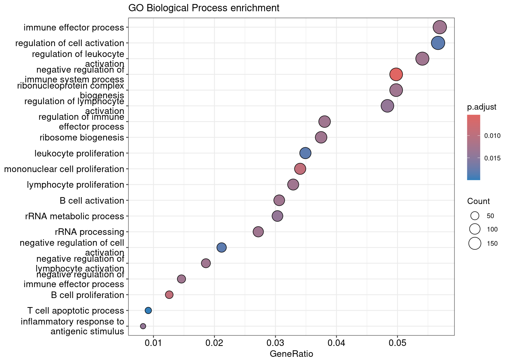
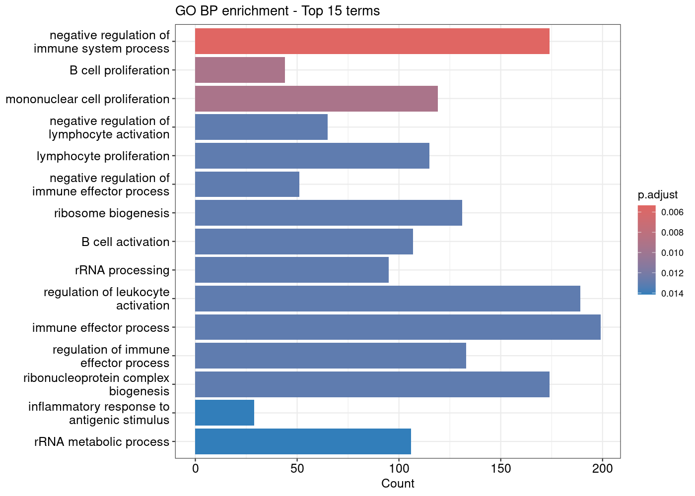
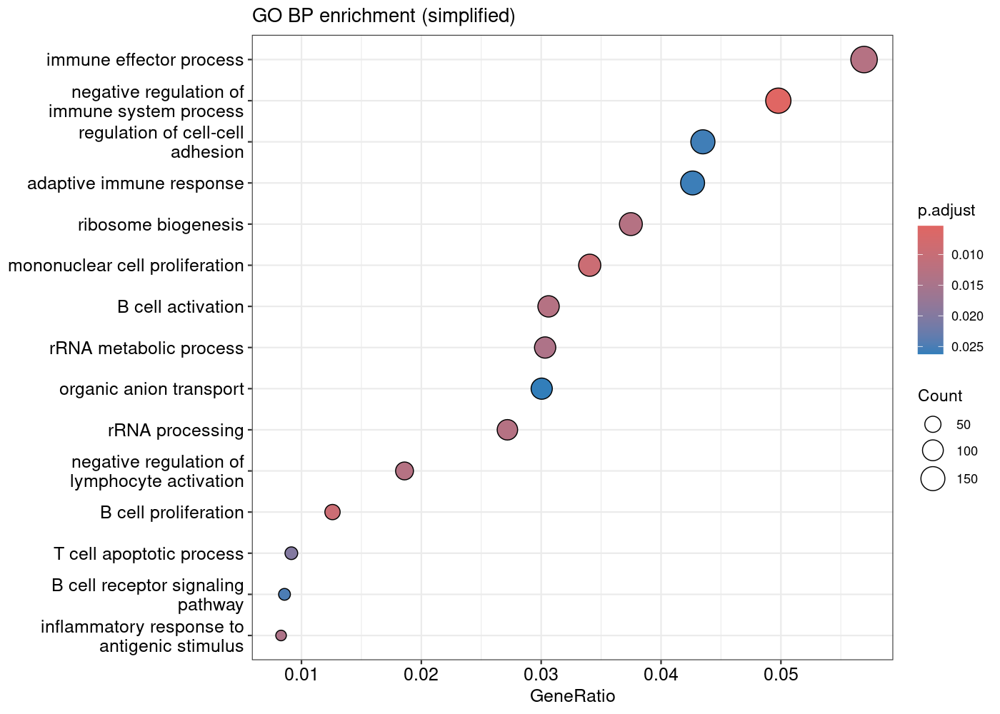
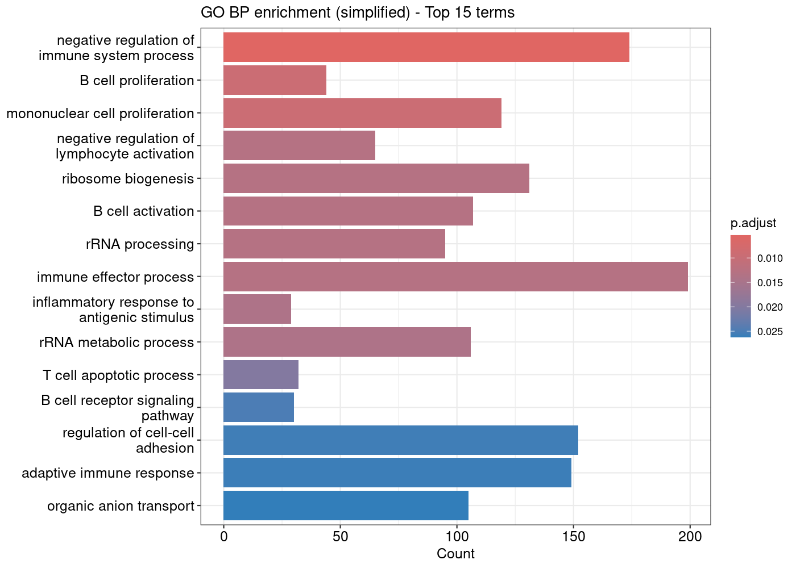
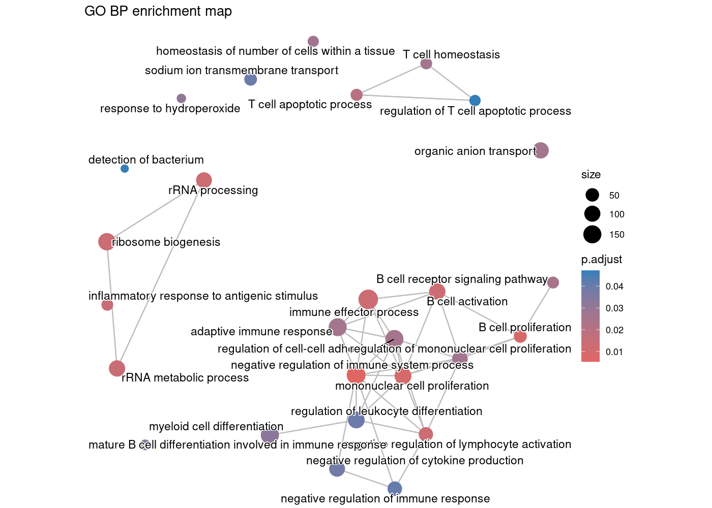
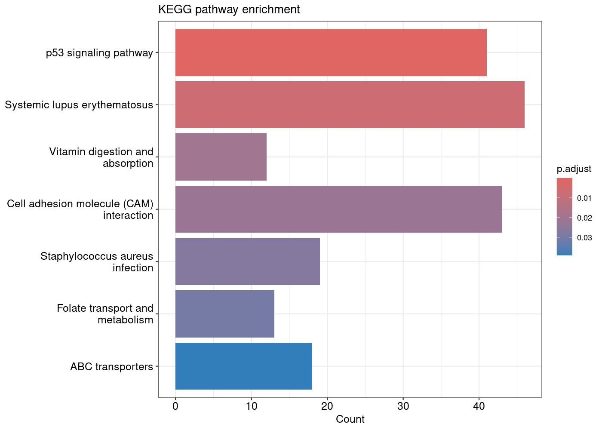
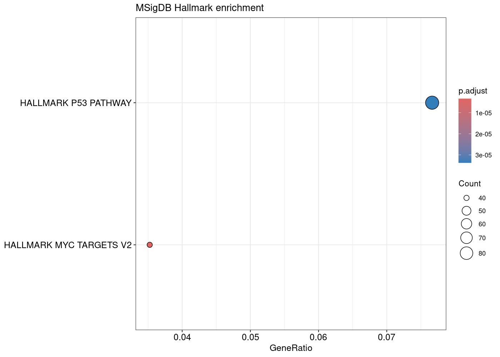
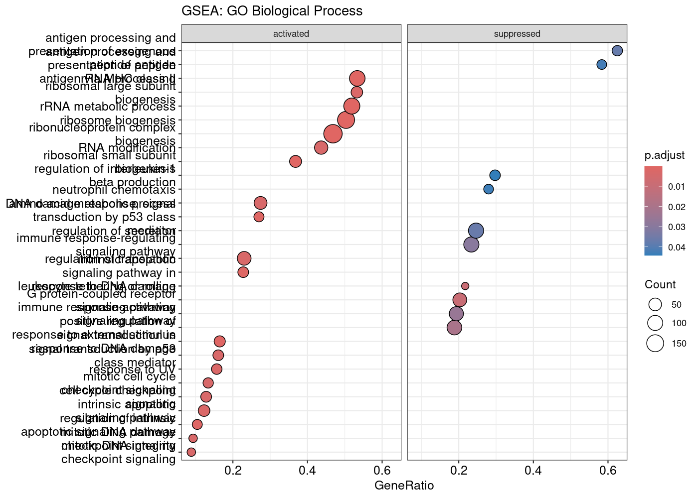
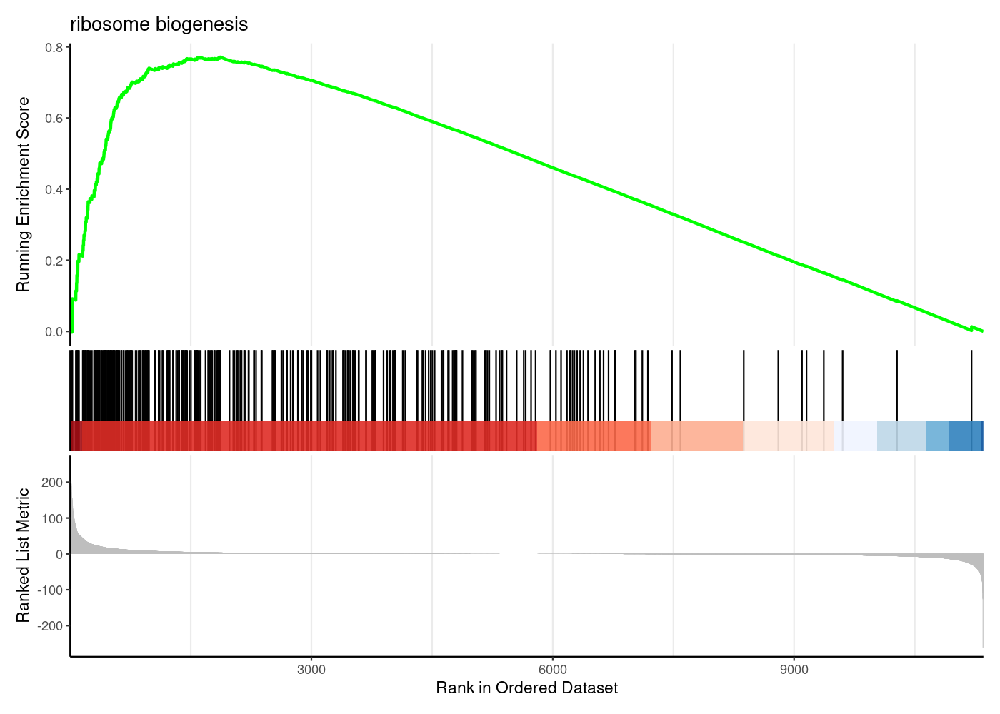

:::::::::::::::::::::::::::::::::::::: questions

- What is over-representation analysis and how does it work statistically?
- How do we identify functional pathways and biological themes from DE genes?
- How do we run enrichment analysis for GO, KEGG, and MSigDB gene sets?
- How do we interpret and compare enrichment results across different databases?
- What are the limitations and best practices for enrichment analysis?

::::::::::::::::::::::::::::::::::::::::::::::::

::::::::::::::::::::::::::::::::::::: objectives

- Understand the statistical basis of over-representation analysis (ORA).
- Prepare gene lists and background universes from DESeq2 results.
- Run GO enrichment using clusterProfiler and interpret ontology categories.
- Run KEGG pathway enrichment with organism-specific data.
- Perform MSigDB Hallmark enrichment for curated biological signatures.
- Produce and interpret barplots, dotplots, and enrichment maps.
- Compare results across multiple gene set databases.

::::::::::::::::::::::::::::::::::::::::::::::::

## Introduction

Differential expression analysis identifies individual genes that change between conditions, but interpreting long gene lists is challenging. **Gene set enrichment analysis** provides biological context by asking: *Are genes with specific functions over-represented among the differentially expressed genes?*

This episode covers **over-representation analysis (ORA)**, the most common approach for interpreting DE results.

::::::::::::::::::::::::::::::::::::::: prereq

## What you need for this episode

- DE results from Episode 05 (`results/deseq2/DESeq2_results_joined.tsv`) or Episode 05b (`results/deseq2_kallisto/DESeq2_kallisto_results.tsv`)
- RStudio session via Open OnDemand
- Internet access from the RStudio session: `enrichKEGG()` queries the KEGG REST service, and `msigdbr()` downloads the MSigDB gene sets the first time it runs

## Required packages

- clusterProfiler (Bioconductor)
- org.Mm.eg.db (mouse annotation)
- msigdbr (MSigDB gene sets)
- enrichplot (visualization)
- dplyr, ggplot2, readr

:::::::::::::::::::::::::::::::::::::::

## Background: Understanding over-representation analysis

### What is ORA?

ORA tests whether a predefined gene set contains more DE genes than expected by chance. It answers the question: *If I randomly selected the same number of genes from my background, how often would I see this many genes from pathway X?*

### The statistical test

ORA uses the **hypergeometric test** (equivalent to Fisher's exact test), which calculates the probability of observing *k* or more genes from a pathway given:

- **N**: Total genes in the background (universe)
- **K**: Genes in the pathway of interest
- **n**: Total DE genes in your list
- **k**: DE genes that are in the pathway

```
                    Pathway genes    Non-pathway genes
DE genes                 k              n - k
Non-DE genes           K - k          N - K - n + k
```

::::::::::::::::::::::::::::::::::::::: callout

## The hypergeometric distribution

The p-value represents the probability of drawing *k* or more pathway genes when randomly selecting *n* genes from a population of *N* genes containing *K* pathway members:

$$P(X \geq k) = \sum_{i=k}^{\min(K,n)} \frac{\binom{K}{i}\binom{N-K}{n-i}}{\binom{N}{n}}$$

This is a one-tailed test asking if the pathway is over-represented (enriched) in your gene list.

:::::::::::::::::::::::::::::::::::::::

### Multiple testing correction

With thousands of gene sets tested, many false positives would occur by chance. We apply **false discovery rate (FDR)** correction using the Benjamini-Hochberg method:

1. Rank all p-values from smallest to largest.
2. Calculate adjusted p-value: $p_{adj} = p \times \frac{n}{rank}$
3. Filter results by adjusted p-value threshold (typically 0.05).

::::::::::::::::::::::::::::::::::::::: callout

## Why the universe matters

The background universe should include **all genes that could have been detected as DE** in your experiment, typically all genes tested by DESeq2.

Common mistakes:
- Using the whole genome (inflates significance).
- Using only expressed genes (may miss relevant pathways).
- Using a different species' gene list.

The universe defines what "expected by chance" means. An inappropriate universe leads to misleading results.

:::::::::::::::::::::::::::::::::::::::

### Gene set databases

Different databases capture different aspects of biology:

| Database | Description | Best for |
|----------|-------------|----------|
| GO BP | Biological Process ontology | Functional processes |
| GO MF | Molecular Function ontology | Protein activities |
| GO CC | Cellular Component ontology | Subcellular localization |
| KEGG | Curated pathways | Metabolic/signaling pathways |
| Reactome | Detailed pathway reactions | Mechanistic understanding |
| MSigDB Hallmark | 50 curated signatures | High-level biological states |
| MSigDB C2 | Curated gene sets | Canonical pathways |

::::::::::::::::::::::::::::::::::::::: discussion

## Which database should I use?

There's no single "best" database. Consider:

- **GO**: Comprehensive but redundant; many overlapping terms.
- **KEGG**: Well-curated pathways; limited coverage; requires Entrez IDs.
- **Hallmark**: Reduced redundancy; easier to interpret; may miss specific pathways.

Best practice: Run multiple databases and look for **convergent signals** across them.

:::::::::::::::::::::::::::::::::::::::

## Step 1: Load DE results and prepare gene lists

Start your RStudio session via Open OnDemand as described in Episode 05, then load the required packages:

Load packages:

```r
library(DESeq2)
library(clusterProfiler)
library(org.Mm.eg.db)
library(msigdbr)
library(enrichplot)
library(dplyr)
library(ggplot2)
library(readr)
# Construct the path dynamically
work_dir <- file.path("/scratch/negishi", Sys.getenv("USER"), "rnaseq-workshop")
setwd(work_dir)
```

Load DESeq2 results from Episode 05. If you followed the Kallisto track (Episodes 04b and 05b), read the Episode 05b table instead, using the commented line; everything after this step is the same for both tracks.

```r
res <- read_tsv("results/deseq2/DESeq2_results_joined.tsv", show_col_types = FALSE)
# Kallisto track (Episode 05b): use this line instead of the one above
# res <- read_tsv("results/deseq2_kallisto/DESeq2_kallisto_results.tsv", show_col_types = FALSE)
head(res)
```

Output:

```text
# A tibble: 6 × 20
  baseMean log2FoldChange  lfcSE        pvalue       padj ensembl_gene_id_vers…¹
     <dbl>          <dbl>  <dbl>         <dbl>      <dbl> <chr>                 
1     259.          0.704 0.123  0.00000000431    2.68e-8 ENSMUSG00000033845.14 
2     142.         -0.244 0.192  0.177            2.56e-1 ENSMUSG00000025903.15 
3     305.          0.218 0.121  0.0652           1.11e-1 ENSMUSG00000033813.16 
4     241.         -0.224 0.129  0.0741           1.23e-1 ENSMUSG00000033793.13 
5     773.         -0.230 0.0952 0.0140           2.86e-2 ENSMUSG00000025907.15 
6     556.         -0.126 0.0892 0.152            2.26e-1 ENSMUSG00000051285.18 
# ℹ abbreviated name: ¹​ensembl_gene_id_version
# ℹ 14 more variables: WT_Bcell_mock_rep1 <dbl>, WT_Bcell_mock_rep2 <dbl>,
#   WT_Bcell_mock_rep3 <dbl>, WT_Bcell_mock_rep4 <dbl>, WT_Bcell_IR_rep1 <dbl>,
#   WT_Bcell_IR_rep2 <dbl>, WT_Bcell_IR_rep3 <dbl>, WT_Bcell_IR_rep4 <dbl>,
#   ensembl_gene_id <chr>, external_gene_name <chr>, gene_biotype <chr>,
#   description <chr>, label <chr>, sig <chr>
```

Define the gene lists:

```r
# Universe: all genes tested
universe <- res$ensembl_gene_id_version

# Significant genes: padj < 0.05 and |log2FC| > log2(1.5)
log2fc_cut <- log2(1.5)
sig_genes <- res %>%
    filter(padj < 0.05, abs(log2FoldChange) > log2fc_cut) %>%
    pull(ensembl_gene_id_version)

length(universe)
length(sig_genes)
```

```text
[1] 11330
[1] 3598
```

::::::::::::::::::::::::::::::::::::::: callout

## Choosing significance thresholds

The threshold for "significant" genes affects enrichment results:

- **Stringent (padj < 0.01, |LFC| > 1)**: Fewer genes, clearer signals, may miss subtle effects.
- **Lenient (padj < 0.1, no LFC cutoff)**: More genes, noisier results, higher sensitivity.

There's no universally correct threshold. Consider your experimental question and validate key findings.

:::::::::::::::::::::::::::::::::::::::

### Convert gene IDs

Most enrichment tools require **Entrez IDs**. Our data uses Ensembl IDs with version numbers, so we need to convert:

```r
# Remove version suffix for mapping
universe_clean <- gsub("\\.\\d+$", "", universe)
sig_clean <- gsub("\\.\\d+$", "", sig_genes)

# Map Ensembl to Entrez
id_map <- bitr(
    universe_clean,
    fromType = "ENSEMBL",
    toType = "ENTREZID",
    OrgDb = org.Mm.eg.db
)

head(id_map)
```

```text
'select()' returned 1:many mapping between keys and columns
Warning message:
0.29% of input gene IDs are fail to map...
             ENSEMBL ENTREZID
1 ENSMUSG00000033845    27395
2 ENSMUSG00000025903    18777
3 ENSMUSG00000033813    21399
4 ENSMUSG00000033793   108664
5 ENSMUSG00000025907    12421
6 ENSMUSG00000051285   319263
```

::::::::::::::::::::::::::::::::::::::: callout

## Gene ID conversion challenges

Not all genes map successfully:

- Some Ensembl IDs lack Entrez equivalents.
- ID mapping databases may be outdated.
- Multi-mapping (one Ensembl → multiple Entrez) can occur.

`bitr()` warns how many IDs failed to map ("x% of input gene IDs are fail to map") and drops them. It can also return more than one Entrez ID for an Ensembl ID, so count unique Ensembl IDs, not rows:

```r
n_mapped <- length(unique(id_map$ENSEMBL))
message(sprintf("Mapped %d of %d genes (%.1f%%); %d rows in id_map",
    n_mapped, length(universe_clean),
    100 * n_mapped / length(universe_clean), nrow(id_map)))
```
 Output:

```text
Mapped 11297 of 11330 genes (99.7%); 11358 rows in id_map
```

:::::::::::::::::::::::::::::::::::::::

Create final gene lists with Entrez IDs:

```r
# Universe with Entrez IDs (unique: one Ensembl ID can map to several Entrez IDs)
universe_entrez <- unique(id_map$ENTREZID)

# Significant genes with Entrez IDs
sig_entrez <- id_map %>%
    filter(ENSEMBL %in% sig_clean) %>%
    pull(ENTREZID) %>%
    unique()

length(sig_entrez)
```
Output:

```text
[1] 3608
```

::::::::::::::::::::::::::::::::::::::: challenge

## Exercise: Prepare up-regulated and down-regulated gene lists

Create separate gene lists for:
1. Up-regulated genes (log2FC > 0 and padj < 0.05)
2. Down-regulated genes (log2FC < 0 and padj < 0.05)

Why might analyzing these separately be informative?

::::::::::::::::::::::::::::::::::: solution

```r
# Up-regulated genes
up_genes <- res %>%
    filter(padj < 0.05, log2FoldChange > log2fc_cut) %>%
    pull(ensembl_gene_id_version)
up_clean <- gsub("\\.\\d+$", "", up_genes)
up_entrez <- id_map %>%
    filter(ENSEMBL %in% up_clean) %>%
    pull(ENTREZID) %>%
    unique()

# Down-regulated genes
down_genes <- res %>%
    filter(padj < 0.05, log2FoldChange < -log2fc_cut) %>%
    pull(ensembl_gene_id_version)
down_clean <- gsub("\\.\\d+$", "", down_genes)
down_entrez <- id_map %>%
    filter(ENSEMBL %in% down_clean) %>%
    pull(ENTREZID) %>%
    unique()
```
Check number of genes:

```r
length(up_entrez)
```

```text
[1] 1800
```

```r
length(down_entrez)
```

```text
[1] 1808
```


Analyzing up and down separately can reveal:
- Different biological processes activated vs. suppressed.
- Clearer signals when combining masks opposing effects.
- Direction-specific pathway involvement.

:::::::::::::::::::::::::::::::::::

:::::::::::::::::::::::::::::::::::::::

## Step 2: GO enrichment analysis

### Run GO Biological Process enrichment

```r
ego_bp <- enrichGO(
    gene = sig_entrez,
    universe = universe_entrez,
    OrgDb = org.Mm.eg.db,
    ont = "BP",
    pAdjustMethod = "BH",
    pvalueCutoff = 0.05,
    qvalueCutoff = 0.1,
    readable = TRUE
)

head(ego_bp, 10)
```

Output (columns truncated for brevity):

```text
                   ID                                    Description GeneRatio
GO:0002683 GO:0002683   negative regulation of immune system process  174/3495
GO:0042100 GO:0042100                           B cell proliferation   44/3495
GO:0032943 GO:0032943                 mononuclear cell proliferation  119/3495
GO:0051250 GO:0051250   negative regulation of lymphocyte activation   65/3495
GO:0046651 GO:0046651                       lymphocyte proliferation  115/3495
GO:0002698 GO:0002698 negative regulation of immune effector process   51/3495
GO:0042254 GO:0042254                            ribosome biogenesis  131/3495
GO:0042113 GO:0042113                              B cell activation  107/3495
GO:0006364 GO:0006364                                rRNA processing   95/3495
GO:0002694 GO:0002694             regulation of leukocyte activation  189/3495
             BgRatio RichFactor FoldEnrichment   zScore       pvalue
GO:0002683 405/10989  0.4296296       1.350844 4.912955 1.024580e-06
GO:0042100  77/10989  0.5714286       1.796689 4.790801 3.662826e-06
GO:0032943 266/10989  0.4473684       1.406618 4.584541 5.342254e-06
GO:0051250 130/10989  0.5000000       1.572103 4.481022 1.098366e-05
GO:0046651 260/10989  0.4423077       1.390707 4.353953 1.449475e-05
GO:0002698  97/10989  0.5257732       1.653139 4.412288 1.650933e-05
GO:0042254 304/10989  0.4309211       1.354905 4.285359 1.836995e-05
GO:0042113 241/10989  0.4439834       1.395975 4.244620 2.337432e-05
GO:0006364 210/10989  0.4523810       1.422379 4.220352 2.698814e-05
GO:0002694 466/10989  0.4055794       1.275225 4.146077 2.898551e-05
              p.adjust      qvalue
GO:0002683 0.005355478 0.005053874
GO:0042100 0.009307986 0.008783790
GO:0032943 0.009307986 0.008783790
GO:0051250 0.013011580 0.012278808
GO:0046651 0.013011580 0.012278808
GO:0002698 0.013011580 0.012278808
GO:0042254 0.013011580 0.012278808
GO:0042113 0.013011580 0.012278808
GO:0006364 0.013011580 0.012278808
GO:0002694 0.013011580 0.012278808
           Count
GO:0002683   174
GO:0042100    44
GO:0032943   119
GO:0051250    65
GO:0046651   115
GO:0002698    51
GO:0042254   131
GO:0042113   107
GO:0006364    95
GO:0002694   189
```


::::::::::::::::::::::::::::::::::::::: callout

## Understanding enrichGO output

Key columns in the results:

- **ID**: GO term identifier (e.g., GO:0006915)
- **Description**: Human-readable term name
- **GeneRatio**: DE genes in term / total DE genes with annotation
- **BgRatio**: Term genes in universe / total annotated genes in universe
- **pvalue**: Raw hypergeometric p-value
- **p.adjust**: BH-corrected p-value
- **qvalue**: Alternative FDR estimate
- **geneID**: List of DE genes in this term
- **Count**: Number of DE genes in this term

:::::::::::::::::::::::::::::::::::::::

### Visualize GO results

Dotplot showing top enriched terms:

```r
dotplot(ego_bp, showCategory = 20) +
    ggtitle("GO Biological Process enrichment")
```

```{r, fig.cap="GO Biological Process enrichment dotplot for all significant genes", echo=FALSE, message=FALSE}

```


The dotplot shows:
- **X-axis**: Gene ratio (proportion of DE genes in the term)
- **Y-axis**: GO term description
- **Color**: Adjusted p-value
- **Size**: Number of genes

Barplot alternative:

```r
barplot(ego_bp, showCategory = 15) +
    ggtitle("GO BP enrichment - Top 15 terms")
```

```{r, fig.cap="GO Biological Process enrichment barplot for all significant genes", echo=FALSE, message=FALSE}

```

### Reduce GO redundancy

GO terms are hierarchical and often redundant. Use `simplify()` to remove similar terms:

```r
ego_bp_simple <- simplify(
    ego_bp,
    cutoff = 0.7,
    by = "p.adjust",
    select_fun = min
)

dotplot(ego_bp_simple, showCategory = 15) +
    ggtitle("GO BP enrichment (simplified)")
```

```{r, fig.cap="Simplified GO Biological Process enrichment dotplot", echo=FALSE, message=FALSE}

```

The same simplified result as a barplot:

```r
barplot(ego_bp_simple, showCategory = 15) +
    ggtitle("GO BP enrichment (simplified) - Top 15 terms")
```

```{r, fig.cap="Simplified GO Biological Process enrichment barplot", echo=FALSE, message=FALSE}

```


::::::::::::::::::::::::::::::::::::::: callout

## Why simplify GO results?

The GO hierarchy means related terms often appear together:
- "regulation of cell death" and "positive regulation of cell death"
- "response to stimulus" and "response to external stimulus"

`simplify()` removes redundant terms based on semantic similarity, making results easier to interpret. The `cutoff` parameter (0-1) controls how aggressively terms are merged.

:::::::::::::::::::::::::::::::::::::::

### Enrichment map visualization

For many significant terms, an enrichment map shows relationships:

```r
ego_bp_em <- pairwise_termsim(ego_bp_simple)
emapplot(ego_bp_em, showCategory = 30) +
    ggtitle("GO BP enrichment map")
```


```{r, fig.cap="GO Biological Process enrichment map showing term relationships", echo=FALSE, message=FALSE}

```


The enrichment map clusters similar terms together, revealing functional themes.

::::::::::::::::::::::::::::::::::::::: challenge

## Exercise: Compare GO ontologies

Run enrichment for GO Molecular Function (MF) and Cellular Component (CC):

```r
ego_mf <- enrichGO(gene = sig_entrez, universe = universe_entrez,
                   OrgDb = org.Mm.eg.db, ont = "MF", readable = TRUE)
ego_cc <- enrichGO(gene = sig_entrez, universe = universe_entrez,
                   OrgDb = org.Mm.eg.db, ont = "CC", readable = TRUE)
```

1. How do the top terms differ between BP, MF, and CC?
2. Are there consistent themes across ontologies?
3. Which ontology provides the most interpretable results for your experiment?

::::::::::::::::::::::::::::::::::: solution

Example interpretation:

- **BP** terms describe processes (e.g., "cell cycle", "RNA processing").
- **MF** terms describe molecular activities (e.g., "RNA binding", "kinase activity").
- **CC** terms describe locations (e.g., "nucleus", "mitochondrion").

Consistent themes across ontologies strengthen biological interpretation. For example, if BP shows "translation" enrichment, MF might show "ribosome binding", and CC might show "ribosome" or "cytoplasm".

:::::::::::::::::::::::::::::::::::

:::::::::::::::::::::::::::::::::::::::

## Step 3: KEGG pathway enrichment

KEGG provides curated pathway maps connecting genes to biological systems.

```r
ekegg <- enrichKEGG(
    gene = sig_entrez,
    universe = universe_entrez,
    organism = "mmu",  # Mouse
    pAdjustMethod = "BH",
    pvalueCutoff = 0.05
)

head(ekegg)
```

Output (geneID column not shown for brevity):

```text
Reading KEGG annotation online: "https://rest.kegg.jp/link/mmu/pathway"...
Reading KEGG annotation online: "https://rest.kegg.jp/list/pathway/mmu"...
                                     category
mmu04115                   Cellular Processes
mmu05322                       Human Diseases
mmu04977                   Organismal Systems
mmu04514 Environmental Information Processing
mmu05150                       Human Diseases
mmu04981                                 <NA>
                                 subcategory       ID
mmu04115               Cell growth and death mmu04115
mmu05322                      Immune disease mmu05322
mmu04977                    Digestive system mmu04977
mmu04514 Signaling molecules and interaction mmu04514
mmu05150       Infectious disease: bacterial mmu05150
mmu04981                                <NA> mmu04981
                                      Description GeneRatio BgRatio RichFactor
mmu04115                    p53 signaling pathway   41/1705 64/5322  0.6406250
mmu05322             Systemic lupus erythematosus   46/1705 87/5322  0.5287356
mmu04977         Vitamin digestion and absorption   12/1705 15/5322  0.8000000
mmu04514 Cell adhesion molecule (CAM) interaction   43/1705 85/5322  0.5058824
mmu05150          Staphylococcus aureus infection   19/1705 30/5322  0.6333333
mmu04981          Folate transport and metabolism   13/1705 18/5322  0.7222222
         FoldEnrichment   zScore       pvalue     p.adjust       qvalue
mmu04115       1.999652 5.523483 1.225915e-07 4.094557e-05 3.935833e-05
mmu05322       1.650399 4.199195 3.991355e-05 6.665562e-03 6.407175e-03
mmu04977       2.497126 3.986245 1.825880e-04 2.032813e-02 1.954012e-02
mmu04514       1.579065 3.694708 2.631397e-04 2.197216e-02 2.112042e-02
mmu05150       1.976891 3.683678 4.054504e-04 2.708409e-02 2.603418e-02
mmu04981       2.254350 3.659635 5.427993e-04 3.021583e-02 2.904452e-02
         Count
mmu04115    41
mmu05322    46
mmu04977    12
mmu04514    43
mmu05150    19
mmu04981    13
```

::::::::::::::::::::::::::::::::::::::: callout

## KEGG organism codes

Common organism codes:
- `"hsa"`: Human
- `"mmu"`: Mouse
- `"rno"`: Rat
- `"dme"`: Drosophila
- `"sce"`: Yeast
- `"ath"`: Arabidopsis

Find your organism: `search_kegg_organism("species name")`

:::::::::::::::::::::::::::::::::::::::

Visualize KEGG results:

```r
barplot(ekegg, showCategory = 15) +
    ggtitle("KEGG pathway enrichment")
```

```{r, fig.cap="KEGG pathway enrichment barplot", echo=FALSE, message=FALSE}

```

::::::::::::::::::::::::::::::::::::::: callout

## Warnings from the plotting functions

enrichplot's `barplot()`, `dotplot()`, `emapplot()`, and `gseaplot2()` may print warnings such as `` `aes_string()` was deprecated in ggplot2 3.0.0 ``, `` Using `size` aesthetic for lines was deprecated ``, or `Arguments in ... must be used. Problematic argument: by = x`. They come from the package internals and the installed ggplot2 version, not from your code, and the plots are correct.

:::::::::::::::::::::::::::::::::::::::


::::::::::::::::::::::::::::::::::::::: callout

## KEGG limitations

Be aware of KEGG-specific issues:

1. **ID coverage**: KEGG uses its own gene IDs; some Entrez IDs may not map.
2. **Update frequency**: KEGG pathways are updated periodically; results may vary.
3. **License**: KEGG has usage restrictions for commercial applications.
4. **Incomplete mapping**: Some genes lack pathway assignments.

Check dropped genes:

```r
message(sprintf("KEGG analysis used %d of %d input genes",
    length(ekegg@gene), length(sig_entrez)))
```

Output:

```text
KEGG analysis used 3608 of 3608 input genes
```

:::::::::::::::::::::::::::::::::::::::

## Step 4: MSigDB Hallmark enrichment

MSigDB Hallmark gene sets are 50 curated signatures representing well-defined biological states and processes.

### Load Hallmark gene sets

```r
hallmark <- msigdbr(species = "Mus musculus", collection = "H")
head(hallmark)
```
Output:

```text
Using human MSigDB with ortholog mapping to mouse. Use `db_species = "MM"` for mouse-native gene sets.
This message is displayed once per session.
Downloading gene sets (first use only, may take a few minutes)...
# A tibble: 6 × 23
  gene_symbol ncbi_gene ensembl_gene db_gene_symbol db_ncbi_gene db_ensembl_gene
  <chr>       <chr>     <chr>        <chr>          <chr>        <chr>          
1 Abca1       11303     ENSMUSG0000… ABCA1          19           ENSG00000165029
2 Abcb8       74610     ENSMUSG0000… ABCB8          11194        ENSG00000197150
3 Acaa2       52538     ENSMUSG0000… ACAA2          10449        ENSG00000167315
4 Acadl       11363     ENSMUSG0000… ACADL          33           ENSG00000115361
5 Acadm       11364     ENSMUSG0000… ACADM          34           ENSG00000117054
6 Acads       11409     ENSMUSG0000… ACADS          35           ENSG00000122971
# ℹ 17 more variables: source_gene <chr>, gs_id <chr>, gs_name <chr>,
#   gs_collection <chr>, gs_subcollection <chr>, gs_collection_name <chr>,
#   gs_description <chr>, gs_source_species <chr>, gs_pmid <chr>,
#   gs_geoid <chr>, gs_exact_source <chr>, gs_url <chr>, db_version <chr>,
#   db_target_species <chr>, ortholog_taxon_id <int>, ortholog_sources <chr>,
#   num_ortholog_sources <dbl>
```


::::::::::::::::::::::::::::::::::::::: callout

## About the msigdbr download

MSigDB gene sets are curated for human. For mouse, msigdbr maps each human gene to its mouse ortholog, which is why the table has both mouse columns (`gene_symbol`, `ncbi_gene`) and human `db_*` columns. Recent msigdbr releases (version 10 and later) download the MSigDB data the first time you call `msigdbr()` and cache it under `~/.cache/R/msigdbr`. If you see a warning like `cannot rename file ... reason 'Invalid cross-device link'`, the cache could not be saved because the temporary directory and your home directory are on different file systems; the gene sets still load, but the next session downloads them again. Older tutorials use `category = "H"` and the `entrez_gene` column; current msigdbr uses `collection = "H"` and `ncbi_gene`.

:::::::::::::::::::::::::::::::::::::::

Prepare gene set list:

```r
hallmark_list <- hallmark %>%
    dplyr::select(gs_name, ncbi_gene) %>%
    dplyr::rename(term = gs_name, gene = ncbi_gene)
```

### Run Hallmark enrichment

```r
ehall <- enricher(
    gene = sig_entrez,
    universe = universe_entrez,
    TERM2GENE = hallmark_list,
    pAdjustMethod = "BH",
    pvalueCutoff = 0.05
)

head(ehall)
```
Output (columns truncated for brevity):

```text
                                             ID             Description
HALLMARK_MYC_TARGETS_V2 HALLMARK_MYC_TARGETS_V2 HALLMARK_MYC_TARGETS_V2
HALLMARK_P53_PATHWAY       HALLMARK_P53_PATHWAY    HALLMARK_P53_PATHWAY
                        GeneRatio  BgRatio RichFactor FoldEnrichment   zScore
HALLMARK_MYC_TARGETS_V2   40/1135  57/3216  0.7017544       1.988407 5.559694
HALLMARK_P53_PATHWAY      87/1135 164/3216  0.5304878       1.503127 4.883817
                              pvalue     p.adjust       qvalue
HALLMARK_MYC_TARGETS_V2 6.761005e-08 3.380503e-06 2.917908e-06
HALLMARK_P53_PATHWAY    1.349008e-06 3.372520e-05 2.911017e-05
                        Count
HALLMARK_MYC_TARGETS_V2    40
HALLMARK_P53_PATHWAY       87
```

Visualize:

```r
dotplot(ehall, showCategory = 20) +
    ggtitle("MSigDB Hallmark enrichment")
```

```{r, fig.cap="MSigDB Hallmark gene set enrichment dotplot", echo=FALSE, message=FALSE}

```


::::::::::::::::::::::::::::::::::::::: callout

## Why use Hallmark gene sets?

Advantages of Hallmark over GO/KEGG:

1. **Reduced redundancy**: Each signature is distinct and non-overlapping.
2. **Expert curation**: Refined from multiple sources to represent coherent biology.
3. **Interpretability**: 50 sets is manageable for detailed examination.
4. **Reproducibility**: Well-documented and stable definitions.

Common Hallmark sets include:
- HALLMARK_INFLAMMATORY_RESPONSE
- HALLMARK_P53_PATHWAY
- HALLMARK_OXIDATIVE_PHOSPHORYLATION
- HALLMARK_MYC_TARGETS_V1

:::::::::::::::::::::::::::::::::::::::

## Step 5: Compare results across databases

Create a summary of top enriched terms from each database:

```r
# Extract top 10 from each
top_go <- head(ego_bp_simple@result, 10) %>%
    mutate(Database = "GO BP") %>%
    dplyr::select(Database, Description, p.adjust, Count)

top_kegg <- head(ekegg@result, 10) %>%
    mutate(Database = "KEGG") %>%
    dplyr::select(Database, Description, p.adjust, Count)

top_hall <- head(ehall@result, 10) %>%
    mutate(Database = "Hallmark") %>%
    dplyr::select(Database, ID, p.adjust, Count) %>%
    dplyr::rename(Description = ID)

# Combine
comparison <- bind_rows(top_go, top_kegg, top_hall)
comparison
```

Output:

```text
                                 Database
GO:0002683                          GO BP
GO:0042100                          GO BP
GO:0032943                          GO BP
GO:0051250                          GO BP
GO:0042254                          GO BP
GO:0042113                          GO BP
GO:0006364                          GO BP
GO:0002252                          GO BP
GO:0002437                          GO BP
GO:0016072                          GO BP
mmu04115                             KEGG
mmu05322                             KEGG
mmu04977                             KEGG
mmu04514                             KEGG
mmu05150                             KEGG
mmu04981                             KEGG
mmu02010                             KEGG
mmu03008                             KEGG
mmu05202                             KEGG
mmu04068                             KEGG
HALLMARK_MYC_TARGETS_V2          Hallmark
HALLMARK_P53_PATHWAY             Hallmark
HALLMARK_XENOBIOTIC_METABOLISM   Hallmark
HALLMARK_HEME_METABOLISM         Hallmark
HALLMARK_IL2_STAT5_SIGNALING     Hallmark
HALLMARK_ALLOGRAFT_REJECTION     Hallmark
HALLMARK_MYC_TARGETS_V1          Hallmark
HALLMARK_TNFA_SIGNALING_VIA_NFKB Hallmark
HALLMARK_ESTROGEN_RESPONSE_EARLY Hallmark
HALLMARK_APOPTOSIS               Hallmark
                                                                  Description
GO:0002683                       negative regulation of immune system process
GO:0042100                                               B cell proliferation
GO:0032943                                     mononuclear cell proliferation
GO:0051250                       negative regulation of lymphocyte activation
GO:0042254                                                ribosome biogenesis
GO:0042113                                                  B cell activation
GO:0006364                                                    rRNA processing
GO:0002252                                            immune effector process
GO:0002437                        inflammatory response to antigenic stimulus
GO:0016072                                             rRNA metabolic process
mmu04115                                                p53 signaling pathway
mmu05322                                         Systemic lupus erythematosus
mmu04977                                     Vitamin digestion and absorption
mmu04514                             Cell adhesion molecule (CAM) interaction
mmu05150                                      Staphylococcus aureus infection
mmu04981                                      Folate transport and metabolism
mmu02010                                                     ABC transporters
mmu03008                                    Ribosome biogenesis in eukaryotes
mmu05202                              Transcriptional misregulation in cancer
mmu04068                                               FoxO signaling pathway
HALLMARK_MYC_TARGETS_V2                               HALLMARK_MYC_TARGETS_V2
HALLMARK_P53_PATHWAY                                     HALLMARK_P53_PATHWAY
HALLMARK_XENOBIOTIC_METABOLISM                 HALLMARK_XENOBIOTIC_METABOLISM
HALLMARK_HEME_METABOLISM                             HALLMARK_HEME_METABOLISM
HALLMARK_IL2_STAT5_SIGNALING                     HALLMARK_IL2_STAT5_SIGNALING
HALLMARK_ALLOGRAFT_REJECTION                     HALLMARK_ALLOGRAFT_REJECTION
HALLMARK_MYC_TARGETS_V1                               HALLMARK_MYC_TARGETS_V1
HALLMARK_TNFA_SIGNALING_VIA_NFKB             HALLMARK_TNFA_SIGNALING_VIA_NFKB
HALLMARK_ESTROGEN_RESPONSE_EARLY             HALLMARK_ESTROGEN_RESPONSE_EARLY
HALLMARK_APOPTOSIS                                         HALLMARK_APOPTOSIS
                                     p.adjust Count
GO:0002683                       5.355478e-03   174
GO:0042100                       9.307986e-03    44
GO:0032943                       9.307986e-03   119
GO:0051250                       1.301158e-02    65
GO:0042254                       1.301158e-02   131
GO:0042113                       1.301158e-02   107
GO:0006364                       1.301158e-02    95
GO:0002252                       1.301158e-02   199
GO:0002437                       1.414184e-02    29
GO:0016072                       1.414184e-02   106
mmu04115                         4.094557e-05    41
mmu05322                         6.665562e-03    46
mmu04977                         2.032813e-02    12
mmu04514                         2.197216e-02    43
mmu05150                         2.708409e-02    19
mmu04981                         3.021583e-02    13
mmu02010                         3.907863e-02    18
mmu03008                         6.905345e-02    35
mmu05202                         6.905345e-02    60
mmu04068                         9.044789e-02    48
HALLMARK_MYC_TARGETS_V2          3.380503e-06    40
HALLMARK_P53_PATHWAY             3.372520e-05    87
HALLMARK_XENOBIOTIC_METABOLISM   1.059555e-01    57
HALLMARK_HEME_METABOLISM         1.059555e-01    72
HALLMARK_IL2_STAT5_SIGNALING     1.645802e-01    69
HALLMARK_ALLOGRAFT_REJECTION     1.645802e-01    70
HALLMARK_MYC_TARGETS_V1          1.797650e-01    84
HALLMARK_TNFA_SIGNALING_VIA_NFKB 2.056196e-01    67
HALLMARK_ESTROGEN_RESPONSE_EARLY 2.056196e-01    56
HALLMARK_APOPTOSIS               2.567067e-01    54
```


::::::::::::::::::::::::::::::::::::::: challenge

## Exercise: Identify convergent themes

Looking at your GO, KEGG, and Hallmark results:

1. Are there biological themes that appear across multiple databases?
2. Are there database-specific findings that don't replicate elsewhere?
3. How would you prioritize which findings to investigate further?

::::::::::::::::::::::::::::::::::: solution

Convergent signals to look for:

- If GO shows "cell cycle" terms, KEGG might show "Cell cycle" pathway, and Hallmark might show "HALLMARK_G2M_CHECKPOINT".
- If GO shows "immune response", KEGG might show "Cytokine-cytokine receptor interaction", and Hallmark might show "HALLMARK_INFLAMMATORY_RESPONSE".

Database-specific findings may indicate:
- Pathway coverage differences.
- Annotation biases.
- Potentially spurious signals (require validation).

Prioritization strategy:
1. Focus on themes appearing in multiple databases.
2. Consider effect size (how many genes, fold enrichment).
3. Assess biological plausibility given experimental design.
4. Validate key findings with independent methods.

:::::::::::::::::::::::::::::::::::

:::::::::::::::::::::::::::::::::::::::

## Step 5b: Direction-aware enrichment analysis

ORA on all significant genes (up + down combined) can mask biological signals when up-regulated and down-regulated genes have different functions. Analyzing directions separately often reveals clearer patterns.

### Prepare direction-specific gene lists

```r
# Up-regulated genes
up_genes <- res %>%
    filter(padj < 0.05, log2FoldChange > log2fc_cut) %>%
    pull(ensembl_gene_id_version)
up_clean <- gsub("\\.\\d+$", "", up_genes)
up_entrez <- id_map %>%
    filter(ENSEMBL %in% up_clean) %>%
    pull(ENTREZID) %>%
    unique()

# Down-regulated genes
down_genes <- res %>%
    filter(padj < 0.05, log2FoldChange < -log2fc_cut) %>%
    pull(ensembl_gene_id_version)
down_clean <- gsub("\\.\\d+$", "", down_genes)
down_entrez <- id_map %>%
    filter(ENSEMBL %in% down_clean) %>%
    pull(ENTREZID) %>%
    unique()

message(sprintf("Up-regulated: %d genes, Down-regulated: %d genes",
    length(up_entrez), length(down_entrez)))
```

```text
Up-regulated: 1800 genes, Down-regulated: 1808 genes
```


### Run enrichment for each direction

```r
# GO enrichment for up-regulated genes
ego_up <- enrichGO(
    gene = up_entrez,
    universe = universe_entrez,
    OrgDb = org.Mm.eg.db,
    ont = "BP",
    readable = TRUE
)

# GO enrichment for down-regulated genes
ego_down <- enrichGO(
    gene = down_entrez,
    universe = universe_entrez,
    OrgDb = org.Mm.eg.db,
    ont = "BP",
    readable = TRUE
)
```

### Compare directions

```r
# Combine top results for comparison
up_top <- head(ego_up@result, 10) %>%
    mutate(Direction = "Up-regulated") %>%
    dplyr::select(Direction, Description, p.adjust, Count)

down_top <- head(ego_down@result, 10) %>%
    mutate(Direction = "Down-regulated") %>%
    dplyr::select(Direction, Description, p.adjust, Count)

direction_comparison <- bind_rows(up_top, down_top)
direction_comparison
```

Output:

```text
                Direction
GO:0022613   Up-regulated
GO:0042254   Up-regulated
GO:0006364   Up-regulated
GO:0016072   Up-regulated
GO:0042273   Up-regulated
GO:0042274   Up-regulated
GO:0006399   Up-regulated
GO:0000470   Up-regulated
GO:0009451   Up-regulated
GO:0000463   Up-regulated
GO:0002694 Down-regulated
GO:0002683 Down-regulated
GO:0050865 Down-regulated
GO:0002252 Down-regulated
GO:0007264 Down-regulated
GO:0051249 Down-regulated
GO:0009617 Down-regulated
GO:0002697 Down-regulated
GO:0007186 Down-regulated
GO:0030036 Down-regulated
                                                                                        Description
GO:0022613                                                     ribonucleoprotein complex biogenesis
GO:0042254                                                                      ribosome biogenesis
GO:0006364                                                                          rRNA processing
GO:0016072                                                                   rRNA metabolic process
GO:0042273                                                       ribosomal large subunit biogenesis
GO:0042274                                                       ribosomal small subunit biogenesis
GO:0006399                                                                   tRNA metabolic process
GO:0000470                                                                   maturation of LSU-rRNA
GO:0009451                                                                         RNA modification
GO:0000463 maturation of LSU-rRNA from tricistronic rRNA transcript (SSU-rRNA, 5.8S rRNA, LSU-rRNA)
GO:0002694                                                       regulation of leukocyte activation
GO:0002683                                             negative regulation of immune system process
GO:0050865                                                            regulation of cell activation
GO:0002252                                                                  immune effector process
GO:0007264                                                small GTPase-mediated signal transduction
GO:0051249                                                      regulation of lymphocyte activation
GO:0009617                                                                    response to bacterium
GO:0002697                                                    regulation of immune effector process
GO:0007186                                             G protein-coupled receptor signaling pathway
GO:0030036                                                          actin cytoskeleton organization
               p.adjust Count
GO:0022613 2.480013e-27   164
GO:0042254 3.493539e-25   128
GO:0006364 4.747624e-19    92
GO:0016072 7.399451e-19   100
GO:0042273 1.126647e-08    33
GO:0042274 4.470014e-08    45
GO:0006399 1.050626e-06    62
GO:0000470 2.540424e-05    17
GO:0009451 5.152986e-05    48
GO:0000463 7.562447e-05    13
GO:0002694 7.414774e-07   127
GO:0002683 8.815232e-07   113
GO:0050865 1.337910e-06   131
GO:0002252 1.337910e-06   130
GO:0007264 2.698226e-06    95
GO:0051249 4.396731e-06   111
GO:0009617 4.561043e-06   120
GO:0002697 1.142019e-05    88
GO:0007186 1.142019e-05    97
GO:0030036 3.006957e-05   123
```


::::::::::::::::::::::::::::::::::::::: callout

## When to analyze directions separately

Separate analysis is particularly useful when:

- You expect different biological processes to be activated vs. suppressed.
- Combined analysis shows few significant results (opposing signals may cancel out).
- You want to understand mechanism (what's gained vs. lost).

Separate analysis is less useful when:

- You have very few DE genes in one direction.
- The biological question is about overall pathway disruption.

:::::::::::::::::::::::::::::::::::::::

## Step 5c: Gene Set Enrichment Analysis (GSEA)

ORA has a fundamental limitation: it requires an arbitrary cutoff to define "significant" genes. **GSEA** uses the full ranked gene list without cutoffs.

### How GSEA differs from ORA

| Aspect | ORA | GSEA |
|--------|-----|------|
| Input | List of significant genes | All genes, ranked by fold change |
| Cutoff | Required (padj, LFC) | None |
| Sensitivity | May miss coordinated small changes | Detects subtle but consistent shifts |
| Gene weights | All DE genes treated equally | Magnitude of change matters |

### Prepare ranked gene list for GSEA

GSEA requires a named vector of gene scores (typically log2 fold change or a signed significance score):

```r
# Create ranked list using signed -log10(pvalue) * sign(LFC)
# This weights by both significance and direction
res_gsea <- res %>%
    filter(!is.na(padj), !is.na(log2FoldChange)) %>%
    mutate(
        ensembl_clean = gsub("\\.\\d+$", "", ensembl_gene_id_version),
        rank_score = -log10(pvalue) * sign(log2FoldChange)
    )

# Map to Entrez IDs
res_gsea <- res_gsea %>%
    inner_join(id_map, by = c("ensembl_clean" = "ENSEMBL"))

# Create named vector (required format for GSEA)
gene_list <- res_gsea$rank_score
names(gene_list) <- res_gsea$ENTREZID

# Sort by rank score (required for GSEA)
gene_list <- sort(gene_list, decreasing = TRUE)
```

```r
head(gene_list)
tail(gene_list)
```

```text
   27015    12519    65964    17246   217882   230784 
250.3965 244.4231 231.8965 213.2033 212.3574 211.3000 
    15002     23943     66222     12481    108105     20343 
-101.4362 -103.0995 -108.3381 -124.5315 -126.5745 -261.1024 
```

### Run GSEA with clusterProfiler

```r
# 1. Sort the list in decreasing order (required by clusterProfiler)
gene_list <- sort(gene_list, decreasing = TRUE)
# 2. Remove duplicate Entrez IDs 
# (Since we sorted by value, this keeps the instance with the highest absolute value)
gene_list <- gene_list[!duplicated(names(gene_list))]
# 3. Verify it is a named numeric vector
# (large positive scores first, Entrez IDs as names)
head(gene_list)
# 4. Run GSEA. The p-values come from random permutations, so set a seed
#    to get the same result every time you run it.
set.seed(42)
gsea_go <- gseGO(
    geneList     = gene_list,      # Pass the numeric vector, NOT names(gene_list)
    OrgDb        = org.Mm.eg.db,
    ont          = "BP",
    minGSSize    = 10,
    maxGSSize    = 500,
    pvalueCutoff = 0.05,
    eps          = 0,              # estimate very small p-values exactly
    seed         = TRUE,           # use the seed set above
    verbose      = FALSE
)
head(gsea_go)
```

Output (columns truncated for brevity):

```text
   27015    12519    65964    17246   217882   230784 
250.3965 244.4231 231.8965 213.2033 212.3574 211.3000 
Warning message:
There are ties in the preranked stats (0.52% of the list).
The order of those tied genes will be arbitrary, which may produce unexpected results.
                   ID                                   Description setSize
GO:0042254 GO:0042254                           ribosome biogenesis     304
GO:0022613 GO:0022613          ribonucleoprotein complex biogenesis     425
GO:0006364 GO:0006364                               rRNA processing     210
GO:0016072 GO:0016072                        rRNA metabolic process     241
GO:0042274 GO:0042274            ribosomal small subunit biogenesis     106
GO:0042770 GO:0042770 signal transduction in response to DNA damage     170
           enrichmentScore      NES       pvalue     p.adjust       qvalue rank
GO:0042254       0.7712952 2.029569 4.343010e-16 2.279212e-12 2.042129e-12 1867
GO:0022613       0.7190404 1.928719 4.302215e-14 1.128901e-10 1.011473e-10 1867
GO:0006364       0.7693857 1.984821 1.180550e-10 2.065175e-07 1.850357e-07 1867
GO:0016072       0.7524483 1.951091 1.777747e-10 2.332404e-07 2.089788e-07 1867
GO:0042274       0.7953617 1.917009 1.560185e-07 1.637571e-04 1.467231e-04  947
GO:0042770       0.7420666 1.875837 4.473394e-07 3.912729e-04 3.505728e-04  891
                             leading_edge
GO:0042254 tags=50%, list=16%, signal=43%
GO:0022613 tags=47%, list=16%, signal=41%
GO:0006364 tags=53%, list=16%, signal=45%
GO:0016072 tags=52%, list=16%, signal=44%
GO:0042274  tags=37%, list=8%, signal=34%
GO:0042770  tags=16%, list=8%, signal=15%
```

::::::::::::::::::::::::::::::::::::::: callout

## Messages from gseGO()

You may see `There are ties in the preranked stats (x% of the list)`. Genes with identical scores (genes with the same p-value and direction) have no defined order between them; with ties in about 0.5 percent of the list here, the effect on the results is negligible. Setting `eps = 0` makes fgsea estimate very small p-values exactly instead of reporting them as `1e-10`, which avoids the message suggesting it. Because GSEA p-values come from permutations, results differ slightly between runs unless you set a seed as above.

:::::::::::::::::::::::::::::::::::::::

### Visualize GSEA results

```r
# Dot plot of enriched gene sets
dotplot(gsea_go, showCategory = 20, split = ".sign") +
    facet_grid(. ~ .sign) +
    ggtitle("GSEA: GO Biological Process")
```

```{r, fig.cap="GSEA dotplot for GO Biological Process showing activated and suppressed gene sets", echo=FALSE, message=FALSE}

```


The `.sign` column indicates whether the gene set is enriched in up-regulated (`activated`) or down-regulated (`suppressed`) genes.

### GSEA enrichment plot for a specific term

```r
# Enrichment plot for top gene set
gseaplot2(gsea_go, geneSetID = 1, title = gsea_go$Description[1])
```


```{r, fig.cap="GSEA enrichment plot showing running enrichment score for top gene set", echo=FALSE, message=FALSE}

```


::::::::::::::::::::::::::::::::::::::: callout

## Interpreting GSEA results

Key metrics:

- **NES (Normalized Enrichment Score)**: Direction and strength of enrichment. Positive = enriched in up-regulated genes; Negative = enriched in down-regulated genes.
- **pvalue/p.adjust**: Statistical significance.
- **core_enrichment**: Genes contributing most to the enrichment signal ("leading edge").

GSEA is particularly valuable when:

- Changes are subtle but coordinated across many genes.
- You want to avoid arbitrary significance cutoffs.
- You're comparing with published gene signatures.

:::::::::::::::::::::::::::::::::::::::

::::::::::::::::::::::::::::::::::::::: challenge

## Exercise: Compare ORA and GSEA results

1. Do the same pathways appear in both ORA and GSEA results?
2. Does GSEA identify any pathways that ORA missed?
3. For pathways appearing in both, is the direction (NES sign) consistent with the ORA direction analysis?

::::::::::::::::::::::::::::::::::::::: solution

Observations for this dataset:

- The strongest signals agree. Ribosome and rRNA biogenesis terms top both the up-regulated ORA and the GSEA table, and "signal transduction in response to DNA damage" is enriched among genes that go up after IR (NES about +1.9).
- GSEA reports 74 significant GO terms, many of which the cutoff-based ORA does not, because it also uses genes with modest changes.
- For the 25 terms found by both GSEA and the direction-specific ORA, the NES sign matches the ORA direction in all 25.
- Where the two disagree, the signal usually comes from many small, consistent changes (seen by GSEA) rather than a few large ones (needed by ORA).

:::::::::::::::::::::::::::::::::::

:::::::::::::::::::::::::::::::::::::::

## Step 6: Save results

Save all enrichment results:

```r
# Create output directory
dir.create("results/enrichment", showWarnings = FALSE)

# GO results
write_csv(as.data.frame(ego_bp), "results/enrichment/GO_BP_enrichment.csv")
write_csv(as.data.frame(ego_bp_simple), "results/enrichment/GO_BP_simplified.csv")

# KEGG results
write_csv(as.data.frame(ekegg), "results/enrichment/KEGG_enrichment.csv")

# Hallmark results
write_csv(as.data.frame(ehall), "results/enrichment/Hallmark_enrichment.csv")

# Direction-aware results
write_csv(as.data.frame(ego_up), "results/enrichment/GO_BP_up_regulated.csv")
write_csv(as.data.frame(ego_down), "results/enrichment/GO_BP_down_regulated.csv")

# GSEA results
write_csv(as.data.frame(gsea_go), "results/enrichment/GSEA_GO_BP.csv")
```

Save plots:

```r
# GO dotplot
pdf("results/enrichment/GO_BP_dotplot.pdf", width = 10, height = 8)
dotplot(ego_bp_simple, showCategory = 20) +
    ggtitle("GO Biological Process enrichment")
dev.off()

# KEGG barplot
pdf("results/enrichment/KEGG_barplot.pdf", width = 10, height = 6)
barplot(ekegg, showCategory = 15) +
    ggtitle("KEGG pathway enrichment")
dev.off()

# Hallmark dotplot
pdf("results/enrichment/Hallmark_dotplot.pdf", width = 10, height = 8)
dotplot(ehall, showCategory = 20) +
    ggtitle("MSigDB Hallmark enrichment")
dev.off()
```

## Interpretation guidelines

### Signs of meaningful enrichment

Enrichment results are more reliable when:

- **Multiple related terms** appear (not just one isolated hit).
- **Consistent themes** emerge across databases.
- **Biological plausibility**: Results align with known biology of your system.
- **Reasonable gene counts**: Terms with many genes (>5-10) are more robust.
- **Moderate p-values**: Extremely low p-values (e.g., 10^-50) may indicate annotation bias.

### Common pitfalls

1. **Over-interpretation**: A significant p-value doesn't prove causation.
2. **Ignoring effect size**: A term with 3/1000 genes is less meaningful than 30/100.
3. **Cherry-picking**: Report all significant results, not just expected ones.
4. **Universe mismatch**: Using wrong background inflates or deflates significance.
5. **Outdated annotations**: Gene function annotations improve over time.

### Reporting enrichment results

In publications, include:

- Method and software versions used.
- Background universe definition.
- Multiple testing correction method.
- Full results tables (supplementary).
- Number of input genes and those successfully mapped.

## Summary

::::::::::::::::::::::::::::::::::::: keypoints

- ORA tests if gene sets contain more DE genes than expected by chance using the hypergeometric test.
- The background universe must include all genes that could have been detected as DE.
- Multiple testing correction (FDR) is essential when testing thousands of gene sets.
- GO provides comprehensive but redundant functional annotation; use `simplify()` to reduce redundancy.
- KEGG provides curated pathway maps but has limited gene coverage and requires Entrez IDs.
- MSigDB Hallmark sets offer 50 high-quality, non-redundant biological signatures.
- **Direction-aware analysis** (up vs. down separately) often reveals clearer biological signals.
- **GSEA** avoids arbitrary cutoffs by using the full ranked gene list; it detects subtle but coordinated changes.
- Convergent findings across multiple databases and methods strengthen biological interpretation.
- Always report methods, thresholds, and full results for reproducibility.

::::::::::::::::::::::::::::::::::::::::::::::::
