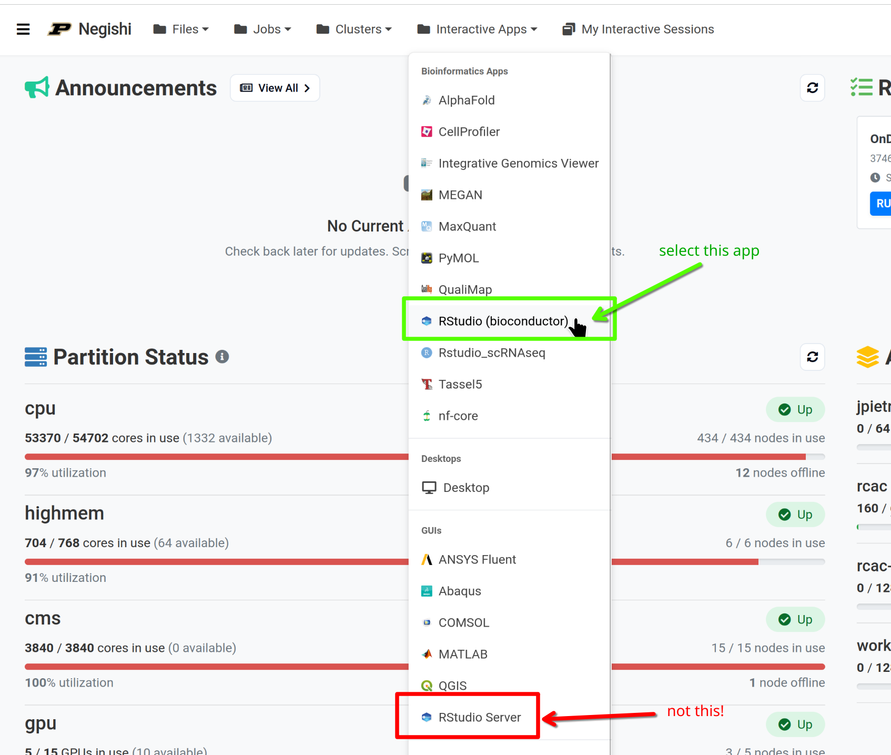
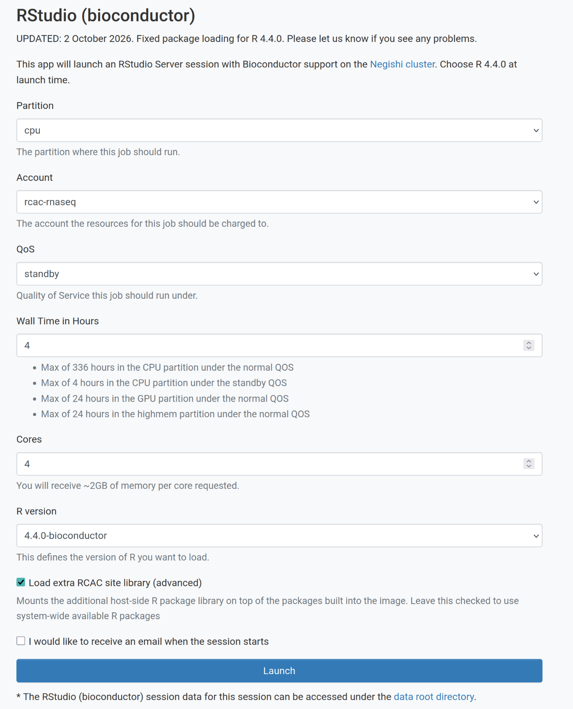

## Instructors

<!-- TODO(instructor): confirm the instructor roster for the 2026-10-06 delivery. -->

1. **Arun Seetharam, Ph.D.**: Arun is a lead bioinformatics scientist at Purdue University’s Rosen Center for Advanced Computing. With extensive expertise in comparative genomics, genome assembly, annotation, single-cell genomics,  NGS data analysis, metagenomics, proteomics, and metabolomics. Arun supports a diverse range of bioinformatics projects across various organisms, including human model systems.

2. **Michael Carlson**, Ph.D.: Michael is a Senior Computational Scientist at Purdue University's Rosen Center for Advanced Computing (RCAC). Michael has a background in computational physics, specifically hypersonic materials. He also leads many introductory workshops in the High-Performance Computing domain.


## Schedule (10/06/2026)


| **Time**     | **Session**                                                                                                                                                                                          |
|:---|-------------|
| **8:30 AM**  | Arrival & Setup                                                                                                                                                                                      |
| **9:00 AM**  | **Introduction to RNA-seq Analysis (Episode 01):** What RNA-seq measures, experimental design and biological replicates, quantification strategies, and an overview of the workflow (QC → alignment → quantification → DE) |
| **9:45 AM**  | **Data Preparation & Quality Control (Episodes 02-03):** Project layout, reference genome, annotation and FASTQ files, running FastQC and MultiQC, and deciding whether trimming is needed (fastp shown for reference only) |
| **10:30 AM** | **Break**                                                                                                                                                                                            |
| **10:45 AM** | **Read Alignment & Quantification (Episode 04a):** Checking strandedness with Salmon, building a STAR index, mapping with a SLURM array job, and generating gene-level counts with featureCounts (Episode 04b, Kallisto, covered conceptually only) |
| **12:00 PM** | **Lunch Break**                                                                                                                                                                                      |
| **1:00 PM**  | **Differential Expression Analysis (Episode 05):** Importing counts into R, normalization, exploratory plots (VST, distance heatmaps, PCA), and identifying significantly differentially expressed genes |
| **2:15 PM**  | **Break**                                                                                                                                                                                            |
| **2:30 PM**  | **Visualization & Interpretation (Episodes 05-06):** Volcano plots, summary tables, and exporting annotated results. Introduction to gene set enrichment methods (ORA/GSEA) with pointers to explore independently. |
| **3:30 PM**  | **Wrap-Up & Discussion:** Review of workflow, troubleshooting common issues, recommended next steps                                                                                                  |
| **4:00 PM**  | End of Workshop                                                                                                                                                                                      |

The full lesson is longer than one day. Episodes 04b (Kallisto), 05b (DESeq2 on Kallisto output), and the remainder of Episode 06 are self-paced: they are published on this site and use the same data and setup as the live sessions.

## Prerequisites

This workshop assumes:

- **Basic Linux/command-line skills**: navigating directories, running commands, editing files
- **Basic R skills**: installing packages, reading/writing data, creating plots
- **A Purdue career account with access to the Negishi cluster**
- **An SSH client**: terminal (macOS/Linux) or MobaXterm/PuTTY (Windows)
- **Genomics knowledge**: understanding of genes, transcripts, and genome structure

<!-- TODO(instructor): confirm how registrants get Negishi access for 2026-10-06 (membership in the rcac-rnaseq SLURM account, a reservation, or their own group's account) and state it here. -->

No prior RNA-seq analysis experience is required.

## Scope of this workshop

This workshop teaches a standard bulk RNA-seq workflow, from raw reads to differentially expressed genes and enriched pathways, using a specific dataset and toolset:

- **Platform and library type:** Illumina HiSeq 2000, paired-end 51 bp reads. The library is **unstranded**: Salmon reports library type `IU` in Episode 04a, so featureCounts runs with `-s 0` and Kallisto runs without a strand flag.
- **Organism and reference:** Mouse (*Mus musculus*, C57BL/6). GRCm39 primary assembly genome, GENCODE vM38 basic gene annotation (GTF), and GENCODE vM38 transcript sequences.
- **Dataset:** GEO [GSE71176](https://www.ncbi.nlm.nih.gov/geo/query/acc.cgi?acc=GSE71176), the p53-mediated response to ionizing radiation in mouse B cells ([Tonelli et al. 2015](https://doi.org/10.18632/oncotarget.5232)). We use 8 wild-type samples: 4 mock (SRR2121778-81) and 4 irradiated, 7 Gy and harvested 4 hours later (SRR2121786-89). Each sample is subsampled to 20 million read pairs so that every step finishes within the workshop.

### Toolchain

| Step | Tools | Where it runs | Episode |
|:-----|:------|:--------------|:--------|
| Download reference and reads | `wget`, SRA Toolkit (`fasterq-dump`, shown but not run) | Negishi shell | 02 |
| Read quality control | FastQC, MultiQC (fastp shown for reference) | Negishi, interactive job | 03 |
| Strandedness check | Salmon (`--libType A`) | Negishi, interactive job | 04a |
| Genome-based quantification | STAR, featureCounts (Subread), MultiQC | Negishi, SLURM batch jobs | 04a |
| Transcript-based quantification | Kallisto, tximport | Negishi, SLURM batch jobs and R (`r-rnaseq` module) | 04b |
| Differential expression | DESeq2 (with apeglm shrinkage), vsn, pheatmap, ggplot2 | RStudio on Open OnDemand | 05, 05b |
| Gene set enrichment | clusterProfiler, enrichplot, org.Mm.eg.db, msigdbr (GO, KEGG, MSigDB Hallmark, GSEA) | RStudio on Open OnDemand | 06 |

Command-line tools are loaded as modules with `module load biocontainers` followed by the tool module (for example `module load star`).

<!-- TODO(instructor): record the module versions (biocontainers, fastqc, multiqc, salmon, star, subread, kallisto, r-rnaseq) used for this delivery; the episodes load module defaults. -->

### Two quantification tracks

Episodes 01-03 and 06 are shared. After QC the lesson splits into two parallel tracks that both end in a DESeq2 analysis:

| Track | Episodes | On 10/06/2026 |
|:------|:---------|:--------------|
| Genome-based: STAR + featureCounts, then DESeq2 | 04a, 05 | Taught live, hands-on |
| Transcript-based: Kallisto + tximport, then DESeq2 | 04b, 05b | 04b introduced conceptually; 04b and 05b are self-paced |

Episode 06 runs on the DESeq2 results from either track.

### What you will be able to do

By the end of the workshop you will be able to:

- Organize an RNA-seq project on an HPC cluster and obtain matching reference files.
- Assess read quality with FastQC and MultiQC and decide whether trimming is needed.
- Determine library strandedness, map reads with STAR, and count reads per gene with featureCounts using SLURM batch and array jobs.
- Run a DESeq2 analysis in R: exploratory QC (VST, sample distances, PCA), testing, fold change shrinkage, volcano plots, and an annotated results table.
- Run and interpret over-representation analysis and GSEA on your DE results.

## What is not covered

1. Wet-lab work: sample collection, library preparation, and sequencing
2. De novo transcriptome assembly (for example Trinity) or genome-guided transcript reconstruction
3. Isoform-level analysis: differential transcript usage, alternative splicing, and transcript-level DE with sleuth
4. Long-read, single-cell, or spatial transcriptomics
5. Batch correction methods (ComBat-seq, sva) beyond a brief mention
6. Interactive analysis tools and dashboards (for example Shiny apps or iDEP)

See the [Reference](reference.md) page for papers and resources on these topics.

## SSH Setup

You need SSH access to Negishi to copy the workshop data and to run the command-line steps in Episodes 02 to 04b. Follow the instructions for your operating system below.

::::::::::::::::::::::::::::::::::::::: discussion

## Connecting to the Cluster

You will connect to `negishi.rcac.purdue.edu` with your Purdue career account username and password, followed by Purdue two-factor authentication. Choose the instructions for your operating system below.

:::::::::::::::::::::::::::::::::::::::::::::::::::

:::::::::::::::: solution

### Windows

**MobaXterm (recommended)**

1. Download and install [MobaXterm](https://mobaxterm.mobatek.net/)
2. Open MobaXterm and click **Session > SSH**
3. Set **Remote host** to `negishi.rcac.purdue.edu`
4. Check **Specify username** and enter your Purdue career account username
5. Click **OK** and enter your password when prompted
6. Complete Purdue two-factor authentication

**PuTTY**

1. Download and install [PuTTY](https://www.putty.org/)
2. Set **Host Name** to `negishi.rcac.purdue.edu`, **Port** to `22`, and **Connection type** to **SSH**
3. Click **Open**, then enter your Purdue career account username at the `login as:` prompt
4. Enter your password and complete Purdue two-factor authentication

:::::::::::::::::::::::::

:::::::::::::::: solution

### macOS

1. Open **Terminal** (Applications > Utilities > Terminal)
2. Connect to the cluster:

```bash
ssh your_username@negishi.rcac.purdue.edu
```

3. Enter your password (characters do not appear as you type, but your password is being entered)
4. Complete Purdue two-factor authentication

:::::::::::::::::::::::::

:::::::::::::::: solution

### Linux

1. Open your terminal emulator
2. Connect to the cluster:

```bash
ssh your_username@negishi.rcac.purdue.edu
```

3. Enter your password (characters do not appear as you type, but your password is being entered)
4. Complete Purdue two-factor authentication

:::::::::::::::::::::::::

Once logged in, check that your scratch directory variables are set. The episodes use `$SCRATCH` and this page uses `$RCAC_SCRATCH`; both should print your scratch path:

```bash
echo $RCAC_SCRATCH
echo $SCRATCH
```

```output
/scratch/negishi/your_username
/scratch/negishi/your_username
```

## Data Setup

### Copying the workshop data

The workshop data is pre-staged on Negishi. Copy it to your scratch directory:

```bash
rsync -avP /depot/workshop/data/rnaseq-workshop ${RCAC_SCRATCH}/
```

This creates `${RCAC_SCRATCH}/rnaseq-workshop`, the working directory every episode uses. It will copy:

<!-- TODO(instructor): this list is derived from the episodes. Verify it against the re-staged copy (including whether scripts/, results/, prebuilt indexes, and data/tx2gene.tsv are present) and fill in the expected size below. -->

- **`data/`, raw reads**: 16 FASTQ files, one R1 and one R2 per sample, subsampled to 20 million read pairs each:
  - `WT_Bcell_mock_rep1_R1.fastq.gz` ... `WT_Bcell_mock_rep4_R2.fastq.gz` (mock, 8 files)
  - `WT_Bcell_IR_rep1_R1.fastq.gz` ... `WT_Bcell_IR_rep4_R2.fastq.gz` (irradiated, 8 files)
- **`data/`, reference files** (uncompressed, GENCODE vM38 on GRCm39):
  - `GRCm39.primary_assembly.genome.fa`: genome sequence, used to build the STAR index
  - `gencode.vM38.primary_assembly.basic.annotation.gtf`: gene annotation, used by STAR, featureCounts, and to build `tx2gene.tsv`
  - `gencode.vM38.transcripts.fa`: transcript sequences as downloaded
  - `gencode.vM38.transcripts-clean.fa`: transcript sequences with simplified headers, used by Salmon and Kallisto
- **`data/`, sample and annotation tables**:
  - `SRR_Acc_List.txt`: the 8 SRA run accessions
  - `mart.tsv` and `annot.tsv`: Ensembl gene annotation (symbols, biotypes, descriptions) loaded in Episodes 05 and 05b

You will create `scripts/`, `results/`, the indexes, and all analysis outputs yourself as you work through the episodes.

### Verifying the data

```bash
ls ${RCAC_SCRATCH}/rnaseq-workshop/
ls ${RCAC_SCRATCH}/rnaseq-workshop/data/
ls ${RCAC_SCRATCH}/rnaseq-workshop/data/*.fastq.gz | wc -l
du -sh ${RCAC_SCRATCH}/rnaseq-workshop/data
```

The FASTQ count must be `16`. The total size of `data/` should be about 19 GB.

<!-- TODO(instructor): the data/ size above is filled from the Negishi run kit (01_learner_setup.sh records `du -sh`). -->

::::::::::::::::::::::::::::::::::::::: callout

## Scratch is temporary

Negishi scratch is not backed up, and files that are not accessed for a while are purged automatically. Copy the data shortly before the workshop, and move anything you want to keep (count tables, DE results, plots) to your home directory or your group's Depot space afterwards.

:::::::::::::::::::::::::::::::::::::::

### Completed results (backup)

A completed version of the workshop directory is available at:

```
/scratch/negishi/aseethar/rnaseq-workshop_results
```

You can copy it to your scratch space using:

```bash
rsync -avP /scratch/negishi/aseethar/rnaseq-workshop_results ${RCAC_SCRATCH}/
```

Use this folder **only if you are unable to complete the exercises during the workshop**. It is copied to `${RCAC_SCRATCH}/rnaseq-workshop_results`, so it does not overwrite your own work. To continue from it, copy the specific files you need (for example `results/counts/gene_counts_clean.txt` for Episode 05) into the matching location under `${RCAC_SCRATCH}/rnaseq-workshop`.

## Starting RStudio on Open OnDemand

Episodes 05, 05b, and 06 run in RStudio through Negishi's Open OnDemand (OOD) web portal.

### Step 1: Log in to Open OnDemand

Open your browser and go to [gateway.negishi.rcac.purdue.edu](https://gateway.negishi.rcac.purdue.edu/). Log in with your Purdue career account and complete Purdue two-factor authentication.

### Step 2: Launch RStudio (Bioconductor)

From the top menu bar, click **Interactive Apps**. Under **Bioinformatics Apps**, select **RStudio (bioconductor)**.

::::::::::::::::::::::::::::::::::::::: callout

## Choose the correct app

Select **RStudio (bioconductor)** under **Bioinformatics Apps**, *not* **RStudio Server** under the **GUIs** section. The Bioconductor app provides the packages used in Episodes 05, 05b, and 06.



:::::::::::::::::::::::::::::::::::::::


### Step 3: Fill in the resource request

| Field | Value |
|:------|:------|
| Partition | `cpu` |
| Account | `rcac-rnaseq` |
| QoS | `standby` |
| Wall Time (hours) | `4` |
| Cores | `4` |
| R version | `4.4.0-bioconductor` |
| Load extra RCAC site library (advanced) | ☑️ |



Why these values:

- **Account, partition, and QoS** match the SLURM jobs in Episodes 02 to 04b, so all your work runs under the same allocation.
- **4 hours** is the longest wall time the `standby` QoS allows on the `cpu` partition, and covers the afternoon session. For self-paced work, start a new session when one expires.
- **4 cores** gives about 8 GB of memory (the form allocates roughly 2 GB per core), which is enough for DESeq2 on 8 samples, tximport on 8 Kallisto runs, and the enrichment analyses in Episode 06. If R reports that it cannot allocate memory (most likely during `simplify()` or `gseGO()` in Episode 06), relaunch with 8 cores (about 16 GB).

After the workshop, if you no longer have access to `rcac-rnaseq`, use your own group's account.

Click **Launch** to submit the job.

### Step 4: Connect to the session

The job waits in the queue briefly. Once its status changes to **Running**, click **Connect to RStudio Server** to open RStudio in a new browser tab. Then run the package check at the end of the next section in the RStudio console; it should print `All packages load`.

## R package installation (skip this section if using OOD)

The packages are provided by the RStudio (bioconductor) app on Open OnDemand. Install them yourself only if you want to run the R episodes on your own computer or in a different R installation. The list below is every package the episodes load, grouped by purpose. The same list is load-tested in the OOD app (R 4.4.0, Bioconductor 3.20) before each delivery; last checked on 2026-10-02 (all 19 packages load, R 4.4.0, Bioconductor 3.20).

```r
# Install BiocManager if not already installed
if (!requireNamespace("BiocManager", quietly = TRUE))
    install.packages("BiocManager")

# CRAN packages
install.packages(c(
    "tidyverse",     # readr, dplyr, ggplot2, tibble (Episodes 04b, 05, 05b, 06)
    "RColorBrewer",  # heatmap colors (05, 05b)
    "pheatmap",      # sample distance heatmaps (05, 05b)
    "ggrepel",       # labels on PCA and volcano plots (05, 05b)
    "reshape2",      # reshaping counts for plotting (05b)
    "hexbin",        # meanSdPlot() in vsn (05)
    "msigdbr"        # MSigDB Hallmark gene sets (06)
))

# Bioconductor packages
BiocManager::install(c(
    # Transcript-level import (04b)
    "tximport",
    # Reading Kallisto abundance.h5 files with tximport (04b)
    "rhdf5",
    # Differential expression and QC plots (05, 05b)
    "DESeq2", "apeglm", "vsn",
    # Gene annotation (05, optional biomaRt spoiler)
    "biomaRt",
    # Enrichment analysis (06)
    "clusterProfiler", "enrichplot", "org.Mm.eg.db"
))

# Check that every package loads
pkgs <- c("tidyverse", "RColorBrewer", "pheatmap", "ggrepel", "reshape2", "hexbin", "msigdbr",
          "tximport", "rhdf5", "DESeq2", "apeglm", "vsn", "biomaRt",
          "clusterProfiler", "enrichplot", "org.Mm.eg.db")
missing <- pkgs[!vapply(pkgs, requireNamespace, logical(1), quietly = TRUE)]
if (length(missing)) message("Missing: ", paste(missing, collapse = ", ")) else message("All packages load")
```

```output
All packages load
```

::::::::::::::::::::::::::::::::::::::: callout

## Version notes

- **msigdbr**: Episode 06 uses the current interface, `msigdbr(species = "Mus musculus", collection = "H")` and the `ncbi_gene` column, which needs msigdbr 10 or later (the OOD app has 26.1.1). Older tutorials use `category = "H"` and `entrez_gene`. msigdbr downloads the gene set data the first time it runs, so it needs internet access.
- **KEGG and biomaRt** query online services (`enrichKEGG()` in Episode 06, the annotation spoiler in Episode 05), so those steps need internet access from wherever R is running.

:::::::::::::::::::::::::::::::::::::::

::::::::::::::::::::::::::::::::::::::: spoiler

## Packages mentioned but not used in the code

These packages appear in the episode text but no episode code calls them. Install them only if you want to explore those topics.

```r
# Shiny app for the experimental design challenge in Episode 01 (GitHub only)
install.packages("remotes")
remotes::install_github("csoneson/ConfoundingExplorer")

# Alternatives and follow-ups mentioned in Episodes 01, 04b, and 05
install.packages("ashr")                                # lfcShrink(type = "ashr")
BiocManager::install(c("Biostrings", "sva", "edgeR"))   # readDNAStringSet(), ComBat-seq, edgeR
```

:::::::::::::::::::::::::::::::::::::::
